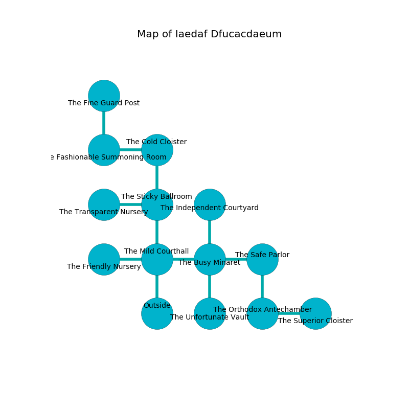

%Ruin Dogs

##Iaedaf Dfucacdaeum
###Overview
Iaedaf Dfucacdaeum is located in a ruined rift. Regions of Iaedaf Dfucacdaeum are flooded. The ruin is coming to life. It is occupied by Drows. Carmon Kellogg The Machiavellian, an Assassin is here. The Drows are the soldiers of Carmon Kellogg The Machiavellian. She  is trying to research [Hed Besa](#Hed-Besa). 

###Artifact
####Hed Besa

Hed Besa is a powerful artifact in the shape of an opaque prism. Water flows away from it. It is a sickly orange color. When touched it levitates those nearby. 

###Locations

####the mild courthall
The floor is cluttered with ashes. The air tastes like hay here. The crystal walls are covered in mold. There are thirty six Drows here. The Drows are willing to negotiate. 

* To the west a dripping corridor opens to [the friendly nursery](#the-friendly-nursery).
* To the east a torchlit cave opens to [the busy minaret](#the-busy-minaret).
* To the north a flooded cavern opens to [the sticky ballroom](#the-sticky-ballroom).
* To the south is the entrance.

####the busy minaret

* To the west a torchlit cave connects to [the mild courthall](#the-mild-courthall).
* To the east a twisted pathway leads to [the safe parlor](#the-safe-parlor).
* To the north a narrow cave opens to [the independent courtyard](#the-independent-courtyard).
* To the south a small artery opens to [the unfortunate vault](#the-unfortunate-vault).

####the sticky ballroom
The floor is sticky. There is a trap here. When activated, a magical sound detector will cast a curse. There are thirty six Drows here. If the Drows notice the Ruin Dogs, one of them will retreat and alert the others. 

* To the west a twisted hallway connects to [the transparent nursery](#the-transparent-nursery).
* To the north a dripping hall connects to [the cold cloister](#the-cold-cloister).
* To the south a flooded cavern leads to [the mild courthall](#the-mild-courthall).

####the safe parlor
The floor is cluttered with debris. The air tastes like macadamia here. There are a Xorn and a Giant Shark here. 

* [Carmon Kellogg The Machiavellian](#Carmon-Kellogg-The-Machiavellian) is here.
* To the west a twisted pathway opens to [the busy minaret](#the-busy-minaret).
* To the south a windy walkway connects to [the orthodox antechamber](#the-orthodox-antechamber).

####the orthodox antechamber
Blue mushrooms are sprouting from the ceiling. The glass walls are scratched. The floor is cluttered with shells. There are a Stirge, an Air Elemental, a Gas Spore, a Myconid Adult, a Ghost, and a Camel here. 

There is an engraving on a tablet written in Drows Script. 

> They are frozen
>
> always joint
>
> imperial and green
>
> afraid, internal, expensive
>

* To the east a long cavern opens to [the superior cloister](#the-superior-cloister).
* To the north a windy walkway opens to [the safe parlor](#the-safe-parlor).

####the friendly nursery
Blue moss is decaying in cracks in the floor. The floor is cluttered with debris. The air tastes like milk here. 

There is an engraving on a stone written in Drows Script. 

> Oh pitiful you
>
> implicit, eloquent, due
>
> it is always steep
>
> everything is deep
>

* There is a branch here.
* There is a fowl here.
* To the east a dripping corridor connects to [the mild courthall](#the-mild-courthall).

####the independent courtyard
The floor is glossy. The air tastes like chemicals here. The wooden walls are unsettled. Yellow mushrooms are swaying in broken urns. 

* To the south a narrow cave connects to [the busy minaret](#the-busy-minaret).

####the cold cloister
There are a Bugbear, an Eagle, a Young Faerie Dragon, an Abominable Yeti, and a Berserker here. The air tastes like apricot here. Green mushrooms are decaying in broken urns. The floor is flooded with four inch deep cool water. 

* To the west a torchlit corridor opens to [the fashionable summoning room](#the-fashionable-summoning-room).
* To the south a dripping hall opens to [the sticky ballroom](#the-sticky-ballroom).

####the unfortunate vault
The air smells like spinach here. There are thirty six Drows here. The Drows are defending this room from intruders. 

* To the north a small artery connects to [the busy minaret](#the-busy-minaret).

####the transparent nursery
The floor is flooded with two inch deep cold water. The stone walls are caving in. There is a trap here. When activated, a tripwire will open a large pit in the floor. 

* To the east a twisted hallway connects to [the sticky ballroom](#the-sticky-ballroom).

####the fashionable summoning room
The floor is bloodstained. The concrete walls are caving in. 

There is an engraving on a tablet written in common. 

> I can not find [Hed Besa](#Hed-Besa).
>
> A trap ahead.
>

* There is a flag here.
* [Hed Besa](#Hed-Besa) is here.
* To the east a torchlit corridor opens to [the cold cloister](#the-cold-cloister).
* To the north a flooded cavern connects to [the fine guard post](#the-fine-guard-post).

####the superior cloister
There is a trap here. When activated, a magical rune will launch a rolling boulder. Green moss is decaying from the walls. The floor is flooded with five inch deep cold water. 

* To the west a long cavern connects to [the orthodox antechamber](#the-orthodox-antechamber).

####the fine guard post
The glass walls are bloodstained. There are a Wraith, a Giant Eagle, a Bone Naga, and a Scorpion here. 

* To the south a flooded cavern opens to [the fashionable summoning room](#the-fashionable-summoning-room).

