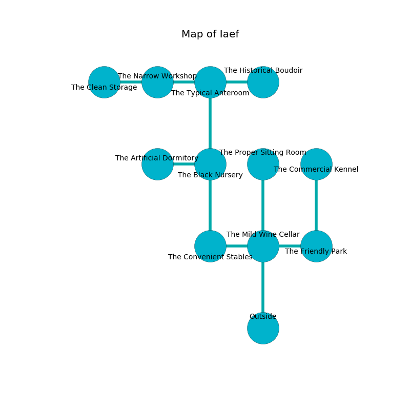

%Ruin Dogs

##Iaef
###Overview
Iaef is located under an alien mountain. Regions of Iaef are unbearably hot. A windstorm is happening outside. It is occupied by Sprites. Conrad Gresham The Perverse, a Sahuagin Priestess is here. The Sprites are the minions of Conrad Gresham The Perverse. He  is founding a new religion. 

###Artifact
####Cmufl

Cmufl is a powerful artifact in the shape of a sharp crystal. It is a dark black color. It smells like absinthe. When smelled it destroys itself. 

###Locations

####the mild wine cellar

* To the west a dark artery opens to [the convenient stables](#the-convenient-stables).
* To the east a small cavern connects to [the friendly park](#the-friendly-park).
* To the north a flooded opening connects to [the proper sitting Room](#the-proper-sitting-Room).
* To the south is the entrance.

####the friendly park
The air smells like gas here. There is a Peryton here. White razorgrass is swaying in a patch on the floor. 

* [Cmufl](#Cmufl) is here.
* [Conrad Gresham The Perverse](#Conrad-Gresham-The-Perverse) is here.
* To the west a small cavern opens to [the mild wine cellar](#the-mild-wine-cellar).
* To the north a dripping pathway opens to [the commercial kennel](#the-commercial-kennel).

####the convenient stables
The floor is sticky. The metallic walls are caving in. There are eight Sprites here. Red ferns are decaying from the ceiling. If the Sprites notice the Ruin Dogs, one of them will retreat and alert the others. 

There is an engraving on the wall written in common. 

> I hid something in Iaef.
>

* To the east a dark artery connects to [the mild wine cellar](#the-mild-wine-cellar).
* To the north a long gap leads to [the black nursery](#the-black-nursery).

####the black nursery
The brick walls are bloodstained. There are eight Sprites here. The Sprites are meditating. 

* To the west a small corridor leads to [the artificial dormitory](#the-artificial-dormitory).
* To the north a flooded hallway connects to [the typical anteroom](#the-typical-anteroom).
* To the south a long gap connects to [the convenient stables](#the-convenient-stables).

####the typical anteroom
White moss is decaying from the walls. The air tastes like narcissus here. The floor is smooth. There are eight Sprites here. The Sprites are willing to fight to the death. 

* To the west a torchlit pathway opens to [the narrow workshop](#the-narrow-workshop).
* To the east a dark threshold opens to [the historical boudoir](#the-historical-boudoir).
* To the south a flooded hallway opens to [the black nursery](#the-black-nursery).

####the historical boudoir
The brick walls are scratched. The floor is bloodstained. 

* There is a dragon here.
* There is a door here.
* To the west a dark threshold connects to [the typical anteroom](#the-typical-anteroom).

####the artificial dormitory
The air tastes like unripe banana here. The metallic walls are unsettled. There are a Gnoll Pack Lord and a Scout here. The floor is bloodstained. 

* To the east a small corridor opens to [the black nursery](#the-black-nursery).

####the narrow workshop
Yellow mushrooms are growing in a patch on the floor. There is a trap here. When activated, a magical rune will launch a fireball. The concrete walls are bloodstained. The floor is sticky. 

* To the west a dark opening leads to [the clean storage](#the-clean-storage).
* To the east a torchlit pathway opens to [the typical anteroom](#the-typical-anteroom).

####the clean storage
The floor is glossy. Gray razorgrass is swaying in a patch on the floor. 

* To the east a dark opening connects to [the narrow workshop](#the-narrow-workshop).

####the proper sitting Room
The glass walls are ruined. The floor is sticky. 

* There is a dragon here.
* To the south a flooded opening opens to [the mild wine cellar](#the-mild-wine-cellar).

####the commercial kennel
The air tastes like acid here. The floor is glossy. 

* To the south a dripping pathway connects to [the friendly park](#the-friendly-park).

