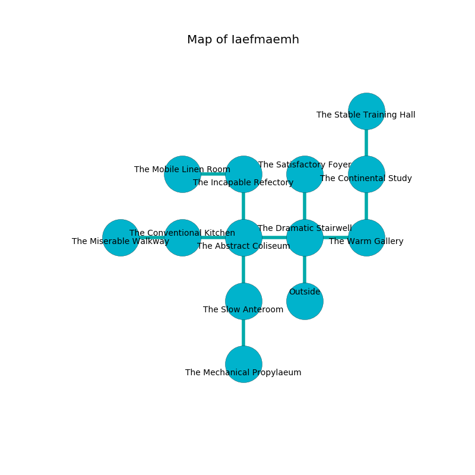

%Ruin Dogs

##Iaefmaemh
###Overview
Iaefmaemh is located under a flooded plain. Parts of it are cursed. The ruin is burning. It is occupied by Centaurs. Curtis Delvalle The Grumpy, a Drow Priestess of Lolth is here. The Centaurs are the slaves of Curtis Delvalle The Grumpy. She  is trying to find [The Continuous Slave](#The-Continuous-Slave). 

###Artifact
####The Continuous Slave

The Continuous Slave is a powerful artifact in the shape of a broken rock. It is a pale purple color. It smells like coffee. Cacophony pours around it. When worn it becomes lost. 

###Locations

####the dramatic stairwell
The air tastes like passion fruit here. There are four Centaurs here. The Centaurs are meditating. 

* To the west a flooded opening leads to [the abstract coliseum](#the-abstract-coliseum).
* To the east a twisted artery connects to [the warm gallery](#the-warm-gallery).
* To the north a twisted cavern connects to [the satisfactory foyer](#the-satisfactory-foyer).
* To the south is the entrance.

####the warm gallery

* There is a triptych here.
* To the west a twisted artery connects to [the dramatic stairwell](#the-dramatic-stairwell).
* To the north a hazy pathway connects to [the continental study](#the-continental-study).

####the continental study
Blue lichens are growing in a patch on the floor. The concrete walls are bloodstained. The air smells like cheese here. There are a Young Brass Dragon, a Barlgura, and a Constrictor Snake here. 

There is an engraving on the wall written in common. 

> A shoe is a food
>
> but never addicted
>
> grateful, fine, dirty
>
> yet never gradual
>
> lost and reckless
>
> successful, neutral, distant
>
> you must never be cursed
>

* [Curtis Delvalle The Grumpy](#Curtis-Delvalle-The-Grumpy) is here.
* To the north a torchlit hall opens to [the stable training hall](#the-stable-training-hall).
* To the south a hazy pathway connects to [the warm gallery](#the-warm-gallery).

####the abstract coliseum

There is an engraving on the wall written in Centaurs Script. 

> Dear me! death is sadistic
>
> always optimistic
>
> inadequate and sensitive
>
> life is realistic
>

* To the west a dark passageway opens to [the conventional kitchen](#the-conventional-kitchen).
* To the east a flooded opening leads to [the dramatic stairwell](#the-dramatic-stairwell).
* To the north a windy hall leads to [the incapable refectory](#the-incapable-refectory).
* To the south a long threshold connects to [the slow anteroom](#the-slow-anteroom).

####the slow anteroom
There are a Medusa, a Copper Dragon Wyrmling, a Crab, a Grick, and a Violet Fungus here. The floor is flooded with two inch deep lukewarm water. The air smells like green bean here. 

* There is a key here.
* There is a dog here.
* To the north a long threshold leads to [the abstract coliseum](#the-abstract-coliseum).
* To the south a dark threshold connects to [the mechanical propylaeum](#the-mechanical-propylaeum).

####the conventional kitchen
There is a Fomorian here. The metallic walls are ruined. 

There is an engraving on the ceiling written in common. 

> Maybe try hiding.
>

* There is a wight here.
* [The Continuous Slave](#The-Continuous-Slave) is here.
* To the west a long gap leads to [the miserable walkway](#the-miserable-walkway).
* To the east a dark passageway connects to [the abstract coliseum](#the-abstract-coliseum).

####the mechanical propylaeum
Red mushrooms are swaying from the ceiling. The floor is smooth. There are a Blue Slaad, a Specter, and a Kenku here. The mirrored walls are scratched. 

* To the north a dark threshold opens to [the slow anteroom](#the-slow-anteroom).

####the incapable refectory
The air tastes like acacia here. 

* There is an orb here.
* To the west a windy opening connects to [the mobile linen room](#the-mobile-linen-room).
* To the south a windy hall opens to [the abstract coliseum](#the-abstract-coliseum).

####the satisfactory foyer
The floor is glossy. There are four Centaurs here. The air tastes like sap here. The Centaurs are fighting amongst themselves. 

* To the south a twisted cavern leads to [the dramatic stairwell](#the-dramatic-stairwell).

####the mobile linen room
Yellow lichens are swaying in cracks in the floor. The glass walls are scratched. 

* There is a hook here.
* There is a sock here.
* To the east a windy opening connects to [the incapable refectory](#the-incapable-refectory).

####the stable training hall
Green razorgrass is sprouting from the walls. The air tastes like sand here. There are an Ape, a Giant Vulture, a Hook Horror, a Reef Shark, a Xorn, and a Rust Monster here. The floor is sticky. 

* To the south a torchlit hall opens to [the continental study](#the-continental-study).

####the miserable walkway
There are a Noble, a Vulture, a Hippogriff, a Cloaker, and a Manes here. The floor is bloodstained. Red razorgrass is growing in cracks in the floor. 

* To the east a long gap leads to [the conventional kitchen](#the-conventional-kitchen).

