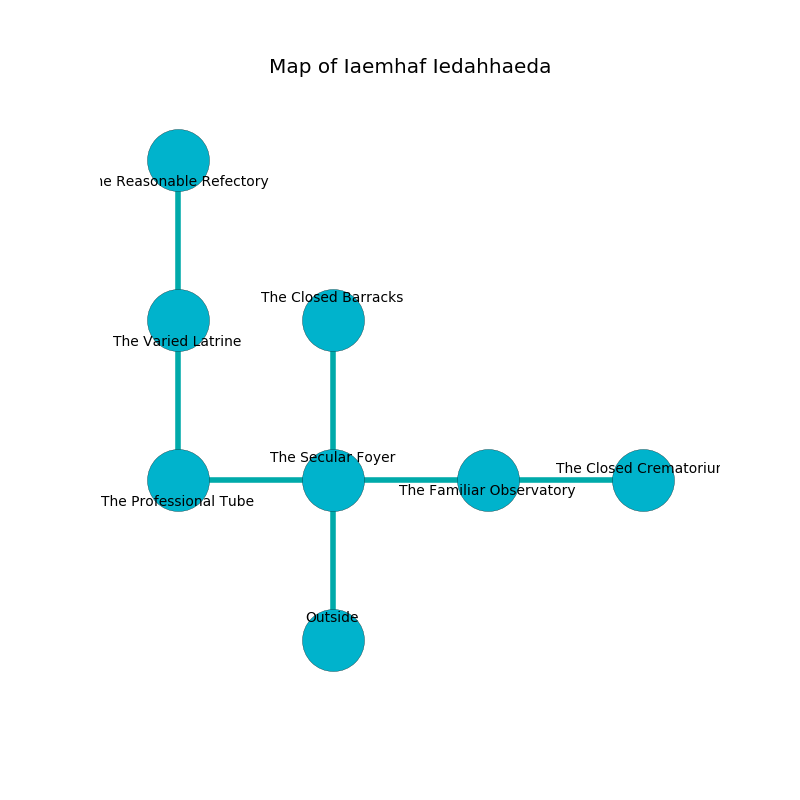

%Ruin Dogs

##Iaemhaf Iedahhaeda
###Overview
Iaemhaf Iedahhaeda is located in a haunted city. Some rooms of Iaemhaf Iedahhaeda are corrupted. A lunar eclipse is happening outside. It is occupied by Orcs. Lory Faulk The Careless, an Orc War Chief is here. The Orcs are ruled by Lory Faulk The Careless. She  is trying to destroy [The High Answer](#The-High-Answer). 

###Artifact
####The High Answer

The High Answer is a powerful artifact in the shape of a wet sphere. Power glows near it. When eaten it curses all nearby. 

###Locations

####the secular foyer
The air smells like jonquil here. There are two Orc War Chiefs here. The Orcs are berserk with rage. 

* To the west a torchlit threshold opens to [the professional tube](#the-professional-tube).
* To the east a hazy threshold connects to [the familiar observatory](#the-familiar-observatory).
* To the north a windy corridor opens to [the closed barracks](#the-closed-barracks).
* To the south is the entrance.

####the closed barracks
The floor is glossy. There are three Orc Eyes of Gruumsh here. Green moss is decaying in cracks in the floor. The Orcs are berserk with rage. 

* To the south a windy corridor leads to [the secular foyer](#the-secular-foyer).

####the familiar observatory
There is a trap here. When activated, a tripwire will extend a spring loaded spear. The floor is sticky. 

* There is a fowl here.
* [The High Answer](#The-High-Answer) is here.
* [Lory Faulk The Careless](#Lory-Faulk-The-Careless) is here.
* To the west a hazy threshold leads to [the secular foyer](#the-secular-foyer).
* To the east a twisted artery opens to [the closed crematorium](#the-closed-crematorium).

####the professional tube
Blue lichens are decaying from the walls. There are a Gnoll, an Owlbear, and a Bulette here. 

* To the east a torchlit threshold connects to [the secular foyer](#the-secular-foyer).
* To the north a small hallway leads to [the varied latrine](#the-varied-latrine).

####the varied latrine
There are two Orc War Chiefs here. There is a trap here. When activated, a magical sound detector will collapse a column. The floor is smooth. The air tastes like flowers here. The Orcs are defending this room from intruders. 

* There is a belt here.
* To the north a narrow threshold leads to [the reasonable refectory](#the-reasonable-refectory).
* To the south a small hallway opens to [the professional tube](#the-professional-tube).

####the reasonable refectory
The floor is smooth. There are an Orc War Chief and two Orc Eyes of Gruumsh here. The air tastes like sesame here. The Orcs are willing to negotiate. 

* To the south a narrow threshold connects to [the varied latrine](#the-varied-latrine).

####the closed crematorium
The air smells like tea here. The crystal walls are covered in mold. The floor is smooth. 

* To the west a twisted artery opens to [the familiar observatory](#the-familiar-observatory).

