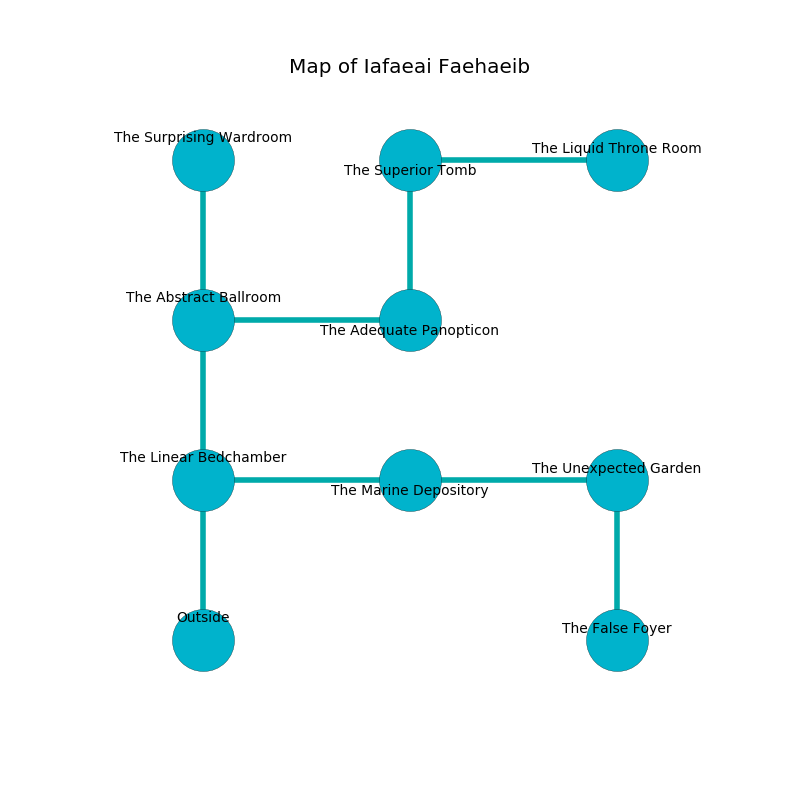

%Ruin Dogs

##Iafaeai Faehaeib
###Overview
Iafaeai Faehaeib is constructed on a volcanic city. Parts of Iafaeai Faehaeib are cursed. The ruin is sinking into the earth. It is occupied by Yuan-Ti. Jamie Nicholson The Grumpy, a Fire Giant is here. The Yuan-Ti are the soldiers of Jamie Nicholson The Grumpy. She  is trying to understand [Amdfwi](#Amdfwi). 

###Artifact
####Amdfwi

Amdfwi is a powerful artifact in the shape of a hard orb. When worn it become energized with a powerful vibration. 

###Locations

####the linear bedchamber
The wooden walls are pristine. Gray mushrooms are swaying in a patch on the floor. There is a trap here. When activated, a tripwire will launch a hail of needles. The floor is sticky. The air tastes like yuzu here. 

There is an engraving on a monolith written in Yuan-Ti Script. 

> Poor me! terrible god
>
> but opposed
>
> secular, viable, odd
>
> sadness is closed
>

* There is a bag here.
* To the east a dark cavern opens to [the marine depository](#the-marine-depository).
* To the north a windy corridor opens to [the abstract ballroom](#the-abstract-ballroom).
* To the south is the entrance.

####the abstract ballroom
There are a Red Dragon Wyrmling, a Drow Priestess of Lolth, a Myconid Sprout, a Draft Horse, and an Acolyte here. The crystal walls are covered in mold. 

There is an engraving on a tablet written in common. 

> Hide here.
>

* To the east a dripping cavern leads to [the adequate panopticon](#the-adequate-panopticon).
* To the north a torchlit walkway leads to [the surprising wardroom](#the-surprising-wardroom).
* To the south a windy corridor leads to [the linear bedchamber](#the-linear-bedchamber).

####the marine depository
The brick walls are scratched. The air smells like melon here. Blue mushrooms are decaying from the walls. 

* There is an imp here.
* To the west a dark cavern leads to [the linear bedchamber](#the-linear-bedchamber).
* To the east a flooded gap leads to [the unexpected garden](#the-unexpected-garden).

####the adequate panopticon
There are a Galeb Duhr, an Allosaurus, and a Bandit Captain here. The air tastes like castoreum here. 

* To the west a dripping cavern opens to [the abstract ballroom](#the-abstract-ballroom).
* To the north a long cavern opens to [the superior tomb](#the-superior-tomb).

####the superior tomb
The floor is cluttered with debris. Green moss is sprouting in broken urns. The air smells like balsamic here. The crystal walls are scratched. 

* [Amdfwi](#Amdfwi) is here.
* To the east a dark walkway opens to [the liquid throne room](#the-liquid-throne-room).
* To the south a long cavern leads to [the adequate panopticon](#the-adequate-panopticon).

####the unexpected garden
There are a Yuan-Ti Malison, a Yuan-Ti Abomination, and a Yuan-Ti Pureblood here. The air tastes like sand here. The Yuan-Ti are crazy with bloodlust. 

* To the west a flooded gap connects to [the marine depository](#the-marine-depository).
* To the south a twisted corridor opens to [the false foyer](#the-false-foyer).

####the false foyer
White lichens are decaying in broken urns. The concrete walls are unsettled. 

* To the north a twisted corridor connects to [the unexpected garden](#the-unexpected-garden).

####the surprising wardroom
There is a trap here. When activated, a pressure plate will fire a scything blade. There are an Orc War Chief, a Vampire Spawn, a Draft Horse, a Clay Golem, and a Manes here. The obsidion walls are covered in mold. 

There is an engraving on a tablet written in common. 

> Maybe try dying.
>

* [Jamie Nicholson The Grumpy](#Jamie-Nicholson-The-Grumpy) is here.
* To the south a torchlit walkway connects to [the abstract ballroom](#the-abstract-ballroom).

####the liquid throne room
The concrete walls are unsettled. 

* There is a leprechaun here.
* To the west a dark walkway opens to [the superior tomb](#the-superior-tomb).

