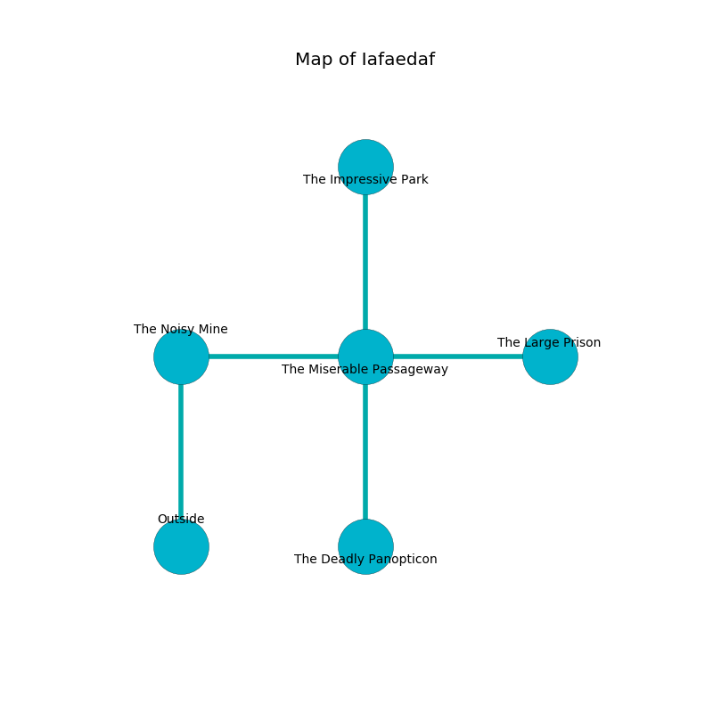

%Ruin Dogs

##Iafaedaf
###Overview
Iafaedaf is located in a spikey rift. Some areas of it are somewhat hot. A blizzard is happening outside. It is occupied by Sahuagin. Marget Corcoran The Sneaky, a Fire Giant is here. The Sahuagin are battling Marget Corcoran The Sneaky. She  is founding a new religion. 

###Artifact
####Icmaloha Gaememca

Icmaloha Gaememca is a powerful artifact in the shape of an opaque amulet. It is a bright pink color. It smells like chamomile. When worn it grants psychic powers. 

###Locations

####the noisy mine
There are two Sahuagin Barons here. Blue moss is swaying in a patch on the floor. The Sahuagin are defending this room from intruders. 

* There is a bowl here.
* There is a breastplate here.
* To the east a long path opens to [the miserable passageway](#the-miserable-passageway).
* To the south is the entrance.

####the miserable passageway
The glass walls are caving in. The floor is sticky. The air smells like lilac here. There are a Medusa, a Triceratops, and a Mule here. 

* There is a trophy here.
* [Icmaloha Gaememca](#Icmaloha-Gaememca) is here.
* To the west a long path connects to [the noisy mine](#the-noisy-mine).
* To the east a twisted hallway connects to [the large prison](#the-large-prison).
* To the north a torchlit threshold connects to [the impressive park](#the-impressive-park).
* To the south a long hall connects to [the deadly panopticon](#the-deadly-panopticon).

####the deadly panopticon
The glass walls are unsettled. White mushrooms are growing from the ceiling. 

* To the north a long hall leads to [the miserable passageway](#the-miserable-passageway).

####the large prison
The air smells like gravy here. There are a Swarm of Rats, an Abominable Yeti, and a Priest here. 

* To the west a twisted hallway opens to [the miserable passageway](#the-miserable-passageway).

####the impressive park
There are a Deva, a Red Slaad, an Ettin, a Swarm of Ravens, and a Baboon here. 

* [Marget Corcoran The Sneaky](#Marget-Corcoran-The-Sneaky) is here.
* To the south a torchlit threshold connects to [the miserable passageway](#the-miserable-passageway).

