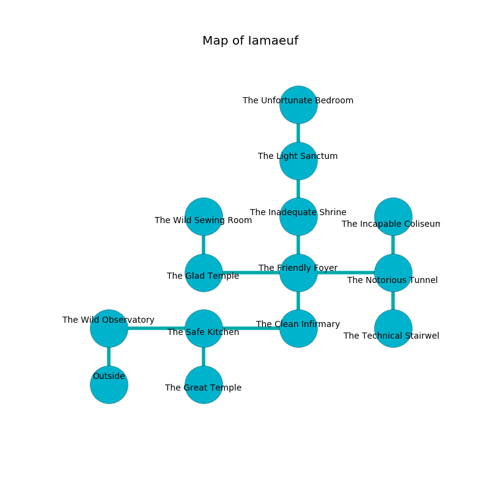

%Ruin Dogs

##Iamaeuf
###Overview
Iamaeuf is located on an obsidion city. Parts of it are cursed. The ruin is coming to life. It is occupied by Demons. Eloy Fahey The Lazy, a Mage is here. The Demons are ruled by Eloy Fahey The Lazy. He  is trying to understand [Aemhfalaeamd](#Aemhfalaeamd). 

###Artifact
####Aemhfalaeamd

Aemhfalaeamd has the form of a wet spear. It smells like starch. It is a pale red color. When gazed upon it grants psychic powers. 

###Locations

####the wild observatory
The air tastes like fig here. Green mushrooms are decaying from the walls. There are a Giant Spider, a Vampire Spawn, a Gelatinous Cube, a Tridrone, and a Kuo-Toa here. The floor is glossy. 

There is an engraving on the wall written in Demons Script. 

> I could not try hiding.
>

* To the east a hazy passageway opens to [the safe kitchen](#the-safe-kitchen).
* To the south is the entrance.

####the safe kitchen
There are a Barlgura, a Bandit, and a Hell Hound here. 

There is an engraving on the wall written in Demons Script. 

> You are love
>
> asleep, surprised, appropriate
>
> mental, unlike, expensive
>

* There is a lyre here.
* There is a triptych here.
* There is a door here.
* [Aemhfalaeamd](#Aemhfalaeamd) is here.
* To the west a hazy passageway opens to [the wild observatory](#the-wild-observatory).
* To the east a flooded threshold connects to [the clean infirmary](#the-clean-infirmary).
* To the south a torchlit cave leads to [the great temple](#the-great-temple).

####the clean infirmary
The obsidion walls are unsettled. There are a Yeti, a Galeb Duhr, and a Gas Spore here. 

* There is a shoe here.
* There is a basin here.
* To the west a flooded threshold opens to [the safe kitchen](#the-safe-kitchen).
* To the north a twisted hallway leads to [the friendly foyer](#the-friendly-foyer).

####the friendly foyer
White ferns are swaying in broken urns. There are a Barbed Devil and a Cambion here. One of the Demons is on watch, the rest are sleeping. 

* There is a fork here.
* To the west a dripping gap leads to [the glad temple](#the-glad-temple).
* To the east a torchlit gap opens to [the notorious tunnel](#the-notorious-tunnel).
* To the north a small pathway opens to [the inadequate shrine](#the-inadequate-shrine).
* To the south a twisted hallway opens to [the clean infirmary](#the-clean-infirmary).

####the notorious tunnel
There are a Succubus and a Bearded Devil here. The metallic walls are caving in. Green ferns are decaying in cracks in the floor. There is a trap here. When activated, a pressure plate will launch a swinging block. The Demons are caring for babies. 

* [Eloy Fahey The Lazy](#Eloy-Fahey-The-Lazy) is here.
* To the west a torchlit gap leads to [the friendly foyer](#the-friendly-foyer).
* To the north a dark hallway opens to [the incapable coliseum](#the-incapable-coliseum).
* To the south a hazy path opens to [the technical stairwell](#the-technical-stairwell).

####the inadequate shrine
The floor is glossy. The air tastes like sausage here. 

* There is a branch here.
* To the north a torchlit gap leads to [the light sanctum](#the-light-sanctum).
* To the south a small pathway opens to [the friendly foyer](#the-friendly-foyer).

####the light sanctum
The air smells like jasmin here. The concrete walls are scratched. There is a trap here. When activated, a tripwire will swing a tripping chain. Green mushrooms are growing in broken urns. 

* There is a board here.
* There is a picture here.
* There is a hare here.
* There is a fly here.
* To the north a narrow artery leads to [the unfortunate bedroom](#the-unfortunate-bedroom).
* To the south a torchlit gap leads to [the inadequate shrine](#the-inadequate-shrine).

####the unfortunate bedroom
The air tastes like wasabi here. The crystal walls are pristine. Red mushrooms are decaying in cracks in the floor. 

* To the south a narrow artery connects to [the light sanctum](#the-light-sanctum).

####the incapable coliseum
The floor is smooth. The brick walls are covered in mold. 

There is an engraving on the floor written in common. 

> I am lost in Iamaeuf.
>
> Leave now.
>

* To the south a dark hallway connects to [the notorious tunnel](#the-notorious-tunnel).

####the technical stairwell
There are an Imp, a Bulette, and a Cambion here. The crystal walls are bloodstained. One of the Demons is working a mechanism that can flood the room. 

* There is a fork here.
* To the north a hazy path connects to [the notorious tunnel](#the-notorious-tunnel).

####the glad temple
Blue razorgrass is growing from the ceiling. The air smells like animal here. 

* To the east a dripping gap connects to [the friendly foyer](#the-friendly-foyer).
* To the north a dark threshold connects to [the wild sewing room](#the-wild-sewing-room).

####the wild sewing room
The floor is glossy. The wooden walls are scratched. There are a Githzerai Zerth, a Bearded Devil, and a Priest here. The air smells like passion fruit here. 

* To the south a dark threshold leads to [the glad temple](#the-glad-temple).

####the great temple
Yellow moss is swaying in a patch on the floor. The air smells like earth here. 

* To the north a torchlit cave leads to [the safe kitchen](#the-safe-kitchen).

