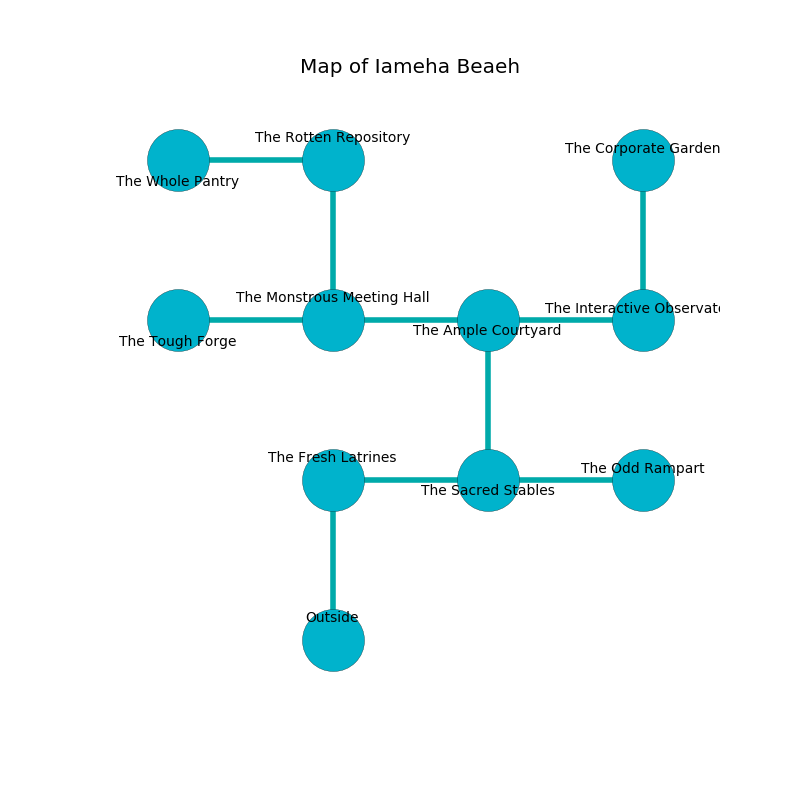

%Ruin Dogs

##Iameha Beaeh
###Overview
Iameha Beaeh is constructed on a flooded plain. Parts of it are somewhat cold. A blizzard is happening outside. It is occupied by Centaurs. Nichol Roy The Impatient, a Stone Giant is here. The Centaurs are the minions of Nichol Roy The Impatient. She  is founding a new religion. 

###Artifact
####The Foolish Stick

The Foolish Stick looks like a smooth sphere. It smells like pine. When picked up it illuminates its surroundings. 

###Locations

####the fresh latrines
White mushrooms are decaying from the walls. The floor is smooth. The air smells like horseradish here. 

* To the east a flooded artery opens to [the sacred stables](#the-sacred-stables).
* To the south is the entrance.

####the sacred stables
Green razorgrass is decaying in cracks in the floor. 

There is an engraving on the floor written in common. 

> Dear me! pitiful god
>
> ever closed
>
> steady and odd
>
> all is opposed
>

* To the west a flooded artery opens to [the fresh latrines](#the-fresh-latrines).
* To the east a twisted cavern opens to [the odd rampart](#the-odd-rampart).
* To the north a flooded hallway opens to [the ample courtyard](#the-ample-courtyard).

####the ample courtyard
The floor is sticky. 

There is an engraving on a tablet written in Centaurs Script. 

> [The Foolish Stick](#The-Foolish-Stick)
>
> always real
>

* [Nichol Roy The Impatient](#Nichol-Roy-The-Impatient) is here.
* To the west a hazy hallway leads to [the monstrous meeting hall](#the-monstrous-meeting-hall).
* To the east a dark walkway opens to [the interactive observatory](#the-interactive-observatory).
* To the south a flooded hallway connects to [the sacred stables](#the-sacred-stables).

####the odd rampart
There are a Hook Horror, an Ankheg, a Crab, a Druid, and a Pixie here. The floor is sticky. The crystal walls are caving in. Green mushrooms are swaying in broken urns. 

* To the west a twisted cavern opens to [the sacred stables](#the-sacred-stables).

####the interactive observatory
The wooden walls are caving in. The floor is cluttered with broken glass. There are four Centaurs here. The Centaurs are meditating. 

* There is a sock here.
* There is a lock here.
* To the west a dark walkway leads to [the ample courtyard](#the-ample-courtyard).
* To the north a long gap connects to [the corporate garden](#the-corporate-garden).

####the corporate garden
The air smells like grapefruit here. 

* To the south a long gap connects to [the interactive observatory](#the-interactive-observatory).

####the monstrous meeting hall
The wooden walls are scratched. The floor is sticky. The air tastes like sweat here. White ferns are swaying from the walls. 

There is an engraving on the floor written in Centaurs Script. 

> I hid something in Iameha Beaeh.
>
> I could not try dying.
>

* To the west a small corridor connects to [the tough forge](#the-tough-forge).
* To the east a hazy hallway connects to [the ample courtyard](#the-ample-courtyard).
* To the north a small walkway leads to [the rotten repository](#the-rotten-repository).

####the rotten repository
White lichens are swaying in broken urns. There are four Centaurs here. The wooden walls are covered in mold. The Centaurs are willing to negotiate. 

* [The Foolish Stick](#The-Foolish-Stick) is here.
* To the west a dripping threshold connects to [the whole pantry](#the-whole-pantry).
* To the south a small walkway connects to [the monstrous meeting hall](#the-monstrous-meeting-hall).

####the tough forge
The air smells like absinthe here. There are a Brass Dragon Wyrmling, a Xorn, a Gnoll Pack Lord, and a Rust Monster here. 

There is an engraving on the ceiling written in common. 

> You are joyful
>
> right, industrial, magnetic
>
> ever paralyzed
>

* To the east a small corridor opens to [the monstrous meeting hall](#the-monstrous-meeting-hall).

####the whole pantry
White ferns are swaying from the walls. The air tastes like watermelon here. The stone walls are unsettled. There are a Pteranodon, an Ankheg, and a Wyvern here. 

* To the east a dripping threshold connects to [the rotten repository](#the-rotten-repository).

