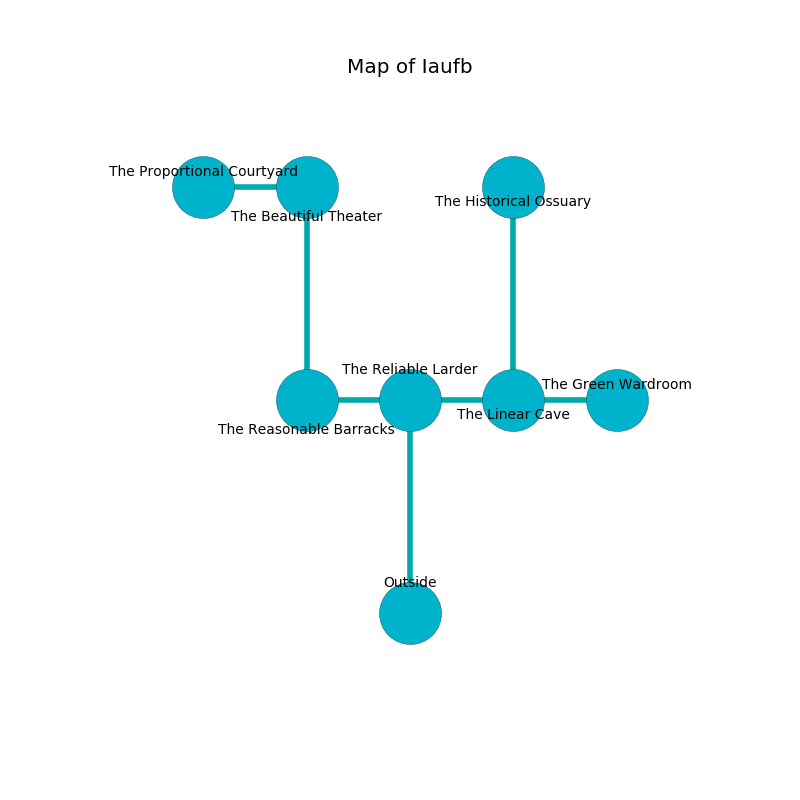

%Ruin Dogs

##Iaufb
###Overview
Iaufb is located on a ruined plain. Parts of Iaufb are somewhat cold. The ruin is flooding. It is occupied by Kobolds. Hanna Wiggins The Pompous, a Gnoll Fang of Yeenoghu is here. The Kobolds are the minions of Hanna Wiggins The Pompous. She  is founding a new religion. 

###Artifact
####The Relevant Wall

The Relevant Wall looks like a sharp gem. It is a pale orange color. When smelled it curses all nearby. 

###Locations

####the reliable larder
The floor is flooded with one inch deep hot water. Gray razorgrass is sprouting from the walls. There is a trap here. When activated, a magical proximity detector will cast a curse. 

* To the west a long walkway connects to [the reasonable barracks](#the-reasonable-barracks).
* To the east a hazy opening connects to [the linear cave](#the-linear-cave).
* To the south is the entrance.

####the linear cave
The floor is bloodstained. There are a Rug of Smothering, a Myconid Sprout, and a Spider here. The stone walls are pristine. 

There is an engraving on the floor written in common. 

> O! terrible soul
>
> it is never straight
>
> shy and whole
>
> all is late
>

* To the west a hazy opening leads to [the reliable larder](#the-reliable-larder).
* To the east a long opening opens to [the green wardroom](#the-green-wardroom).
* To the north a windy corridor connects to [the historical ossuary](#the-historical-ossuary).

####the reasonable barracks
The air tastes like citrus peel here. Yellow ferns are swaying in cracks in the floor. There are a Death Dog, a Scout, a Rug of Smothering, a Mule, and a Giant Toad here. 

There is an engraving on the ceiling written in Kobolds Script. 

> I tried hiding.
>

* To the east a long walkway leads to [the reliable larder](#the-reliable-larder).
* To the north a windy opening opens to [the beautiful theater](#the-beautiful-theater).

####the green wardroom
White mushrooms are swaying from the walls. The air tastes like cassia here. The metallic walls are bloodstained. There is a trap here. When activated, a pressure plate will fire a net. The floor is bloodstained. 

* [Hanna Wiggins The Pompous](#Hanna-Wiggins-The-Pompous) is here.
* To the west a long opening leads to [the linear cave](#the-linear-cave).

####the beautiful theater
The air smells like peony here. The crystal walls are caving in. 

* [The Relevant Wall](#The-Relevant-Wall) is here.
* To the west a small walkway opens to [the proportional courtyard](#the-proportional-courtyard).
* To the south a windy opening opens to [the reasonable barracks](#the-reasonable-barracks).

####the historical ossuary
The floor is glossy. There are nine Winged Kobolds and seven Kobolds here. One of the Kobolds is on watch, the rest are fighting amongst themselves. 

There is an engraving on a monolith written in Kobolds Script. 

> O everything is sadistic
>
> but never optimistic
>
> fat, awful, fragrant
>
> death is optimistic
>

* To the south a windy corridor leads to [the linear cave](#the-linear-cave).

####the proportional courtyard
There are an Ankylosaurus and a Priest here. Yellow moss is growing in broken urns. The stone walls are caving in. 

* To the east a small walkway leads to [the beautiful theater](#the-beautiful-theater).

