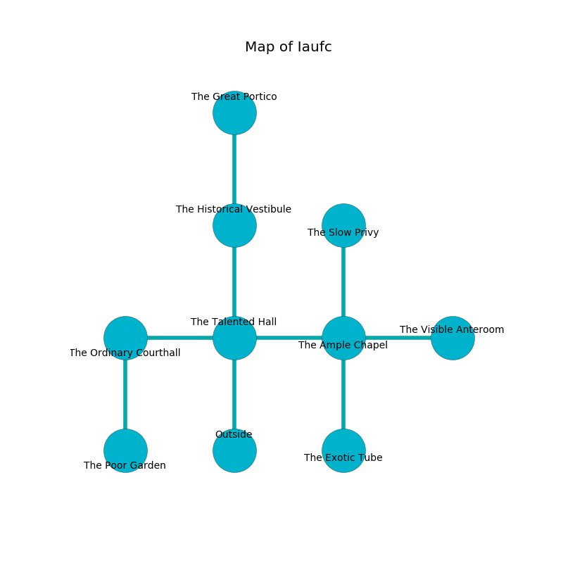

%Ruin Dogs

##Iaufc
###Overview
Iaufc is located on a ruined plain. Some areas of Iaufc are corrupted. The ruin is larger on the inside than the outside. It is occupied by Centaurs. Broderick Warden The Moody, a Sahuagin Baron is here. The Centaurs are the slaves of Broderick Warden The Moody. He  is founding a new religion. 

###Artifact
####Gfaaehmd

Gfaaehmd has the form of a cold crystal. It is a light green color. Light flows around it. When rubbed it burns the mind. 

###Locations

####the talented hall

* There is a cord here.
* To the west a torchlit hallway connects to [the ordinary courthall](#the-ordinary-courthall).
* To the east a dark hall opens to [the ample chapel](#the-ample-chapel).
* To the north a narrow hall connects to [the historical vestibule](#the-historical-vestibule).
* To the south is the entrance.

####the historical vestibule
The air smells like magnolia here. The metallic walls are caving in. There are a Red Dragon Wyrmling, a Dire Wolf, and a Boar here. 

There is an engraving on a stone written in common. 

> Dear me! the memory of you is poor
>
> scientific and continental
>
> but never mature
>
> hope is mental
>

* To the north a windy hallway leads to [the great portico](#the-great-portico).
* To the south a narrow hall leads to [the talented hall](#the-talented-hall).

####the great portico
The glass walls are covered in mold. There are three Centaurs here. The Centaurs are performing a ritual. If not interrupted, the Centaurs will become more powerful. 

* There is a face here.
* To the south a windy hallway opens to [the historical vestibule](#the-historical-vestibule).

####the ample chapel
The floor is sticky. 

* There is an arch here.
* [Gfaaehmd](#Gfaaehmd) is here.
* To the west a dark hall leads to [the talented hall](#the-talented-hall).
* To the east a dripping hall leads to [the visible anteroom](#the-visible-anteroom).
* To the north a windy gap leads to [the slow privy](#the-slow-privy).
* To the south a hazy cave connects to [the exotic tube](#the-exotic-tube).

####the visible anteroom
The concrete walls are unsettled. The floor is glossy. The air smells like oatmeal here. White razorgrass is sprouting from the walls. 

* To the west a dripping hall leads to [the ample chapel](#the-ample-chapel).

####the ordinary courthall
The wooden walls are unsettled. 

* There is a cat here.
* [Broderick Warden The Moody](#Broderick-Warden-The-Moody) is here.
* To the east a torchlit hallway connects to [the talented hall](#the-talented-hall).
* To the south a dark pathway connects to [the poor garden](#the-poor-garden).

####the poor garden
The air smells like mutton here. 

* To the north a dark pathway opens to [the ordinary courthall](#the-ordinary-courthall).

####the exotic tube
The floor is smooth. There are a Thug, a Kenku, a Dire Wolf, a Giant Frog, a Poisonous Snake, a Bat, a Quadrone, and an Awakened Tree here. 

There is an engraving on the floor written in common. 

> Go away.
>

* There is a cheese here.
* There is a kettle here.
* There is a card here.
* To the north a hazy cave connects to [the ample chapel](#the-ample-chapel).

####the slow privy
The floor is cluttered with debris. The wooden walls are bloodstained. There are a Pentadrone, a Young Remorhaz, a Half-Ogre, a Shrieker, and a Dryad here. Green lichens are swaying from the ceiling. 

* To the south a windy gap opens to [the ample chapel](#the-ample-chapel).

