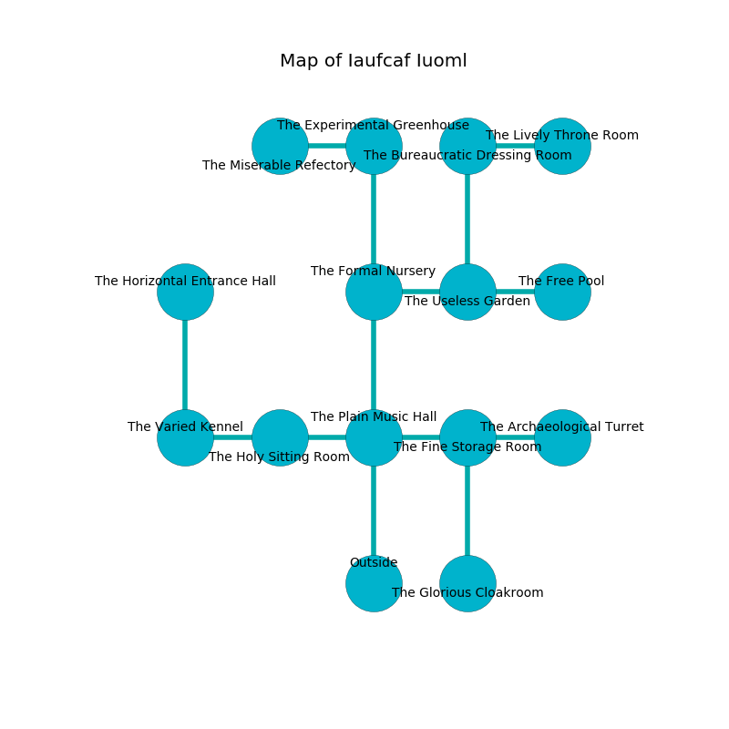

%Ruin Dogs

##Iaufcaf Iuoml
###Overview
Iaufcaf Iuoml is located on an obsidion mountain. Parts of it are incredibly cold. The ruin is coming to life. It is occupied by Yuan-Ti. Waldo Huerta The Self-Indulgent, a Kuo-Toa Monitor is here. The Yuan-Ti are ruled by Waldo Huerta The Self-Indulgent. He  is trying to research [The Talented Pier](#The-Talented-Pier). 

###Artifact
####The Talented Pier

The Talented Pier looks like a soft orb. It is a medium purple color. It smells like roasted barley. Gravity flows away from it. When cradled it becomes lost. 

###Locations

####the plain music hall
The floor is flooded with three inch deep scalding water. The air tastes like egg nog here. The concrete walls are covered in mold. 

* There is a dress here.
* To the west a twisted walkway leads to [the holy sitting Room](#the-holy-sitting-Room).
* To the east a twisted corridor leads to [the fine storage room](#the-fine-storage-room).
* To the north a dark corridor connects to [the formal nursery](#the-formal-nursery).
* To the south is the entrance.

####the fine storage room
There are a Yuan-Ti Pureblood and a Yuan-Ti Malison here. The floor is cluttered with broken glass. Yellow mushrooms are swaying in cracks in the floor. The Yuan-Ti are performing a ritual. If not interrupted, the ruin dogs will be weakened. 

There is an engraving on the ceiling written in Yuan-Ti Script. 

> A cushion is a chain
>
> responsible, interesting, military
>
> gradual and sacred
>

* [Waldo Huerta The Self-Indulgent](#Waldo-Huerta-The-Self-Indulgent) is here.
* To the west a twisted corridor opens to [the plain music hall](#the-plain-music-hall).
* To the east a torchlit passageway leads to [the archaeological turret](#the-archaeological-turret).
* To the south a dripping walkway connects to [the glorious cloakroom](#the-glorious-cloakroom).

####the formal nursery
The floor is flooded with five inch deep cold water. Yellow moss is growing in a patch on the floor. The air smells like cologne here. 

* To the east a dark artery connects to [the useless garden](#the-useless-garden).
* To the north a twisted gap opens to [the experimental greenhouse](#the-experimental-greenhouse).
* To the south a dark corridor leads to [the plain music hall](#the-plain-music-hall).

####the holy sitting Room

* To the west a torchlit opening connects to [the varied kennel](#the-varied-kennel).
* To the east a twisted walkway opens to [the plain music hall](#the-plain-music-hall).

####the glorious cloakroom
Blue ferns are growing in broken urns. There are two Yuan-Ti Malisons here. The air tastes like oak wood here. The Yuan-Ti are meditating. 

* To the north a dripping walkway leads to [the fine storage room](#the-fine-storage-room).

####the varied kennel
The floor is bloodstained. There are a Carrion Crawler, a Dust Mephit, and a Basilisk here. Green razorgrass is sprouting in a patch on the floor. 

* To the east a torchlit opening leads to [the holy sitting Room](#the-holy-sitting-Room).
* To the north a narrow opening opens to [the horizontal entrance hall](#the-horizontal-entrance-hall).

####the archaeological turret
Yellow moss is sprouting from the ceiling. The stone walls are covered in mold. The floor is glossy. 

* To the west a torchlit passageway leads to [the fine storage room](#the-fine-storage-room).

####the useless garden
There are a Riding Horse, a Dust Mephit, a Gelatinous Cube, a Worg, and a Goblin Boss here. 

* To the west a dark artery opens to [the formal nursery](#the-formal-nursery).
* To the east a dark hall opens to [the free pool](#the-free-pool).
* To the north a small threshold connects to [the bureaucratic dressing room](#the-bureaucratic-dressing-room).

####the bureaucratic dressing room
Blue razorgrass is decaying from the ceiling. The floor is cluttered with rocks. 

* To the east a dark threshold opens to [the lively throne room](#the-lively-throne-room).
* To the south a small threshold opens to [the useless garden](#the-useless-garden).

####the experimental greenhouse
White mushrooms are decaying in broken urns. The obsidion walls are unsettled. The floor is sticky. 

* [The Talented Pier](#The-Talented-Pier) is here.
* To the west a windy corridor opens to [the miserable refectory](#the-miserable-refectory).
* To the south a twisted gap opens to [the formal nursery](#the-formal-nursery).

####the free pool

There is an engraving on the ceiling written in common. 

> Try swimming.
>

* There is a sword here.
* To the west a dark hall connects to [the useless garden](#the-useless-garden).

####the lively throne room
The air smells like popcorn here. The mirrored walls are pristine. There are four Yuan-Ti Purebloods here. The Yuan-Ti are crazy with bloodlust. 

There is an engraving on a tablet written in Yuan-Ti Script. 

> I am hidden.
>
> A trap ahead.
>

* To the west a dark threshold opens to [the bureaucratic dressing room](#the-bureaucratic-dressing-room).

####the horizontal entrance hall
Green ferns are growing in a patch on the floor. The air tastes like hay here. There are a Yuan-Ti Malison and a Yuan-Ti Pureblood here. One of the Yuan-Ti is working a mechanism that can flood the room. 

* To the south a narrow opening leads to [the varied kennel](#the-varied-kennel).

####the miserable refectory
White moss is growing from the walls. The floor is flooded with six inch deep lukewarm water. The glass walls are ruined. 

* To the east a windy corridor opens to [the experimental greenhouse](#the-experimental-greenhouse).

