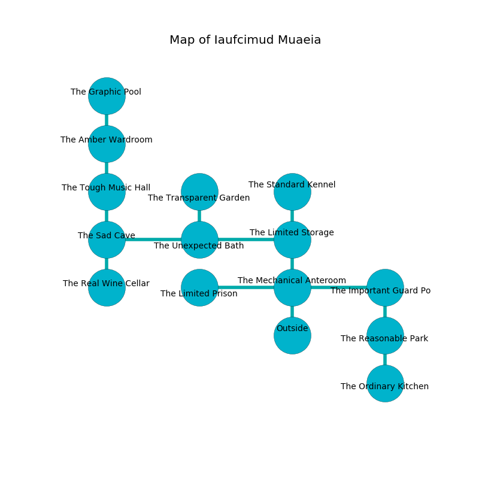

%Ruin Dogs

##Iaufcimud Muaeia
###Overview
Iaufcimud Muaeia is located on a spikey rift. Parts of it are frozen. The ruin is coming to life. It is occupied by Humans. Leigh Dangelo The Intolerant, a Kuo-Toa Monitor is here. The Humans are the soldiers of Leigh Dangelo The Intolerant. He  is founding a new religion. 

###Artifact
####Gfaimbem Dhucc

Gfaimbem Dhucc has the form of a soft spear. Power slides around it. It smells like cooked apple. It is a bright white color. When gazed upon it turns surrounding objects to ashes. 

###Locations

####the mechanical anteroom
There are a Myconid Sovereign, a Flying Sword, and a Green Hag here. The air tastes like hazelnut here. The concrete walls are covered in mold. 

There is an engraving on a monolith written in common. 

> I am lost in Iaufcimud Muaeia.
>
> Run away.
>

* To the west a small hallway leads to [the limited prison](#the-limited-prison).
* To the east a torchlit path leads to [the important guard post](#the-important-guard-post).
* To the north a flooded corridor connects to [the limited storage](#the-limited-storage).
* To the south is the entrance.

####the limited storage
The wooden walls are caving in. The floor is cluttered with ashes. There are two Veterans, a Tribal Warrior, a Commoner, and  here. The Humans are drunk. 

* There is a tome here.
* To the west a torchlit corridor connects to [the unexpected bath](#the-unexpected-bath).
* To the north a small cave connects to [the standard kennel](#the-standard-kennel).
* To the south a flooded corridor leads to [the mechanical anteroom](#the-mechanical-anteroom).

####the unexpected bath
There are a Nightmare and a Merrow here. Blue ferns are sprouting from the ceiling. The concrete walls are scratched. 

There is an engraving on the ceiling written in Humans Script. 

> O! death is poor
>
> it is never last
>
> tolerant, young, mature
>
> fate is past
>

* There is a cord here.
* To the west a narrow walkway connects to [the sad cave](#the-sad-cave).
* To the east a torchlit corridor leads to [the limited storage](#the-limited-storage).
* To the north a twisted artery opens to [the transparent garden](#the-transparent-garden).

####the sad cave
There are a Giant Wolf Spider, an Imp, a Noble, an Ettercap, a Rust Monster, and a Camel here. There is a trap here. When activated, a tripwire will fire an acid arrow. The air tastes like pistachio here. The obsidion walls are ruined. 

* To the east a narrow walkway opens to [the unexpected bath](#the-unexpected-bath).
* To the north a narrow cave connects to [the tough music hall](#the-tough-music-hall).
* To the south a torchlit gap connects to [the real wine cellar](#the-real-wine-cellar).

####the limited prison
Red moss is decaying from the walls. There are a Bandit Captain and a Priest here. The air smells like mulberry here. The glass walls are scratched. The Humans are willing to negotiate. 

* [Leigh Dangelo The Intolerant](#Leigh-Dangelo-The-Intolerant) is here.
* To the east a small hallway opens to [the mechanical anteroom](#the-mechanical-anteroom).

####the important guard post
The floor is glossy. There are a Dust Mephit, a Monodrone, a Black Dragon Wyrmling, a Merfolk, and a Killer Whale here. 

* To the west a torchlit path connects to [the mechanical anteroom](#the-mechanical-anteroom).
* To the south a hazy threshold leads to [the reasonable park](#the-reasonable-park).

####the reasonable park
The floor is smooth. 

* There is a branch here.
* To the north a hazy threshold leads to [the important guard post](#the-important-guard-post).
* To the south a dripping cavern opens to [the ordinary kitchen](#the-ordinary-kitchen).

####the tough music hall
The air smells like sweat here. Red ferns are decaying in a patch on the floor. 

* There is a drake here.
* To the north a twisted corridor connects to [the amber wardroom](#the-amber-wardroom).
* To the south a narrow cave leads to [the sad cave](#the-sad-cave).

####the standard kennel
The mirrored walls are bloodstained. 

There is an engraving on the wall written in Humans Script. 

> Oh my! dire soul
>
> meaningful, definite, whole
>
> sudden and exclusive
>
> all is whole
>

* To the south a small cave connects to [the limited storage](#the-limited-storage).

####the transparent garden
The air smells like skunk here. 

* There is a fowl here.
* There is a stocking here.
* There is a boat here.
* There is a head here.
* To the south a twisted artery connects to [the unexpected bath](#the-unexpected-bath).

####the real wine cellar
The obsidion walls are ruined. Yellow mushrooms are growing from the walls. 

* To the north a torchlit gap opens to [the sad cave](#the-sad-cave).

####the amber wardroom
The air smells like maple here. Gray mushrooms are sprouting in a patch on the floor. There are a Cult Fanatic, a Scout, and a Berserker here. The Humans are defending this room from intruders. 

* [Gfaimbem Dhucc](#Gfaimbem-Dhucc) is here.
* To the north a twisted cave connects to [the graphic pool](#the-graphic-pool).
* To the south a twisted corridor opens to [the tough music hall](#the-tough-music-hall).

####the ordinary kitchen
There are a Doppelganger, a Tribal Warrior, a Swarm of Ravens, a Giant Poisonous Snake, a Poisonous Snake, and a Specter here. The glass walls are unsettled. Red mushrooms are sprouting from the walls. 

* To the north a dripping cavern opens to [the reasonable park](#the-reasonable-park).

####the graphic pool
The floor is sticky. There are a Spectator, a Grell, and a Satyr here. 

* To the south a twisted cave connects to [the amber wardroom](#the-amber-wardroom).

