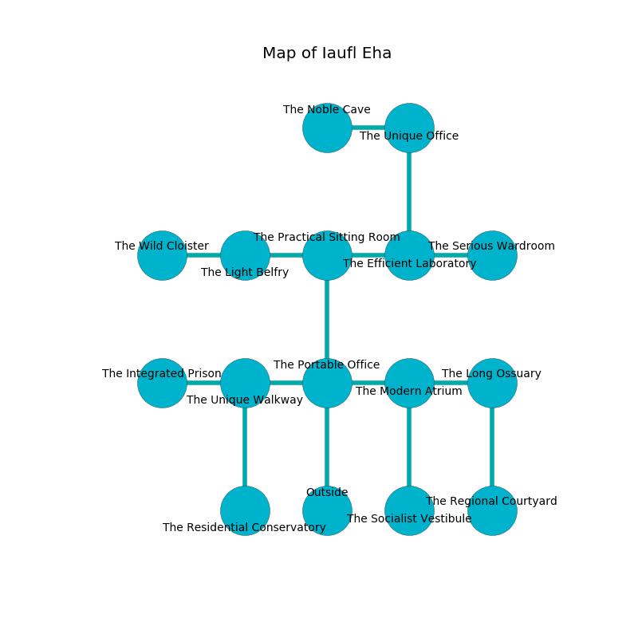

%Ruin Dogs

##Iaufl Eha
###Overview
Iaufl Eha is located under a cursed tree. Some rooms of it are cursed. The ruin is coming to life. It is occupied by Demons. Carlos Jett The Naughty, a Bulette is here. The Demons are the soldiers of Carlos Jett The Naughty. She  is founding a new religion. 

###Artifact
####Goml Iaeca

Goml Iaeca is a powerful artifact in the shape of an opaque crystal. It is a dark purple color. When thrown it grants a wish. 

###Locations

####the portable office

* There is a spear here.
* To the west a twisted cavern opens to [the unique walkway](#the-unique-walkway).
* To the east a narrow cavern connects to [the modern atrium](#the-modern-atrium).
* To the north a small artery connects to [the practical sitting Room](#the-practical-sitting-Room).
* To the south is the entrance.

####the unique walkway
Yellow razorgrass is growing in cracks in the floor. The floor is glossy. There are an Imp and a Bearded Devil here. If the Demons notice the Ruin Dogs, one of them will retreat and alert the others. 

* To the west a hazy opening opens to [the integrated prison](#the-integrated-prison).
* To the east a twisted cavern opens to [the portable office](#the-portable-office).
* To the south a torchlit cave opens to [the residential conservatory](#the-residential-conservatory).

####the practical sitting Room
The metallic walls are covered in mold. The air tastes like white rose here. 

* To the west a long gap leads to [the light belfry](#the-light-belfry).
* To the east a windy cavern connects to [the efficient laboratory](#the-efficient-laboratory).
* To the south a small artery leads to [the portable office](#the-portable-office).

####the modern atrium
Gray ferns are swaying in cracks in the floor. The concrete walls are scratched. 

* To the west a narrow cavern connects to [the portable office](#the-portable-office).
* To the east a hazy path connects to [the long ossuary](#the-long-ossuary).
* To the south a windy opening connects to [the socialist vestibule](#the-socialist-vestibule).

####the efficient laboratory
The air smells like balsam	petal here. The crystal walls are caving in. Gray razorgrass is swaying in broken urns. There are a Minotaur, a Peryton, and a Quadrone here. 

* To the west a windy cavern leads to [the practical sitting Room](#the-practical-sitting-Room).
* To the east a dark passageway leads to [the serious wardroom](#the-serious-wardroom).
* To the north a narrow passageway opens to [the unique office](#the-unique-office).

####the long ossuary
The brick walls are pristine. There are an Incubus and a Bearded Devil here. The Demons are performing a ritual. If not interrupted, the ruin dogs will be weakened. 

There is an engraving on the wall written in common. 

> I am young.
>

* To the west a hazy path leads to [the modern atrium](#the-modern-atrium).
* To the south a dripping corridor leads to [the regional courtyard](#the-regional-courtyard).

####the unique office
Gray mushrooms are growing in broken urns. The air smells like chicken coup here. The mirrored walls are covered in mold. 

* There is a shirt here.
* [Goml Iaeca](#Goml-Iaeca) is here.
* To the west a windy corridor opens to [the noble cave](#the-noble-cave).
* To the south a narrow passageway leads to [the efficient laboratory](#the-efficient-laboratory).

####the residential conservatory
The floor is sticky. 

There is an engraving on a tablet written in Demons Script. 

> I tried jumping.
>

* To the north a torchlit cave leads to [the unique walkway](#the-unique-walkway).

####the light belfry
The floor is smooth. 

There is an engraving on a tablet written in Demons Script. 

> You are corrupted
>
> ambitious and racial
>

* To the west a small cavern opens to [the wild cloister](#the-wild-cloister).
* To the east a long gap connects to [the practical sitting Room](#the-practical-sitting-Room).

####the serious wardroom

* There is a hook here.
* To the west a dark passageway connects to [the efficient laboratory](#the-efficient-laboratory).

####the socialist vestibule
The air smells like absinthe here. There are a Manticore and a Giant Boar here. The floor is flooded with seven inch deep cold water. 

* To the north a windy opening leads to [the modern atrium](#the-modern-atrium).

####the integrated prison
The floor is bloodstained. Red lichens are decaying in cracks in the floor. The concrete walls are caving in. The air smells like castoreum here. 

* [Carlos Jett The Naughty](#Carlos-Jett-The-Naughty) is here.
* To the east a hazy opening leads to [the unique walkway](#the-unique-walkway).

####the wild cloister
The mirrored walls are unsettled. Green ferns are sprouting in a patch on the floor. 

* To the east a small cavern opens to [the light belfry](#the-light-belfry).

####the regional courtyard
The floor is glossy. The metallic walls are bloodstained. The air smells like nut skin here. 

* To the north a dripping corridor connects to [the long ossuary](#the-long-ossuary).

####the noble cave
There are a Bugbear, a Black Dragon Wyrmling, a Pentadrone, and a Pixie here. The air tastes like tomato here. The floor is cluttered with ashes. There is a trap here. When activated, a magical rune will collapse a column. The metallic walls are unsettled. 

* To the east a windy corridor leads to [the unique office](#the-unique-office).

