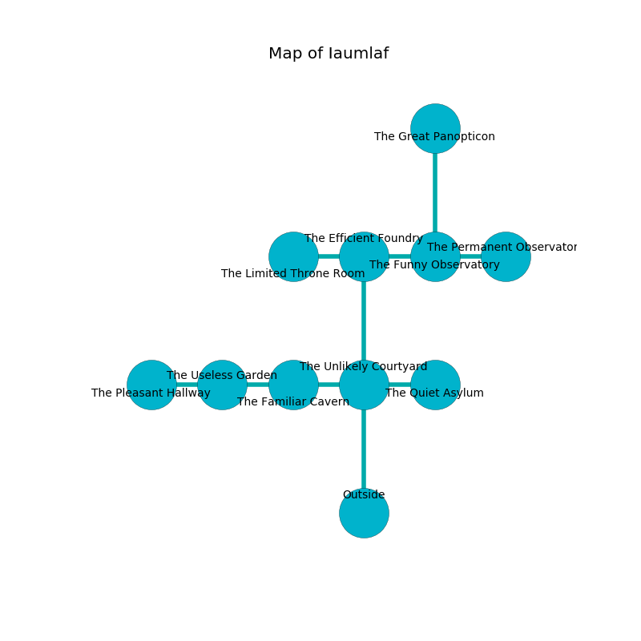

%Ruin Dogs

##Iaumlaf
###Overview
Iaumlaf is located on a poisoned mountain. Some rooms of it are flooded. A battle between raiders is happening outside. It is occupied by Duergars. Emery Dorsey The Foolish, a Hill Giant is here. The Duergars are ruled by Emery Dorsey The Foolish. He  is founding a new religion. 

###Artifact
####Faehmd

Faehmd is a powerful artifact in the shape of an opaque meteorite. It smells like clam. When rubbed it shows an image of the future. 

###Locations

####the unlikely courtyard
The floor is sticky. There are five Duergars here. One of the Duergars is working a mechanism that can flood the room. 

* To the west a torchlit opening leads to [the familiar cavern](#the-familiar-cavern).
* To the east a narrow hall leads to [the quiet asylum](#the-quiet-asylum).
* To the north a small gap opens to [the efficient foundry](#the-efficient-foundry).
* To the south is the entrance.

####the efficient foundry
There are five Duergars here. The floor is bloodstained. Red mushrooms are sprouting from the ceiling. If the Duergars notice the Ruin Dogs, one of them will retreat and alert the others. 

* To the west a hazy hall connects to [the limited throne room](#the-limited-throne-room).
* To the east a flooded pathway connects to [the funny observatory](#the-funny-observatory).
* To the south a small gap connects to [the unlikely courtyard](#the-unlikely-courtyard).

####the quiet asylum
The air smells like gasoline here. The wooden walls are ruined. The floor is smooth. 

There is an engraving on a tablet written in Duergars Script. 

> [Faehmd](#Faehmd)
>
> personal and genuine
>
> false and marine
>
> [Faehmd](#Faehmd)
>
> incongruous and childish
>
> [Faehmd](#Faehmd)
>

* To the west a narrow hall leads to [the unlikely courtyard](#the-unlikely-courtyard).

####the familiar cavern
The crystal walls are covered in mold. The floor is cluttered with ashes. There are five Duergars here. One of the Duergars is on watch, the rest are fighting amongst themselves. 

* There is a brake here.
* To the west a torchlit passageway connects to [the useless garden](#the-useless-garden).
* To the east a torchlit opening leads to [the unlikely courtyard](#the-unlikely-courtyard).

####the limited throne room
The floor is cluttered with bones. The glass walls are bloodstained. The air smells like bergamot here. Yellow mushrooms are growing in a patch on the floor. 

* There is a brush here.
* To the east a hazy hall opens to [the efficient foundry](#the-efficient-foundry).

####the funny observatory
The floor is glossy. There is a Triceratops here. 

* There is a wand here.
* To the west a flooded pathway connects to [the efficient foundry](#the-efficient-foundry).
* To the east a flooded corridor connects to [the permanent observatory](#the-permanent-observatory).
* To the north a hazy threshold opens to [the great panopticon](#the-great-panopticon).

####the great panopticon
Blue lichens are decaying in broken urns. The floor is glossy. 

* [Emery Dorsey The Foolish](#Emery-Dorsey-The-Foolish) is here.
* To the south a hazy threshold opens to [the funny observatory](#the-funny-observatory).

####the useless garden
There are a Grell, an Allosaurus, a Swarm of Ravens, and a Scout here. The floor is cluttered with ashes. Yellow razorgrass is decaying in broken urns. 

There is an engraving on the wall written in common. 

> I could not try cowering.
>

* [Faehmd](#Faehmd) is here.
* To the west a dripping threshold connects to [the pleasant hallway](#the-pleasant-hallway).
* To the east a torchlit passageway leads to [the familiar cavern](#the-familiar-cavern).

####the permanent observatory
There are a Mud Mephit, a Helmed Horror, a Shadow, and a Giant Poisonous Snake here. 

* To the west a flooded corridor leads to [the funny observatory](#the-funny-observatory).

####the pleasant hallway
There are a Wolf, a Spined Devil, and a Young Remorhaz here. The floor is flooded with one inch deep hot water. Gray razorgrass is swaying in a patch on the floor. 

There is an engraving on the ceiling written in Duergars Script. 

> Treasure here.
>

* There is a gold coin here.
* To the east a dripping threshold leads to [the useless garden](#the-useless-garden).

