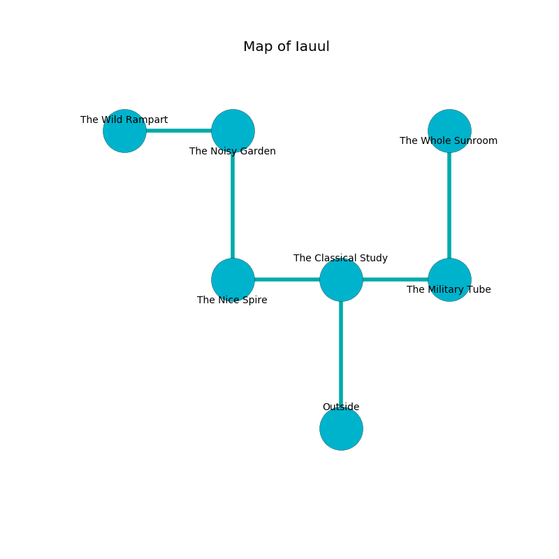

%Ruin Dogs

##Iauul
###Overview
Iauul is located in a flooded city. Some rooms of it are corrupted. A solar eclipse is happening outside. It is occupied by Drows. Celestine Redding The Belligerent, an Imp is here. The Drows are the minions of Celestine Redding The Belligerent. She  is trying to destroy [The Funny Emphasis](#The-Funny-Emphasis). 

###Artifact
####The Funny Emphasis

The Funny Emphasis looks like a cold sphere. It smells like tobacco. It is a medium white color. When held it grants a wish. 

###Locations

####the classical study
The crystal walls are pristine. White ferns are sprouting in a patch on the floor. 

There is an engraving on the wall written in common. 

> An island is a remedy
>
> important, rough, industrial
>
> small and balanced
>
> you must never be crystalized
>

* [Celestine Redding The Belligerent](#Celestine-Redding-The-Belligerent) is here.
* To the west a torchlit passageway opens to [the nice spire](#the-nice-spire).
* To the east a dark gap leads to [the military tube](#the-military-tube).
* To the south is the entrance.

####the nice spire
There is a trap here. When activated, a magical sound detector will fire a scything blade. The floor is bloodstained. 

* To the east a torchlit passageway opens to [the classical study](#the-classical-study).
* To the north a windy cavern leads to [the noisy garden](#the-noisy-garden).

####the noisy garden
Gray moss is growing from the walls. There are eight Drows here. The air smells like hyssop here. The floor is flooded with two inch deep scalding water. The Drows are willing to negotiate. 

There is an engraving on the wall written in common. 

> O dire soul
>
> yet never viable
>
> spontaneous, modern, whole
>
> fate is reliable
>

* There is a horse here.
* [The Funny Emphasis](#The-Funny-Emphasis) is here.
* To the west a flooded path leads to [the wild rampart](#the-wild-rampart).
* To the south a windy cavern opens to [the nice spire](#the-nice-spire).

####the military tube
The floor is smooth. The glass walls are bloodstained. 

* There is a treasure here.
* To the west a dark gap opens to [the classical study](#the-classical-study).
* To the north a windy path connects to [the whole sunroom](#the-whole-sunroom).

####the whole sunroom
The glass walls are bloodstained. There is a trap here. When activated, a magical sound detector will swing a tripping chain. Red mushrooms are swaying from the ceiling. There are eight Drows here. The floor is glossy. The Drows are meditating. 

* To the south a windy path connects to [the military tube](#the-military-tube).

####the wild rampart
The wooden walls are caving in. Yellow moss is decaying from the ceiling. 

There is an engraving on a monolith written in common. 

> [The Funny Emphasis](#The-Funny-Emphasis)
>
> miserable and attractive
>
> [The Funny Emphasis](#The-Funny-Emphasis)
>
> responsible, satisfactory, sexual
>
> yet constant
>
> false, distant, central
>
> always revolutionary
>
> external, brown, early
>
> always good
>
> latest and difficult
>
> national, critical, low
>
> offensive and dry
>
> objective, gregarious, sharp
>
> A scissors is a catalogue
>
> ever productive
>
> [The Funny Emphasis](#The-Funny-Emphasis)
>

* To the east a flooded path connects to [the noisy garden](#the-noisy-garden).

