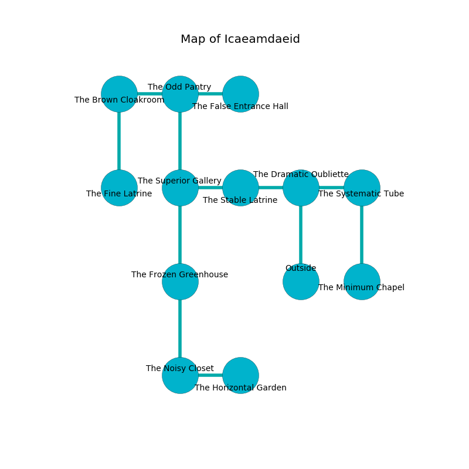

%Ruin Dogs

##Icaeamdaeid
###Overview
Icaeamdaeid is located on a broken city. Some areas of Icaeamdaeid are cursed. A massive storm is happening outside. It is occupied by Goblins. Cheryle Desimone The Superficial, a Yuan-Ti Malison is here. The Goblins are the minions of Cheryle Desimone The Superficial. She  is trying to steal [Ioidacd Edduaemdbamd](#Ioidacd-Edduaemdbamd). 

###Artifact
####Ioidacd Edduaemdbamd

Ioidacd Edduaemdbamd has the form of a smooth monument. Cacophony bends near it. When thrown it curses all nearby. 

###Locations

####the dramatic oubliette
The crystal walls are scratched. The floor is smooth. There are a Tiger and a Gibbering Mouther here. 

There is an engraving on the wall written in Goblins Script. 

> Poor me! my life is woe
>
> it is never possible
>
> polite and low
>
> sadness is impossible
>

* There is a bucket here.
* To the west a hazy pathway opens to [the stable latrine](#the-stable-latrine).
* To the east a small walkway leads to [the systematic tube](#the-systematic-tube).
* To the south is the entrance.

####the stable latrine
The floor is sticky. 

* To the west a dark pathway opens to [the superior gallery](#the-superior-gallery).
* To the east a hazy pathway opens to [the dramatic oubliette](#the-dramatic-oubliette).

####the systematic tube
The floor is cluttered with rocks. The wooden walls are unsettled. The air tastes like custard here. 

* To the west a small walkway opens to [the dramatic oubliette](#the-dramatic-oubliette).
* To the south a torchlit pathway connects to [the minimum chapel](#the-minimum-chapel).

####the superior gallery
There are a Duergar, a Shrieker, a Kuo-Toa, a Giant Boar, a Twig Blight, and a Cultist here. The air smells like autumn here. 

* To the east a dark pathway leads to [the stable latrine](#the-stable-latrine).
* To the north a twisted corridor connects to [the odd pantry](#the-odd-pantry).
* To the south a dark cave leads to [the frozen greenhouse](#the-frozen-greenhouse).

####the frozen greenhouse
White razorgrass is sprouting in a patch on the floor. The concrete walls are unsettled. There are a Goblin, a Hobgoblin, and a Hobgoblin Captain here. The floor is cluttered with ashes. One of the Goblins is pointing a ballista at the entrance. 

* To the north a dark cave leads to [the superior gallery](#the-superior-gallery).
* To the south a small path connects to [the noisy closet](#the-noisy-closet).

####the noisy closet
The air smells like tansy here. The floor is smooth. There is a trap here. When activated, a tripwire will fire a scything blade. There are an Ape, a Vine Blight, and a Green Dragon Wyrmling here. The stone walls are scratched. 

* [Ioidacd Edduaemdbamd](#Ioidacd-Edduaemdbamd) is here.
* To the east a long passageway opens to [the horizontal garden](#the-horizontal-garden).
* To the north a small path opens to [the frozen greenhouse](#the-frozen-greenhouse).

####the odd pantry
The floor is sticky. 

* To the west a dark opening opens to [the brown cloakroom](#the-brown-cloakroom).
* To the east a long pathway leads to [the false entrance hall](#the-false-entrance-hall).
* To the south a twisted corridor leads to [the superior gallery](#the-superior-gallery).

####the brown cloakroom
The air tastes like plum here. The mirrored walls are unsettled. 

* To the east a dark opening opens to [the odd pantry](#the-odd-pantry).
* To the south a dark threshold connects to [the fine latrine](#the-fine-latrine).

####the fine latrine
Gray razorgrass is growing from the ceiling. The air tastes like ozone here. The brick walls are bloodstained. The floor is cluttered with ashes. There is a Werewolf here. 

* To the north a dark threshold opens to [the brown cloakroom](#the-brown-cloakroom).

####the false entrance hall
There are two Goblins and five Hobgoblins here. Red moss is swaying in a patch on the floor. The Goblins are feasting. 

* [Cheryle Desimone The Superficial](#Cheryle-Desimone-The-Superficial) is here.
* To the west a long pathway leads to [the odd pantry](#the-odd-pantry).

####the minimum chapel
There are a Gnoll Pack Lord and a Pegasus here. White razorgrass is swaying from the walls. The stone walls are covered in mold. The air tastes like roast beef here. 

There is an engraving on the ceiling written in common. 

> I am lovely.
>

* There is a kettle here.
* To the north a torchlit pathway connects to [the systematic tube](#the-systematic-tube).

####the horizontal garden
The floor is cluttered with bones. There are a Scarecrow and a Priest here. 

* There is a spirit here.
* To the west a long passageway opens to [the noisy closet](#the-noisy-closet).

