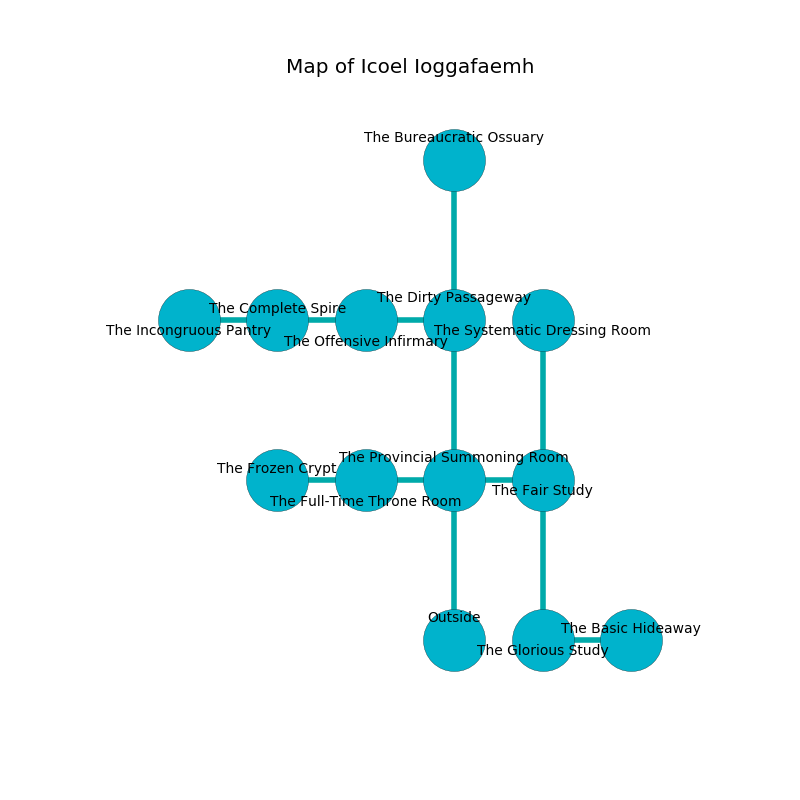

%Ruin Dogs

##Icoel Ioggafaemh
###Overview
Icoel Ioggafaemh is constructed on a ruined city. Regions of it are cursed. The ruin is larger on the inside than the outside. It is occupied by Githyanki. Shawnee Napier The Timid, a Cambion is here. The Githyanki are the minions of Shawnee Napier The Timid. She  is trying to exploit [Idacaebam](#Idacaebam). 

###Artifact
####Idacaebam

Idacaebam has the form of a mushy amulet. It is a dark gray color. It smells like herbs. When carried it ignites its surrroundings. 

###Locations

####the provincial summoning room
The air smells like cornmeal here. The floor is flooded with five inch deep lukewarm water. Red razorgrass is sprouting from the walls. 

There is an engraving on a tablet written in common. 

> Oh my! sorry god
>
> but never odd
>
> lazy, expected, insufficient
>
> nothing is sufficient
>

* To the west a windy threshold leads to [the full-time throne room](#the-full-time-throne-room).
* To the east a hazy passageway connects to [the fair study](#the-fair-study).
* To the north a dark gap connects to [the dirty passageway](#the-dirty-passageway).
* To the south is the entrance.

####the fair study
The brick walls are caving in. Red razorgrass is decaying in broken urns. The floor is sticky. 

* To the west a hazy passageway connects to [the provincial summoning room](#the-provincial-summoning-room).
* To the north a flooded passageway connects to [the systematic dressing room](#the-systematic-dressing-room).
* To the south a long hall opens to [the glorious study](#the-glorious-study).

####the dirty passageway
The floor is glossy. The air tastes like frankincense here. 

* To the west a twisted threshold opens to [the offensive infirmary](#the-offensive-infirmary).
* To the north a long passageway connects to [the bureaucratic ossuary](#the-bureaucratic-ossuary).
* To the south a dark gap connects to [the provincial summoning room](#the-provincial-summoning-room).

####the full-time throne room
The floor is glossy. There are a Veteran and a Grell here. 

* To the west a hazy passageway leads to [the frozen crypt](#the-frozen-crypt).
* To the east a windy threshold opens to [the provincial summoning room](#the-provincial-summoning-room).

####the offensive infirmary

* To the west a windy gap opens to [the complete spire](#the-complete-spire).
* To the east a twisted threshold opens to [the dirty passageway](#the-dirty-passageway).

####the systematic dressing room
The mirrored walls are unsettled. 

* There is a key here.
* To the south a flooded passageway opens to [the fair study](#the-fair-study).

####the complete spire
There is a trap here. When activated, a pressure plate will open a trapdoor in the floor. The air smells like cognac here. There are two Githyanki Warriors here. The Githyanki are willing to negotiate. 

* There is a drake here.
* To the west a torchlit gap opens to [the incongruous pantry](#the-incongruous-pantry).
* To the east a windy gap opens to [the offensive infirmary](#the-offensive-infirmary).

####the glorious study
The air tastes like lavender here. The floor is cluttered with ashes. 

* There is a treasure here.
* [Idacaebam](#Idacaebam) is here.
* [Shawnee Napier The Timid](#Shawnee-Napier-The-Timid) is here.
* To the east a dripping hall connects to [the basic hideaway](#the-basic-hideaway).
* To the north a long hall connects to [the fair study](#the-fair-study).

####the frozen crypt
There are a Swarm of Quippers, a Giant Scorpion, and a Mimic here. The obsidion walls are ruined. Red ferns are growing from the walls. The floor is bloodstained. 

* To the east a hazy passageway connects to [the full-time throne room](#the-full-time-throne-room).

####the bureaucratic ossuary
Gray mushrooms are growing in cracks in the floor. There is a trap here. When activated, a pressure plate will collapse a column. There are a Minotaur, an Eagle, and an Incubus here. The floor is sticky. 

* To the south a long passageway connects to [the dirty passageway](#the-dirty-passageway).

####the incongruous pantry
The air smells like gasoline here. The metallic walls are bloodstained. The floor is smooth. There are two Githyanki Warriors here. One of the Githyanki is on watch, the rest are caring for babies. 

* To the east a torchlit gap leads to [the complete spire](#the-complete-spire).

####the basic hideaway
Green mushrooms are sprouting in a patch on the floor. There is a trap here. When activated, a magical sound detector will open a large pit in the floor. The crystal walls are bloodstained. 

* To the west a dripping hall opens to [the glorious study](#the-glorious-study).

