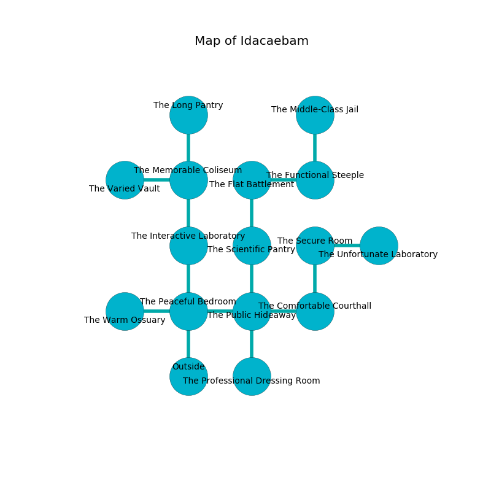

%Ruin Dogs

##Idacaebam
###Overview
Idacaebam is constructed on an obsidion city. Parts of Idacaebam are frozen. The ruin is sinking into the earth. It is occupied by Sprites. Jenniffer Sterling The Stingy, a Fire Giant is here. The Sprites are the soldiers of Jenniffer Sterling The Stingy. She  is trying to find [The Intellectual Triangle](#The-Intellectual-Triangle). 

###Artifact
####The Intellectual Triangle

The Intellectual Triangle has the form of a glassy orb. Water glows away from it. It is a light purple color. When rubbed it changes probabilities. 

###Locations

####the peaceful bedroom
The metallic walls are bloodstained. The floor is flooded with nine inch deep hot water. 

* There is a triptych here.
* To the west a windy path leads to [the warm ossuary](#the-warm-ossuary).
* To the east a hazy gap connects to [the public hideaway](#the-public-hideaway).
* To the north a narrow cave opens to [the interactive laboratory](#the-interactive-laboratory).
* To the south is the entrance.

####the public hideaway
Gray ferns are decaying from the ceiling. 

* To the west a hazy gap leads to [the peaceful bedroom](#the-peaceful-bedroom).
* To the east a twisted opening opens to [the comfortable courthall](#the-comfortable-courthall).
* To the north a hazy threshold opens to [the scientific pantry](#the-scientific-pantry).
* To the south a small pathway opens to [the professional dressing room](#the-professional-dressing-room).

####the scientific pantry
The air tastes like calamus here. Gray ferns are sprouting in cracks in the floor. 

* To the north a narrow opening leads to [the flat battlement](#the-flat-battlement).
* To the south a hazy threshold leads to [the public hideaway](#the-public-hideaway).

####the professional dressing room
There is a trap here. When activated, a magical proximity detector will launch a swinging block. 

* To the north a small pathway leads to [the public hideaway](#the-public-hideaway).

####the comfortable courthall

* To the west a twisted opening opens to [the public hideaway](#the-public-hideaway).
* To the north a twisted cave leads to [the secure room](#the-secure-room).

####the interactive laboratory
There are forty Sprites here. The stone walls are ruined. The Sprites are performing a ritual. If not interrupted, the Sprites will become more powerful. 

* To the north a flooded pathway opens to [the memorable coliseum](#the-memorable-coliseum).
* To the south a narrow cave opens to [the peaceful bedroom](#the-peaceful-bedroom).

####the flat battlement
The metallic walls are scratched. The air tastes like hawthorn here. Green ferns are decaying from the walls. 

* There is a box here.
* To the east a long pathway opens to [the functional steeple](#the-functional-steeple).
* To the south a narrow opening connects to [the scientific pantry](#the-scientific-pantry).

####the secure room
The air smells like flowers here. White razorgrass is decaying from the walls. The concrete walls are caving in. The floor is glossy. 

* To the east a small corridor leads to [the unfortunate laboratory](#the-unfortunate-laboratory).
* To the south a twisted cave leads to [the comfortable courthall](#the-comfortable-courthall).

####the warm ossuary
The floor is glossy. The wooden walls are covered in mold. The air tastes like cocoa here. There are a Giant Vulture, a Nightmare, a Hippogriff, a Bearded Devil, an Azer, a Quadrone, and a Flying Snake here. 

* To the east a windy path connects to [the peaceful bedroom](#the-peaceful-bedroom).

####the memorable coliseum
The floor is bloodstained. The air tastes like spearmint here. 

There is an engraving on a monolith written in common. 

> Run away.
>

* There is a leprechaun here.
* To the west a narrow artery connects to [the varied vault](#the-varied-vault).
* To the north a torchlit threshold leads to [the long pantry](#the-long-pantry).
* To the south a flooded pathway connects to [the interactive laboratory](#the-interactive-laboratory).

####the varied vault
The air tastes like egg nog here. There are a Grick Alpha, a Black Bear, and a Green Hag here. The obsidion walls are pristine. 

There is an engraving on the ceiling written in Sprites Script. 

> I am lost in Idacaebam.
>

* [Jenniffer Sterling The Stingy](#Jenniffer-Sterling-The-Stingy) is here.
* To the east a narrow artery opens to [the memorable coliseum](#the-memorable-coliseum).

####the long pantry
There are a Lizard King, a Dust Mephit, a Shadow, a Panther, three Giant Centipedes, a Hunter Shark, a Blue Dragon Wyrmling, a Mastiff,  here. The brick walls are pristine. 

There is an engraving on the wall written in Sprites Script. 

> I discovered [The Intellectual Triangle](#The-Intellectual-Triangle).
>

* To the south a torchlit threshold connects to [the memorable coliseum](#the-memorable-coliseum).

####the functional steeple
The brick walls are ruined. Red lichens are sprouting from the ceiling. The floor is bloodstained. 

* [The Intellectual Triangle](#The-Intellectual-Triangle) is here.
* To the west a long pathway opens to [the flat battlement](#the-flat-battlement).
* To the north a windy hall leads to [the middle-class jail](#the-middle-class-jail).

####the unfortunate laboratory
The air tastes like grapefruit here. There are forty Sprites here. Yellow razorgrass is decaying in a patch on the floor. The floor is cluttered with bones. The Sprites are willing to negotiate. 

* There is a cart here.
* There is a diamond here.
* To the west a small corridor connects to [the secure room](#the-secure-room).

####the middle-class jail
White ferns are growing in cracks in the floor. There are forty Sprites here. The air smells like black currant here. The floor is flooded with seven inch deep cool water. The Sprites are berserk with rage. 

* To the south a windy hall connects to [the functional steeple](#the-functional-steeple).

