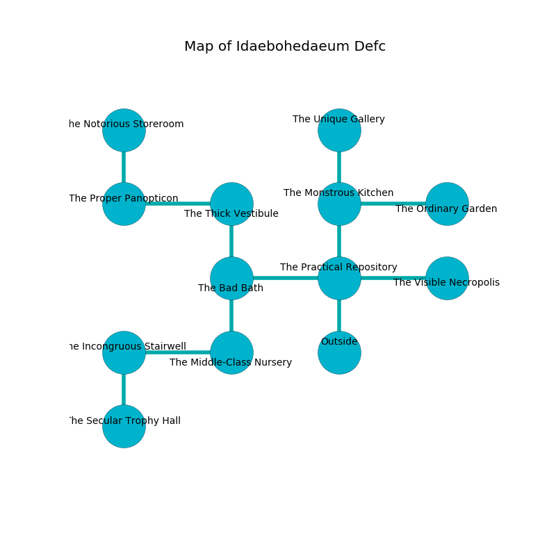

%Ruin Dogs

##Idaebohedaeum Defc
###Overview
Idaebohedaeum Defc is located in a cursed rift. Parts of Idaebohedaeum Defc are inaccessible. A battle between raiders is happening outside. It is occupied by Kuo-Toa. Shawn Hefner The Nasty, a Mind Flayer Arcanist is here. The Kuo-Toa are the soldiers of Shawn Hefner The Nasty. He  is founding a new religion. 

###Artifact
####Dfucaii Fagoieh

Dfucaii Fagoieh looks like a mushy figurine. When picked up it glows with an eerie light. 

###Locations

####the practical repository
There are a Fire Elemental and an Old Faerie Dragon here. The air smells like brown sugar here. The floor is smooth. Gray lichens are growing from the walls. 

* To the west a flooded path connects to [the bad bath](#the-bad-bath).
* To the east a torchlit passageway leads to [the visible necropolis](#the-visible-necropolis).
* To the north a flooded passageway connects to [the monstrous kitchen](#the-monstrous-kitchen).
* To the south is the entrance.

####the bad bath
There are four Kuo-Toa Whips, a Kuo-Toa Monitor, a Kuo-Toa,  here. The air tastes like balsam	petal here. Blue moss is sprouting in broken urns. There is a trap here. When activated, a magical rune will flood the room with water. One of the Kuo-Toa is working a mechanism that can engulf the room in a fiery blaze. 

There is an engraving on a monolith written in common. 

> Hide here.
>

* To the east a flooded path opens to [the practical repository](#the-practical-repository).
* To the north a twisted corridor opens to [the thick vestibule](#the-thick-vestibule).
* To the south a twisted path connects to [the middle-class nursery](#the-middle-class-nursery).

####the middle-class nursery
The obsidion walls are covered in mold. The floor is flooded with four inch deep cold water. The air tastes like thyme here. Gray ferns are decaying from the ceiling. 

* There is a dress here.
* To the west a torchlit artery connects to [the incongruous stairwell](#the-incongruous-stairwell).
* To the north a twisted path leads to [the bad bath](#the-bad-bath).

####the monstrous kitchen
The floor is cluttered with debris. The concrete walls are pristine. Blue mushrooms are growing from the ceiling. 

* [Dfucaii Fagoieh](#Dfucaii-Fagoieh) is here.
* [Shawn Hefner The Nasty](#Shawn-Hefner-The-Nasty) is here.
* To the east a torchlit passageway connects to [the ordinary garden](#the-ordinary-garden).
* To the north a windy path opens to [the unique gallery](#the-unique-gallery).
* To the south a flooded passageway connects to [the practical repository](#the-practical-repository).

####the thick vestibule
There are a Kuo-Toa Whip, a Kuo-Toa Archpriest, and a Kuo-Toa here. The concrete walls are scratched. If the Kuo-Toa notice the Ruin Dogs, one of them will retreat and alert [Shawn Hefner](#Shawn-Hefner). 

There is an engraving on a stone written in Kuo-Toa Script. 

> I found [Dfucaii Fagoieh](#Dfucaii-Fagoieh).
>
> Run away.
>

* There is a stick here.
* To the west a dripping pathway leads to [the proper panopticon](#the-proper-panopticon).
* To the south a twisted corridor leads to [the bad bath](#the-bad-bath).

####the visible necropolis
The air smells like civet here. There are two Kuo-Toa Archpriests and a Kuo-Toa here. The Kuo-Toa are performing a ritual. If not interrupted, a powerful monster will be summoned. 

* To the west a torchlit passageway opens to [the practical repository](#the-practical-repository).

####the incongruous stairwell
The air tastes like roasted almond here. Yellow ferns are sprouting from the walls. The obsidion walls are unsettled. The floor is glossy. 

* To the east a torchlit artery connects to [the middle-class nursery](#the-middle-class-nursery).
* To the south a narrow cave leads to [the secular trophy hall](#the-secular-trophy-hall).

####the ordinary garden
The floor is cluttered with broken glass. The mirrored walls are ruined. The air tastes like ripe banana here. Red mushrooms are sprouting from the ceiling. There are two Kuo-Toa Archpriests here. One of the Kuo-Toa is on watch, the rest are caring for babies. 

* To the west a torchlit passageway connects to [the monstrous kitchen](#the-monstrous-kitchen).

####the proper panopticon
Blue lichens are sprouting in broken urns. The air smells like feces here. There are a Cockatrice, a Ghoul, a Spectator, and a Chimera here. The floor is flooded with one inch deep scalding water. 

There is an engraving on the wall written in common. 

> A girl is a penny
>
> but wild
>
> but never eligible
>
> [Dfucaii Fagoieh](#Dfucaii-Fagoieh)
>
> liberal, proportional, dirty
>
> but never ambiguous
>
> A shirt is a midnight
>
> loud, middle-class, emotional
>
> social, premature, free
>
> A girl is a penny
>

* There is a jewel here.
* To the east a dripping pathway leads to [the thick vestibule](#the-thick-vestibule).
* To the north a small path opens to [the notorious storeroom](#the-notorious-storeroom).

####the secular trophy hall
The floor is smooth. 

* To the north a narrow cave leads to [the incongruous stairwell](#the-incongruous-stairwell).

####the notorious storeroom
The wooden walls are scratched. White mushrooms are sprouting in a patch on the floor. The air smells like ham here. The floor is glossy. 

* To the south a small path connects to [the proper panopticon](#the-proper-panopticon).

####the unique gallery
The obsidion walls are covered in mold. The air smells like cornmeal here. Blue ferns are sprouting in broken urns. 

* There is a wight here.
* To the south a windy path opens to [the monstrous kitchen](#the-monstrous-kitchen).

