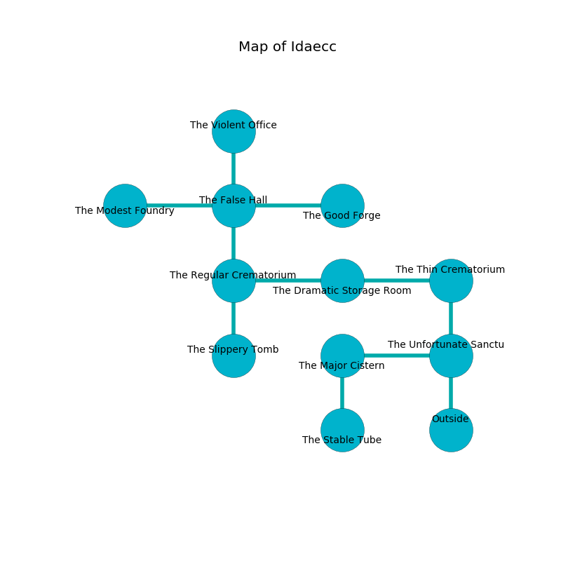

%Ruin Dogs

##Idaecc
###Overview
Idaecc is located on a flooded mountain. Parts of Idaecc are cursed. A windstorm is happening outside. It is occupied by Sahuagin. William Shively The Obstinate, a Hill Giant is here. The Sahuagin are the minions of William Shively The Obstinate. She  is founding a new religion. 

###Artifact
####Deid

Deid has the form of a glassy monument. It is a sickly purple color. It smells like sand. Power glows near it. When cradled it curses all nearby. 

###Locations

####the unfortunate sanctum
The brick walls are caving in. The floor is bloodstained. 

There is an engraving on the floor written in common. 

> Go away.
>

* [William Shively The Obstinate](#William-Shively-The-Obstinate) is here.
* To the west a dark walkway opens to [the major cistern](#the-major-cistern).
* To the north a windy path opens to [the thin crematorium](#the-thin-crematorium).
* To the south is the entrance.

####the thin crematorium
The obsidion walls are covered in mold. 

* To the west a twisted cave opens to [the dramatic storage room](#the-dramatic-storage-room).
* To the south a windy path opens to [the unfortunate sanctum](#the-unfortunate-sanctum).

####the dramatic storage room
There are a Centaur and a Chuul here. The air tastes like unripe banana here. The floor is flooded with nine inch deep lukewarm water. The wooden walls are covered in mold. 

* To the west a narrow cave leads to [the regular crematorium](#the-regular-crematorium).
* To the east a twisted cave opens to [the thin crematorium](#the-thin-crematorium).

####the regular crematorium
The floor is smooth. The metallic walls are pristine. The air tastes like herbs here. There are a Quaggoth Thonot and a Gladiator here. 

* [Deid](#Deid) is here.
* To the east a narrow cave leads to [the dramatic storage room](#the-dramatic-storage-room).
* To the north a small hallway connects to [the false hall](#the-false-hall).
* To the south a long pathway opens to [the slippery tomb](#the-slippery-tomb).

####the false hall
The floor is cluttered with bones. Red mushrooms are growing from the walls. 

There is an engraving on a tablet written in common. 

> A trap ahead.
>

* To the west a dripping threshold leads to [the modest foundry](#the-modest-foundry).
* To the east a torchlit passageway connects to [the good forge](#the-good-forge).
* To the north a windy path opens to [the violent office](#the-violent-office).
* To the south a small hallway connects to [the regular crematorium](#the-regular-crematorium).

####the major cistern
The air tastes like banana peel here. 

* To the east a dark walkway opens to [the unfortunate sanctum](#the-unfortunate-sanctum).
* To the south a dripping walkway opens to [the stable tube](#the-stable-tube).

####the good forge
The air tastes like spruce here. There are two Sahuagin and a Sahuagin Baron here. The Sahuagin are defending this room from intruders. 

* To the west a torchlit passageway leads to [the false hall](#the-false-hall).

####the violent office
The crystal walls are unsettled. The air smells like raisin here. There are a Giant Eagle and a Young Remorhaz here. 

* To the south a windy path leads to [the false hall](#the-false-hall).

####the stable tube
There are two Sahuagin Barons here. Green mushrooms are decaying in broken urns. The wooden walls are bloodstained. The floor is smooth. The air tastes like cashew here. The Sahuagin are willing to fight to the death. 

There is an engraving on the ceiling written in common. 

> O meak soul
>
> dynamic, aloof, whole
>
> logical and surprising
>
> nothing is whole
>

* There is a casket here.
* To the north a dripping walkway leads to [the major cistern](#the-major-cistern).

####the modest foundry
There are a Drow, a Merrow, a Merfolk, a Mummy, a Rust Monster, a Homunculus, a Half-Ogre, a Specter, and a Baboon here. Blue moss is swaying in a patch on the floor. The mirrored walls are unsettled. 

* To the east a dripping threshold opens to [the false hall](#the-false-hall).

####the slippery tomb
White ferns are decaying from the ceiling. The air smells like cedar here. There are an Earth Elemental and a Gelatinous Cube here. 

* To the north a long pathway leads to [the regular crematorium](#the-regular-crematorium).

