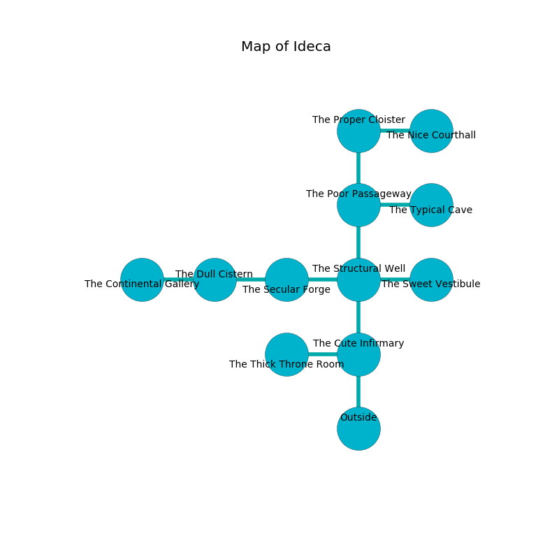

%Ruin Dogs

##Ideca
###Overview
Ideca is constructed on a broken rift. Regions of it are flooded. The ruin is flooding. It is occupied by Pixies. Melvin Frederick The Aloof, a Stone Giant is here. The Pixies have been charmed by Melvin Frederick The Aloof. He  is trying to discover [Mefuaid Haebaededaeum](#Mefuaid-Haebaededaeum). 

###Artifact
####Mefuaid Haebaededaeum

Mefuaid Haebaededaeum has the form of a wet monument. Power shifts away from it. When eaten it turns surrounding objects to ashes. 

###Locations

####the cute infirmary
There are a Bugbear, a Drow Mage, and a Revenant here. Green ferns are decaying in a patch on the floor. The floor is cluttered with broken glass. 

There is an engraving on a tablet written in Pixies Script. 

> They are dying
>
> fair, valuable, bare
>
> All of us are sorrowful
>
> privileged and compatible
>
> fine, color-blind, academic
>
> They are damned
>
> primary and sensitive
>

* There is a dress here.
* [Melvin Frederick The Aloof](#Melvin-Frederick-The-Aloof) is here.
* To the west a narrow path connects to [the thick throne room](#the-thick-throne-room).
* To the north a torchlit passageway leads to [the structural well](#the-structural-well).
* To the south is the entrance.

####the structural well
There are a Grick Alpha, a Will-O’-Wisp, a Giant Bat, and a Shrieker here. The wooden walls are unsettled. 

* To the west a windy hallway leads to [the secular forge](#the-secular-forge).
* To the east a torchlit hall connects to [the sweet vestibule](#the-sweet-vestibule).
* To the north a dark hall leads to [the poor passageway](#the-poor-passageway).
* To the south a torchlit passageway opens to [the cute infirmary](#the-cute-infirmary).

####the secular forge
There are thirty two Pixies here. The wooden walls are unsettled. If the Pixies notice the Ruin Dogs, one of them will retreat and alert the others. 

There is an engraving on a tablet written in common. 

> I thought about giving up.
>

* There is a hat here.
* There is a shirt here.
* To the west a dark artery opens to [the dull cistern](#the-dull-cistern).
* To the east a windy hallway leads to [the structural well](#the-structural-well).

####the poor passageway
There are thirty two Pixies here. The glass walls are caving in. The air smells like sausage here. The floor is smooth. The Pixies are defending this room from intruders. 

* There is a sheep here.
* To the east a hazy pathway connects to [the typical cave](#the-typical-cave).
* To the north a dripping walkway opens to [the proper cloister](#the-proper-cloister).
* To the south a dark hall opens to [the structural well](#the-structural-well).

####the proper cloister
The air tastes like neroli here. White moss is swaying from the walls. The glass walls are bloodstained. 

* To the east a long path connects to [the nice courthall](#the-nice-courthall).
* To the south a dripping walkway connects to [the poor passageway](#the-poor-passageway).

####the dull cistern
Yellow ferns are growing from the walls. The obsidion walls are ruined. There are thirty two Pixies here. The Pixies are performing a ritual. If not interrupted, [Melvin Frederick](#Melvin-Frederick) will be magically alarmed. 

* [Mefuaid Haebaededaeum](#Mefuaid-Haebaededaeum) is here.
* To the west a dark hallway connects to [the continental gallery](#the-continental-gallery).
* To the east a dark artery leads to [the secular forge](#the-secular-forge).

####the typical cave
The air tastes like honeysuckle here. There are thirty two Pixies here. Red moss is swaying in cracks in the floor. The brick walls are scratched. If the Pixies notice the Ruin Dogs, one of them will retreat and alert [Melvin Frederick](#Melvin-Frederick). 

* There is a branch here.
* To the west a hazy pathway connects to [the poor passageway](#the-poor-passageway).

####the sweet vestibule
Green ferns are growing from the walls. There are two Death Dogs, a Giant Poisonous Snake, a Young White Dragon, and  here. The air tastes like vanilla here. 

* To the west a torchlit hall leads to [the structural well](#the-structural-well).

####the nice courthall
The mirrored walls are ruined. 

* To the west a long path connects to [the proper cloister](#the-proper-cloister).

####the thick throne room
The floor is smooth. There are a Swarm of Rats and a Young Bronze Dragon here. The air tastes like cinnamon here. 

* To the east a narrow path connects to [the cute infirmary](#the-cute-infirmary).

####the continental gallery
There are a Pteranodon, a Half-Red Dragon Veteran, a Crawling Claw, a Goblin Boss, a Needle Blight, a Grell, and a Fire Snake here. The concrete walls are bloodstained. 

* To the east a dark hallway connects to [the dull cistern](#the-dull-cistern).

