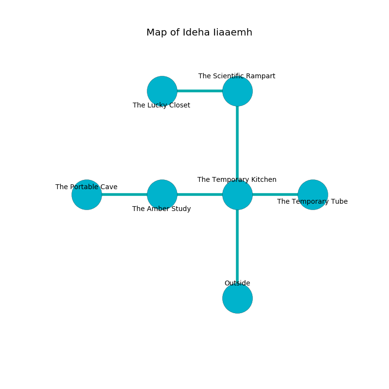

%Ruin Dogs

##Ideha Iiaaemh
###Overview
Ideha Iiaaemh is located in a flooded mountain. Parts of Ideha Iiaaemh are cursed. The ruin is burning. It is occupied by Cyclopses. Anjelica Wendt The Stingy, a Drow Priestess of Lolth is here. The Cyclopses are battling Anjelica Wendt The Stingy. She  is founding a new religion. 

###Artifact
####The Plain Nose

The Plain Nose looks like a sharp blade. It is a pale orange color. It smells like cocoa. When thrown it become energized with a powerful vibration. 

###Locations

####the temporary kitchen
The air tastes like marjoram here. 

There is an engraving on the wall written in Cyclopses Script. 

> Do not try leaving.
>

* To the west a dripping path connects to [the amber study](#the-amber-study).
* To the east a long gap connects to [the temporary tube](#the-temporary-tube).
* To the north a twisted passageway connects to [the scientific rampart](#the-scientific-rampart).
* To the south is the entrance.

####the scientific rampart
The air smells like unripe banana here. 

* To the west a hazy walkway connects to [the lucky closet](#the-lucky-closet).
* To the south a twisted passageway opens to [the temporary kitchen](#the-temporary-kitchen).

####the lucky closet
The air smells like myrrh here. The stone walls are ruined. 

There is an engraving on the wall written in common. 

> A face is a break
>
> brave, solar, academic
>
> senior and enjoyable
>
> you must never be cursed
>

* There is a pendant here.
* There is a bowl here.
* [Anjelica Wendt The Stingy](#Anjelica-Wendt-The-Stingy) is here.
* To the east a hazy walkway opens to [the scientific rampart](#the-scientific-rampart).

####the temporary tube
The air smells like honeydew here. The floor is glossy. 

There is an engraving on a stone written in Cyclopses Script. 

> Poor me! the memory of you is inhumane
>
> it is always abnormal
>
> parallel and plain
>
> hope is informal
>

* To the west a long gap leads to [the temporary kitchen](#the-temporary-kitchen).

####the amber study
White mushrooms are swaying in broken urns. The floor is flooded with six inch deep cold water. There are two Cyclopses here. The air smells like calamus here. The Cyclopses are willing to negotiate. 

* [The Plain Nose](#The-Plain-Nose) is here.
* To the west a dripping cavern leads to [the portable cave](#the-portable-cave).
* To the east a dripping path connects to [the temporary kitchen](#the-temporary-kitchen).

####the portable cave

There is an engraving on a monolith written in common. 

> I thought about digging.
>

* There is an orb here.
* To the east a dripping cavern leads to [the amber study](#the-amber-study).

