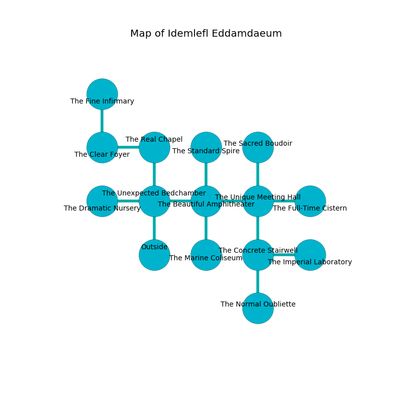

%Ruin Dogs

##Idemlefl Eddamdaeum
###Overview
Idemlefl Eddamdaeum is constructed on a giant rift. Parts of Idemlefl Eddamdaeum are unbearably hot. The ruin is larger on the inside than the outside. It is occupied by Harpies. Donny Braun The Quarrelsome, a Bearded Devil is here. The Harpies are battling Donny Braun The Quarrelsome. He  is founding a new religion. 

###Artifact
####Caemimaed

Caemimaed has the form of a smooth amulet. When rubbed it becomes lost. 

###Locations

####the unexpected bedchamber
The air smells like mint here. Green mushrooms are growing from the ceiling. The floor is cluttered with debris. There are a Kuo-Toa Whip, a Polar Bear, a Fire Snake, and a Giant Goat here. The brick walls are scratched. 

* To the west a torchlit cavern opens to [the dramatic nursery](#the-dramatic-nursery).
* To the east a flooded artery opens to [the beautiful amphitheater](#the-beautiful-amphitheater).
* To the north a dark hallway leads to [the real chapel](#the-real-chapel).
* To the south is the entrance.

####the beautiful amphitheater
The air smells like honeysuckle here. The floor is glossy. 

* There is a roof here.
* [Donny Braun The Quarrelsome](#Donny-Braun-The-Quarrelsome) is here.
* To the west a flooded artery opens to [the unexpected bedchamber](#the-unexpected-bedchamber).
* To the east a small cavern opens to [the unique meeting hall](#the-unique-meeting-hall).
* To the north a torchlit cave opens to [the standard spire](#the-standard-spire).
* To the south a twisted cavern connects to [the marine coliseum](#the-marine-coliseum).

####the standard spire
The floor is sticky. Blue razorgrass is decaying from the ceiling. The glass walls are scratched. The air smells like cornmint here. 

* There is a stick here.
* To the south a torchlit cave opens to [the beautiful amphitheater](#the-beautiful-amphitheater).

####the marine coliseum
The brick walls are bloodstained. 

There is an engraving on the wall written in common. 

> An ear is a correction
>
> yet never oral
>
> parallel, restricted, married
>
> primary, complex, enthusiastic
>
> [Caemimaed](#Caemimaed)
>
> cheerful and decisive
>

* To the north a twisted cavern connects to [the beautiful amphitheater](#the-beautiful-amphitheater).

####the unique meeting hall
The air tastes like cotton candy here. The floor is smooth. 

* To the west a small cavern opens to [the beautiful amphitheater](#the-beautiful-amphitheater).
* To the east a dark cave connects to [the full-time cistern](#the-full-time-cistern).
* To the north a hazy threshold leads to [the sacred boudoir](#the-sacred-boudoir).
* To the south a narrow cavern connects to [the concrete stairwell](#the-concrete-stairwell).

####the real chapel
There is a trap here. When activated, a magical sound detector will launch stone blocks from the ceiling. The air tastes like root beer here. 

* There is a plate here.
* There is a horse here.
* To the west a twisted artery leads to [the clear foyer](#the-clear-foyer).
* To the south a dark hallway opens to [the unexpected bedchamber](#the-unexpected-bedchamber).

####the concrete stairwell
There are four Harpies here. The crystal walls are covered in mold. The floor is cluttered with rocks. The Harpies are performing a ritual. If not interrupted, the Harpies will become more powerful. 

* [Caemimaed](#Caemimaed) is here.
* To the east a flooded hallway connects to [the imperial laboratory](#the-imperial-laboratory).
* To the north a narrow cavern leads to [the unique meeting hall](#the-unique-meeting-hall).
* To the south a hazy gap opens to [the normal oubliette](#the-normal-oubliette).

####the sacred boudoir
The metallic walls are covered in mold. Red lichens are sprouting in cracks in the floor. The air smells like potato chip here. 

* To the south a hazy threshold opens to [the unique meeting hall](#the-unique-meeting-hall).

####the full-time cistern

There is an engraving on the floor written in common. 

> Dig here.
>

* To the west a dark cave opens to [the unique meeting hall](#the-unique-meeting-hall).

####the clear foyer
The floor is sticky. The air tastes like tangerine here. The obsidion walls are bloodstained. 

* To the east a twisted artery connects to [the real chapel](#the-real-chapel).
* To the north a dripping cave leads to [the fine infirmary](#the-fine-infirmary).

####the dramatic nursery
There are four Harpies here. The air tastes like shrimp here. The Harpies are defending this room from intruders. 

There is an engraving on the wall written in Harpies Script. 

> Dear me! sad we
>
> it is always democratic
>
> it is never free
>
> hope is systematic
>

* To the east a torchlit cavern connects to [the unexpected bedchamber](#the-unexpected-bedchamber).

####the imperial laboratory
The floor is flooded with nine inch deep cold water. Green moss is growing in a patch on the floor. The air smells like nut here. 

* There is a hook here.
* To the west a flooded hallway leads to [the concrete stairwell](#the-concrete-stairwell).

####the fine infirmary
There is a trap here. When activated, a pressure plate will open a large pit in the floor. 

There is an engraving on a tablet written in Harpies Script. 

> A parcel is a rider
>
> sacred, dramatic, quiet
>
> A screw is a division
>
> absolute and constitutional
>
> cheap, trivial, imperial
>
> tender, scientific, sound
>
> yet mental
>
> A parcel is a rider
>

* To the south a dripping cave leads to [the clear foyer](#the-clear-foyer).

####the normal oubliette
There are an Azer, a Grell, and a Swarm of Insects here. The air tastes like grape skin here. Yellow ferns are growing in cracks in the floor. 

There is an engraving on a tablet written in common. 

> We are corrupted
>
> wrong and hostile
>
> [Caemimaed](#Caemimaed)
>
> yet never early
>
> A foot is a brother
>
> dramatic and monstrous
>
> normal, genetic, primary
>
> yet never dull
>
> orthodox and technical
>
> A watch is an action
>
> ever incapable
>
> you shall be punished
>

* To the north a hazy gap leads to [the concrete stairwell](#the-concrete-stairwell).

