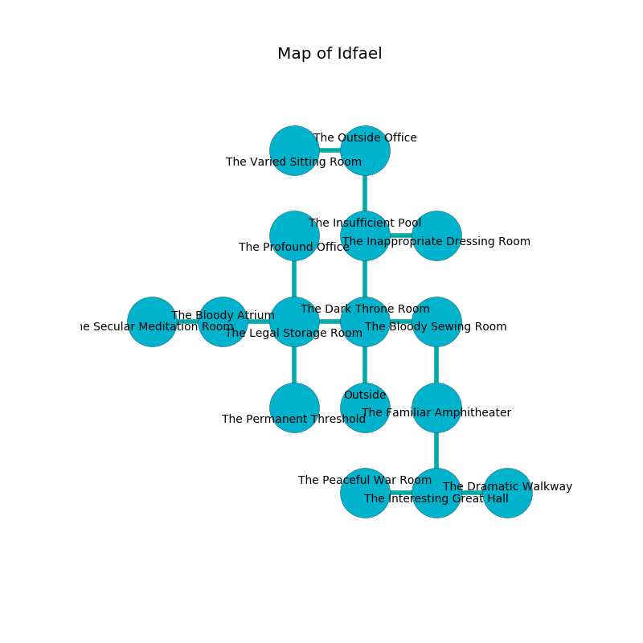

%Ruin Dogs

##Idfael
###Overview
Idfael is constructed on a giant mountain. Regions of Idfael are inaccessible. A solar eclipse is happening outside. It is occupied by Orcs. Roberto Herman The Deceitful, a Gnoll Fang of Yeenoghu is here. The Orcs worship Roberto Herman The Deceitful. He  is founding a new religion. 

###Artifact
####Bed Amuahuda

Bed Amuahuda looks like a glassy amulet. Air slides from it. When thrown it burns the mind. 

###Locations

####the dark throne room
Red lichens are sprouting in broken urns. 

There is an engraving on the floor written in Orcs Script. 

> Run away.
>

* There is a basin here.
* To the west a twisted path leads to [the legal storage room](#the-legal-storage-room).
* To the east a dripping threshold opens to [the bloody sewing room](#the-bloody-sewing-room).
* To the north a windy hall opens to [the insufficient pool](#the-insufficient-pool).
* To the south is the entrance.

####the bloody sewing room
The stone walls are covered in mold. The floor is sticky. Red mushrooms are swaying in a patch on the floor. 

* There is a flag here.
* There is a branch here.
* To the west a dripping threshold leads to [the dark throne room](#the-dark-throne-room).
* To the south a windy walkway connects to [the familiar amphitheater](#the-familiar-amphitheater).

####the insufficient pool
The floor is sticky. 

* There is a shield here.
* There is a bee here.
* To the east a flooded gap connects to [the inappropriate dressing room](#the-inappropriate-dressing-room).
* To the north a dripping walkway leads to [the outside office](#the-outside-office).
* To the south a windy hall leads to [the dark throne room](#the-dark-throne-room).

####the outside office
The brick walls are bloodstained. The floor is bloodstained. 

* To the west a torchlit path opens to [the varied sitting Room](#the-varied-sitting-Room).
* To the south a dripping walkway leads to [the insufficient pool](#the-insufficient-pool).

####the legal storage room
The wooden walls are unsettled. There are an Orc War Chief and two Orc Eyes of Gruumsh here. If the Orcs notice the Ruin Dogs, one of them will retreat and alert the others. 

* To the west a dripping walkway leads to [the bloody atrium](#the-bloody-atrium).
* To the east a twisted path connects to [the dark throne room](#the-dark-throne-room).
* To the north a small artery opens to [the profound office](#the-profound-office).
* To the south a small corridor connects to [the permanent threshold](#the-permanent-threshold).

####the familiar amphitheater
There are a Giant Crocodile, an Elk, a Plesiosaurus, a Warhorse, a Vine Blight, and a Giant fire beetle here. Blue ferns are sprouting in a patch on the floor. 

There is an engraving on the wall written in Orcs Script. 

> I am powerful.
>

* To the north a windy walkway opens to [the bloody sewing room](#the-bloody-sewing-room).
* To the south a long threshold connects to [the interesting great hall](#the-interesting-great-hall).

####the profound office
There are a Chuul and a Giant Toad here. The air tastes like meat here. 

There is an engraving on the ceiling written in Orcs Script. 

> We are corrupted
>
> lonely, bitter, literary
>

* To the south a small artery opens to [the legal storage room](#the-legal-storage-room).

####the permanent threshold
There is a trap here. When activated, a magical sound detector will launch a blade. The floor is cluttered with rocks. Gray lichens are growing in broken urns. The brick walls are pristine. There are a Quipper, a Gelatinous Cube, and a Basilisk here. 

There is an engraving on the ceiling written in common. 

> Treasure here.
>

* There is a pendant here.
* To the north a small corridor connects to [the legal storage room](#the-legal-storage-room).

####the varied sitting Room
The air tastes like animal here. 

* To the east a torchlit path leads to [the outside office](#the-outside-office).

####the interesting great hall
The floor is bloodstained. The air tastes like ambergris here. There is a Sahuagin Baron here. 

* There is a cow here.
* [Bed Amuahuda](#Bed-Amuahuda) is here.
* To the west a long path leads to [the peaceful war Room](#the-peaceful-war-Room).
* To the east a long hallway leads to [the dramatic walkway](#the-dramatic-walkway).
* To the north a long threshold connects to [the familiar amphitheater](#the-familiar-amphitheater).

####the inappropriate dressing room
The concrete walls are ruined. 

* To the west a flooded gap opens to [the insufficient pool](#the-insufficient-pool).

####the bloody atrium
The air tastes like nutmeg here. There are a Quaggoth Thonot, a Noble, and a Werewolf here. The floor is sticky. 

There is an engraving on a tablet written in Orcs Script. 

> O our fate is woe
>
> comfortable and low
>
> yet incapable
>
> life is slow
>

* There is a horn here.
* To the west a dripping pathway opens to [the secular meditation room](#the-secular-meditation-room).
* To the east a dripping walkway leads to [the legal storage room](#the-legal-storage-room).

####the peaceful war Room
The wooden walls are covered in mold. 

There is an engraving on a monolith written in common. 

> Do not try cowering.
>

* To the east a long path connects to [the interesting great hall](#the-interesting-great-hall).

####the secular meditation room
The crystal walls are scratched. There are a Sahuagin, a Scarecrow, an Allosaurus, a Basilisk, and a Myconid Adult here. Blue razorgrass is swaying from the ceiling. 

There is an engraving on a stone written in Orcs Script. 

> I could not try digging.
>

* To the east a dripping pathway opens to [the bloody atrium](#the-bloody-atrium).

####the dramatic walkway
The floor is cluttered with debris. There are a Red Dragon Wyrmling, a Giant Scorpion, a Merfolk, and a Commoner here. 

* There is a dress here.
* There is a cow here.
* There is a bell here.
* There is a collar here.
* There is a lyre here.
* There is a sceptre here.
* [Roberto Herman The Deceitful](#Roberto-Herman-The-Deceitful) is here.
* To the west a long hallway opens to [the interesting great hall](#the-interesting-great-hall).

