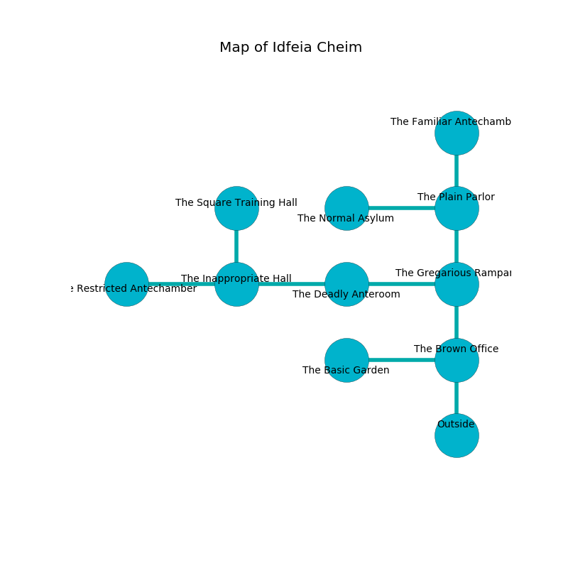

%Ruin Dogs

##Idfeia Cheim
###Overview
Idfeia Cheim is located in a haunted city. Regions of it are unbearably cold. The ruin is flooding. It is occupied by Deep Gnomes. Mason Crowder The Secretive, a Mind Flayer Arcanist is here. The Deep Gnomes worship Mason Crowder The Secretive. He  is founding a new religion. 

###Artifact
####The Functional Graduate

The Functional Graduate looks like a sharp blade. It is a bright blue color. Power incinerates away from it. It smells like sarsaparilla. When thrown it grants power to its owner. 

###Locations

####the brown office
Blue ferns are swaying from the walls. 

There is an engraving on the floor written in Deep Gnomes Script. 

> Oh my! everything is woe
>
> educational, exact, slow
>
> but never realistic
>
> the world is characteristic
>

* There is a wand here.
* To the west a dripping artery leads to [the basic garden](#the-basic-garden).
* To the north a dripping passageway opens to [the gregarious rampart](#the-gregarious-rampart).
* To the south is the entrance.

####the basic garden
There are fourteen Deep Gnomes here. Red ferns are sprouting in broken urns. The air tastes like cucumber here. One of the Deep Gnomes is on watch, the rest are drunk. 

* To the east a dripping artery leads to [the brown office](#the-brown-office).

####the gregarious rampart
The air tastes like civet here. Red lichens are sprouting in a patch on the floor. There are a Mud Mephit, a Ghast, a Galeb Duhr, a Merfolk, a Berserker, an Axe Beak, a Twig Blight, and a Panther here. 

* To the west a dripping cavern leads to [the deadly anteroom](#the-deadly-anteroom).
* To the north a windy corridor connects to [the plain parlor](#the-plain-parlor).
* To the south a dripping passageway leads to [the brown office](#the-brown-office).

####the deadly anteroom

* To the west a narrow opening connects to [the inappropriate hall](#the-inappropriate-hall).
* To the east a dripping cavern leads to [the gregarious rampart](#the-gregarious-rampart).

####the plain parlor
Blue mushrooms are growing from the walls. 

There is an engraving on the ceiling written in Deep Gnomes Script. 

> Oh my! the world is woe
>
> rural, important, low
>
> useful and alive
>
> sadness is live
>

* To the west a hazy passageway connects to [the normal asylum](#the-normal-asylum).
* To the north a hazy hall connects to [the familiar antechamber](#the-familiar-antechamber).
* To the south a windy corridor leads to [the gregarious rampart](#the-gregarious-rampart).

####the inappropriate hall
The air smells like quince here. The concrete walls are bloodstained. There are a Kuo-Toa Monitor, a Giant Wolf Spider, a Gas Spore, a Wolf, a Quaggoth Spore Servant, a Giant Toad, and a Giant Hyena here. 

* [The Functional Graduate](#The-Functional-Graduate) is here.
* To the west a long cave connects to [the restricted antechamber](#the-restricted-antechamber).
* To the east a narrow opening opens to [the deadly anteroom](#the-deadly-anteroom).
* To the north a hazy walkway leads to [the square training hall](#the-square-training-hall).

####the restricted antechamber
Red mushrooms are decaying from the walls. There are a Giant Frog, a Warhorse, an Unicorn, and a Flesh Golem here. The concrete walls are ruined. The air smells like verbena here. 

There is an engraving on a tablet written in common. 

> Treasure here.
>

* [Mason Crowder The Secretive](#Mason-Crowder-The-Secretive) is here.
* To the east a long cave opens to [the inappropriate hall](#the-inappropriate-hall).

####the normal asylum
The floor is glossy. The air smells like lovage here. 

* To the east a hazy passageway connects to [the plain parlor](#the-plain-parlor).

####the familiar antechamber
The crystal walls are covered in mold. Yellow moss is decaying in a patch on the floor. The air tastes like avocado here. 

There is an engraving on the ceiling written in common. 

> [The Functional Graduate](#The-Functional-Graduate)
>
> aloof and satisfied
>
> but never heavy
>
> thin and feminine
>
> We are sorrowful
>
> solid and resident
>

* To the south a hazy hall leads to [the plain parlor](#the-plain-parlor).

####the square training hall
The air tastes like molasses here. Gray mushrooms are sprouting in a patch on the floor. The floor is glossy. 

* To the south a hazy walkway opens to [the inappropriate hall](#the-inappropriate-hall).

