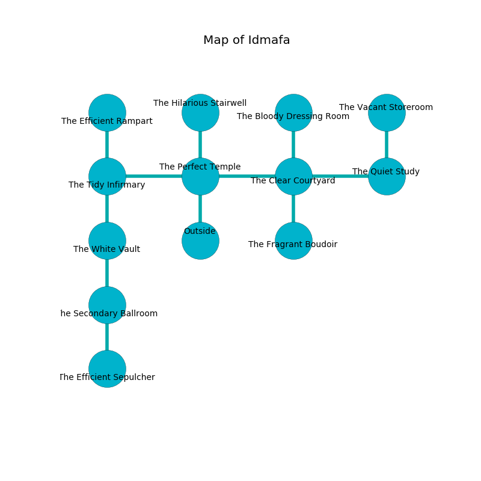

%Ruin Dogs

##Idmafa
###Overview
Idmafa is constructed on a poisoned plain. Parts of Idmafa are flooded. A massive flood is happening outside. It is occupied by Humans. Raina Barbee The Nasty, an Incubus is here. The Humans are the minions of Raina Barbee The Nasty. She  is founding a new religion. 

###Artifact
####Fadahhaeum

Fadahhaeum looks like a hard rock. It smells like celery. When rubbed it changes probabilities. 

###Locations

####the perfect temple
The floor is bloodstained. The air smells like fruit here. The wooden walls are unsettled. 

* To the west a hazy pathway connects to [the tidy infirmary](#the-tidy-infirmary).
* To the east a windy artery connects to [the clear courtyard](#the-clear-courtyard).
* To the north a dark hallway connects to [the hilarious stairwell](#the-hilarious-stairwell).
* To the south is the entrance.

####the tidy infirmary
Red lichens are swaying in a patch on the floor. 

* [Raina Barbee The Nasty](#Raina-Barbee-The-Nasty) is here.
* To the east a hazy pathway leads to [the perfect temple](#the-perfect-temple).
* To the north a torchlit path leads to [the efficient rampart](#the-efficient-rampart).
* To the south a dark opening opens to [the white vault](#the-white-vault).

####the clear courtyard
The obsidion walls are pristine. Green razorgrass is swaying from the ceiling. The floor is cluttered with bones. There is a trap here. When activated, a magical proximity detector will collapse a wall. 

* To the west a windy artery leads to [the perfect temple](#the-perfect-temple).
* To the east a dripping cavern leads to [the quiet study](#the-quiet-study).
* To the north a small walkway opens to [the bloody dressing room](#the-bloody-dressing-room).
* To the south a hazy pathway opens to [the fragrant boudoir](#the-fragrant-boudoir).

####the bloody dressing room
The floor is cluttered with broken glass. The air smells like immortelle here. Yellow lichens are swaying in cracks in the floor. 

* There is a wall here.
* To the south a small walkway connects to [the clear courtyard](#the-clear-courtyard).

####the white vault
The air smells like grass here. Gray razorgrass is swaying in broken urns. There are a Cult Fanatic, a Thug, a Knight, and a Guard here. If the Humans notice the Ruin Dogs, one of them will retreat and alert the others. 

* There is a ring here.
* To the north a dark opening connects to [the tidy infirmary](#the-tidy-infirmary).
* To the south a small passageway leads to [the secondary ballroom](#the-secondary-ballroom).

####the hilarious stairwell
There are a Thug, a Druid, a Bandit Captain, and a Scout here. The glass walls are unsettled. The Humans are crazy with bloodlust. 

* There is a rod here.
* To the south a dark hallway leads to [the perfect temple](#the-perfect-temple).

####the fragrant boudoir
Yellow mushrooms are decaying in cracks in the floor. The air smells like roasted peanut here. There are a Grell, a Goat, and a Ghost here. The concrete walls are pristine. 

* To the north a hazy pathway opens to [the clear courtyard](#the-clear-courtyard).

####the quiet study
The floor is bloodstained. 

There is an engraving on a tablet written in Humans Script. 

> I am hiding in this place.
>

* To the west a dripping cavern connects to [the clear courtyard](#the-clear-courtyard).
* To the north a torchlit corridor leads to [the vacant storeroom](#the-vacant-storeroom).

####the secondary ballroom
There are a Cult Fanatic, a Cultist, a Commoner, two Bandit Captains, an Acolyte, and  here. If the Humans notice the Ruin Dogs, one of them will retreat and alert [Raina Barbee](#Raina-Barbee). 

There is an engraving on the ceiling written in Humans Script. 

> A  is a reduction
>
> primary, flexible, bureaucratic
>
> A bird is a feedback
>
> senior, kind, anonymous
>
> [Fadahhaeum](#Fadahhaeum)
>
> small, thirsty, legal
>

* [Fadahhaeum](#Fadahhaeum) is here.
* To the north a small passageway leads to [the white vault](#the-white-vault).
* To the south a twisted walkway leads to [the efficient sepulcher](#the-efficient-sepulcher).

####the efficient rampart
The floor is sticky. Yellow razorgrass is growing from the ceiling. 

There is an engraving on a tablet written in Humans Script. 

> I am lost.
>
> Dig here.
>

* To the south a torchlit path leads to [the tidy infirmary](#the-tidy-infirmary).

####the vacant storeroom
The air tastes like raw	reseda here. The brick walls are scratched. The floor is cluttered with debris. 

* There is an amulet here.
* To the south a torchlit corridor connects to [the quiet study](#the-quiet-study).

####the efficient sepulcher
The brick walls are pristine. Gray ferns are swaying in cracks in the floor. 

* There is a branch here.
* To the north a twisted walkway opens to [the secondary ballroom](#the-secondary-ballroom).

