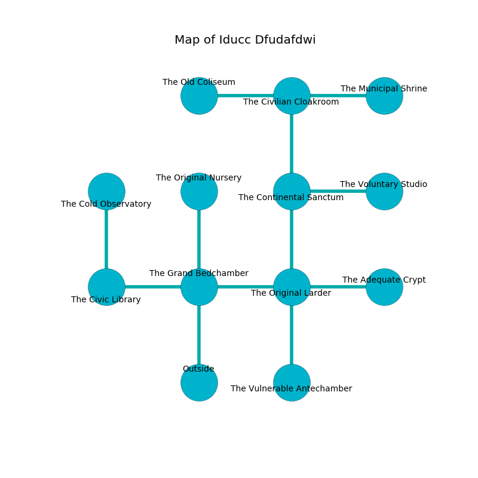

%Ruin Dogs

##Iducc Dfudafdwi
###Overview
Iducc Dfudafdwi is constructed on a spikey rift. Some areas of Iducc Dfudafdwi are flooded. The ruin is sinking into the earth. It is occupied by Demons. Paul Mooney The Bitchy, a Kuo-Toa Monitor is here. The Demons are the soldiers of Paul Mooney The Bitchy. He  is founding a new religion. 

###Artifact
####The False Expenditure

The False Expenditure has the form of a transparent spear. Power pours around it. It smells like sesame. It is a bright yellow color. When carried it dissappears. 

###Locations

####the grand bedchamber
White ferns are decaying from the walls. The air tastes like cumin here. The floor is glossy. The obsidion walls are bloodstained. 

There is an engraving on a monolith written in Demons Script. 

> Oh sad god
>
> but odd
>
> cheap and secure
>
> hope is pure
>

* There is a femur here.
* [The False Expenditure](#The-False-Expenditure) is here.
* To the west a small artery connects to [the civic library](#the-civic-library).
* To the east a long cave leads to [the original larder](#the-original-larder).
* To the north a windy hall leads to [the original nursery](#the-original-nursery).
* To the south is the entrance.

####the civic library
The air smells like fir needle here. Blue ferns are growing in cracks in the floor. 

There is an engraving on a tablet written in common. 

> I am powerful.
>

* To the east a small artery leads to [the grand bedchamber](#the-grand-bedchamber).
* To the north a dripping cavern leads to [the cold observatory](#the-cold-observatory).

####the original larder
Green razorgrass is growing in a patch on the floor. There are two Imp here. The air tastes like camphoreous here. The Demons are feasting. 

* [Paul Mooney The Bitchy](#Paul-Mooney-The-Bitchy) is here.
* To the west a long cave opens to [the grand bedchamber](#the-grand-bedchamber).
* To the east a narrow artery opens to [the adequate crypt](#the-adequate-crypt).
* To the north a small gap opens to [the continental sanctum](#the-continental-sanctum).
* To the south a long passageway opens to [the vulnerable antechamber](#the-vulnerable-antechamber).

####the vulnerable antechamber
The floor is glossy. 

* To the north a long passageway connects to [the original larder](#the-original-larder).

####the continental sanctum
Blue lichens are decaying in cracks in the floor. The air tastes like resin here. 

There is an engraving on the ceiling written in Demons Script. 

> Go away.
>

* There is a cow here.
* To the east a narrow gap leads to [the voluntary studio](#the-voluntary-studio).
* To the north a flooded gap opens to [the civilian cloakroom](#the-civilian-cloakroom).
* To the south a small gap leads to [the original larder](#the-original-larder).

####the voluntary studio
The floor is sticky. There are a Tiger and a Scarecrow here. The obsidion walls are scratched. 

* There is a rod here.
* There is a cart here.
* To the west a narrow gap connects to [the continental sanctum](#the-continental-sanctum).

####the adequate crypt
The crystal walls are bloodstained. The air tastes like dry	durian here. 

* To the west a narrow artery leads to [the original larder](#the-original-larder).

####the cold observatory
The glass walls are covered in mold. The floor is glossy. 

There is an engraving on a tablet written in common. 

> I am worshipping Iducc Dfudafdwi.
>

* To the south a dripping cavern leads to [the civic library](#the-civic-library).

####the civilian cloakroom
The stone walls are scratched. There are an Imp and a Spined Devil here. The air smells like hay here. Gray lichens are decaying from the walls. The Demons are performing a ritual. If not interrupted, the Demons will become more powerful. 

There is an engraving on a stone written in common. 

> I am free.
>
> I thought about giving up.
>

* To the west a flooded passageway opens to [the old coliseum](#the-old-coliseum).
* To the east a flooded corridor connects to [the municipal shrine](#the-municipal-shrine).
* To the south a flooded gap opens to [the continental sanctum](#the-continental-sanctum).

####the old coliseum
There are two Imp here. The floor is sticky. Gray razorgrass is sprouting from the walls. The glass walls are unsettled. The air smells like vinegar here. The Demons are performing a ritual. If not interrupted, the ruin dogs will be weakened. 

* There is a triptych here.
* To the east a flooded passageway opens to [the civilian cloakroom](#the-civilian-cloakroom).

####the municipal shrine
The air tastes like origanum here. The floor is bloodstained. There is a Saber-Toothed Tiger here. 

There is an engraving on the floor written in common. 

> Dear me! dire you
>
> restless, awkward, new
>
> skilled and precise
>
> nothing is nice
>

* There is a ghost here.
* To the west a flooded corridor leads to [the civilian cloakroom](#the-civilian-cloakroom).

####the original nursery
Blue mushrooms are swaying from the walls. The air smells like tomato here. There are a Hawk, a Myconid Sovereign, and a Giant Bat here. 

* To the south a windy hall connects to [the grand bedchamber](#the-grand-bedchamber).

