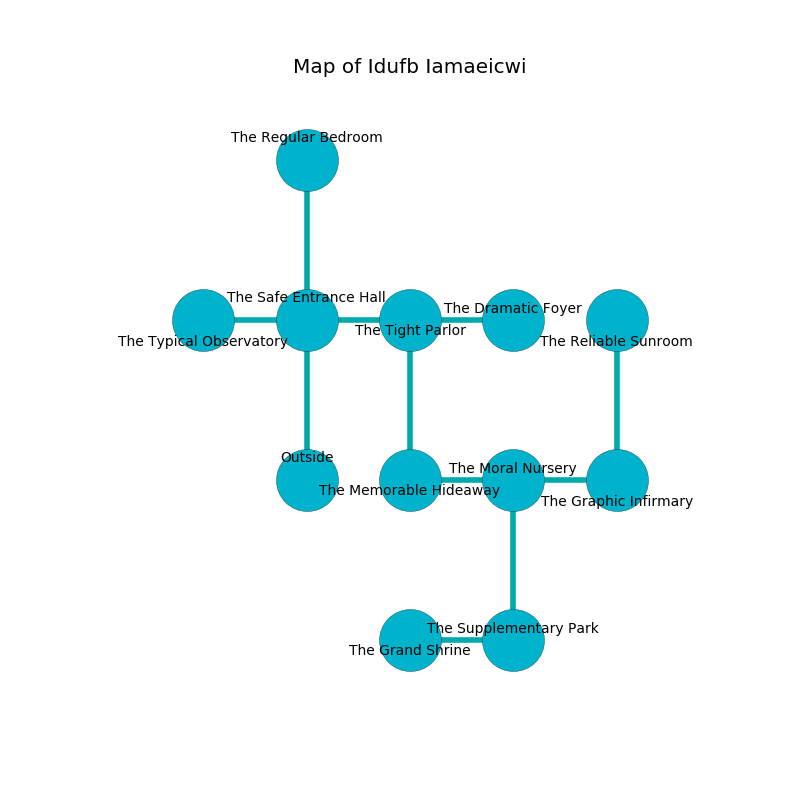

%Ruin Dogs

##Idufb Iamaeicwi
###Overview
Idufb Iamaeicwi is constructed on an obsidion plain. Parts of it are cursed. The ruin is coming to life. It is occupied by Orcs. Celeste Mccord The Touchy, a Frost Giant is here. The Orcs worship Celeste Mccord The Touchy. She  is trying to recover [The Reckless Cattle](#The-Reckless-Cattle). 

###Artifact
####The Reckless Cattle

The Reckless Cattle is a powerful artifact in the shape of an opaque orb. Power incinerates near it. It is a shifting brown color. It smells like cucumber. When rubbed it grants power to its owner. 

###Locations

####the safe entrance hall
There are two Orc War Chiefs and an Orc Eye of Gruumsh here. The wooden walls are ruined. The Orcs are berserk with rage. 

There is an engraving on a monolith written in Orcs Script. 

> O my fate is sadistic
>
> it is always optimistic
>
> implicit and bold
>
> death is cold
>

* There is a rat here.
* To the west a windy walkway opens to [the typical observatory](#the-typical-observatory).
* To the east a torchlit path leads to [the tight parlor](#the-tight-parlor).
* To the north a windy walkway leads to [the regular bedroom](#the-regular-bedroom).
* To the south is the entrance.

####the tight parlor
There are two Orc War Chiefs and an Orc Eye of Gruumsh here. The obsidion walls are scratched. The Orcs are caring for babies. 

* There is a cart here.
* To the west a torchlit path connects to [the safe entrance hall](#the-safe-entrance-hall).
* To the east a windy path connects to [the dramatic foyer](#the-dramatic-foyer).
* To the south a torchlit hallway leads to [the memorable hideaway](#the-memorable-hideaway).

####the regular bedroom
The floor is glossy. The brick walls are scratched. 

* To the south a windy walkway opens to [the safe entrance hall](#the-safe-entrance-hall).

####the memorable hideaway
There are an Orc War Chief and three Orc Eyes of Gruumsh here. The air smells like licorice here. The concrete walls are scratched. The floor is flooded with two inch deep cold water. The Orcs are feasting. 

* [Celeste Mccord The Touchy](#Celeste-Mccord-The-Touchy) is here.
* To the east a twisted artery connects to [the moral nursery](#the-moral-nursery).
* To the north a torchlit hallway opens to [the tight parlor](#the-tight-parlor).

####the dramatic foyer
Blue mushrooms are decaying in a patch on the floor. There are an Orc War Chief and three Orc Eyes of Gruumsh here. The air tastes like grape skin here. If the Orcs notice the Ruin Dogs, one of them will retreat and alert the others. 

* To the west a windy path connects to [the tight parlor](#the-tight-parlor).

####the moral nursery
White razorgrass is growing from the walls. There is a trap here. When activated, a tripwire will launch a poison needle. 

There is an engraving on the ceiling written in common. 

> Leave now.
>

* To the west a twisted artery connects to [the memorable hideaway](#the-memorable-hideaway).
* To the east a torchlit artery leads to [the graphic infirmary](#the-graphic-infirmary).
* To the south a windy artery connects to [the supplementary park](#the-supplementary-park).

####the graphic infirmary
The glass walls are scratched. There are a Fire Elemental and a Gladiator here. 

* [The Reckless Cattle](#The-Reckless-Cattle) is here.
* To the west a torchlit artery connects to [the moral nursery](#the-moral-nursery).
* To the north a narrow artery opens to [the reliable sunroom](#the-reliable-sunroom).

####the supplementary park
There is a trap here. When activated, a magical proximity detector will blast flames. The wooden walls are caving in. The floor is sticky. 

* To the west a long hallway leads to [the grand shrine](#the-grand-shrine).
* To the north a windy artery opens to [the moral nursery](#the-moral-nursery).

####the typical observatory
The floor is smooth. The obsidion walls are pristine. 

There is an engraving on the ceiling written in common. 

> I am lost in Idufb Iamaeicwi.
>
> I thought about leaving.
>

* There is a drawer here.
* To the east a windy walkway connects to [the safe entrance hall](#the-safe-entrance-hall).

####the grand shrine
Gray mushrooms are swaying in broken urns. There are a Cat, a Wereboar, a Dire Wolf, and a Cambion here. The glass walls are scratched. The air tastes like chocolate here. 

There is an engraving on a stone written in Orcs Script. 

> Run away.
>

* To the east a long hallway opens to [the supplementary park](#the-supplementary-park).

####the reliable sunroom
There are an Orc War Chief and three Orc Eyes of Gruumsh here. White mushrooms are growing from the ceiling. One of the Orcs is on watch, the rest are drunk. 

* There is a plow here.
* To the south a narrow artery opens to [the graphic infirmary](#the-graphic-infirmary).

