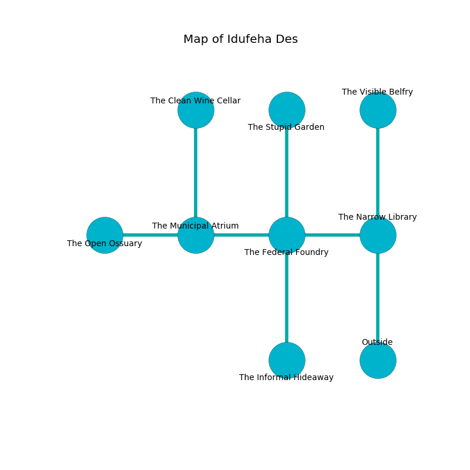

%Ruin Dogs

##Idufeha Des
###Overview
Idufeha Des is located in a volcanic mountain. Some areas of Idufeha Des are corrupted. A battle between raiders is happening outside. It is occupied by Orcs. Georgetta Fontaine The Finicky, a Cloud Giant is here. The Orcs are ruled by Georgetta Fontaine The Finicky. She  is trying to hide [Eluemdeha](#Eluemdeha). 

###Artifact
####Eluemdeha

Eluemdeha has the form of a sharp meteorite. It is a bright red color. It smells like salt. Power bends towards it. When touched it becomes a deadly projectile. 

###Locations

####the narrow library
The floor is smooth. The air smells like tangerine here. The concrete walls are unsettled. 

* To the west a torchlit cave connects to [the federal foundry](#the-federal-foundry).
* To the north a hazy passageway connects to [the visible belfry](#the-visible-belfry).
* To the south is the entrance.

####the visible belfry
The air smells like mutton here. The stone walls are pristine. The floor is smooth. There is a trap here. When activated, a magical proximity detector will launch a rolling boulder. There are two Orc War Chiefs and two Orc Eyes of Gruumsh here. The Orcs are celebrating. 

* To the south a hazy passageway leads to [the narrow library](#the-narrow-library).

####the federal foundry
There are an Orc War Chief and three Orc Eyes of Gruumsh here. The air tastes like liver here. If the Orcs notice the Ruin Dogs, one of them will retreat and alert the others. 

* To the west a narrow hall leads to [the municipal atrium](#the-municipal-atrium).
* To the east a torchlit cave leads to [the narrow library](#the-narrow-library).
* To the north a narrow opening opens to [the stupid garden](#the-stupid-garden).
* To the south a windy corridor opens to [the informal hideaway](#the-informal-hideaway).

####the municipal atrium
Green lichens are growing in broken urns. The glass walls are covered in mold. The air tastes like grape skin here. 

* [Eluemdeha](#Eluemdeha) is here.
* To the west a narrow artery opens to [the open ossuary](#the-open-ossuary).
* To the east a narrow hall connects to [the federal foundry](#the-federal-foundry).
* To the north a dripping artery leads to [the clean wine cellar](#the-clean-wine-cellar).

####the open ossuary
There are a Warhorse Skeleton, a Nycaloth, and a Mule here. The floor is sticky. 

There is an engraving on a tablet written in common. 

> Leave at once.
>

* To the east a narrow artery connects to [the municipal atrium](#the-municipal-atrium).

####the informal hideaway
The air smells like cashew here. Yellow razorgrass is decaying from the ceiling. The floor is bloodstained. 

* To the north a windy corridor connects to [the federal foundry](#the-federal-foundry).

####the stupid garden
There are a Grick Alpha, a Lamia, and a Rat here. The air smells like juice here. 

* [Georgetta Fontaine The Finicky](#Georgetta-Fontaine-The-Finicky) is here.
* To the south a narrow opening opens to [the federal foundry](#the-federal-foundry).

####the clean wine cellar
The concrete walls are bloodstained. 

* To the south a dripping artery connects to [the municipal atrium](#the-municipal-atrium).

