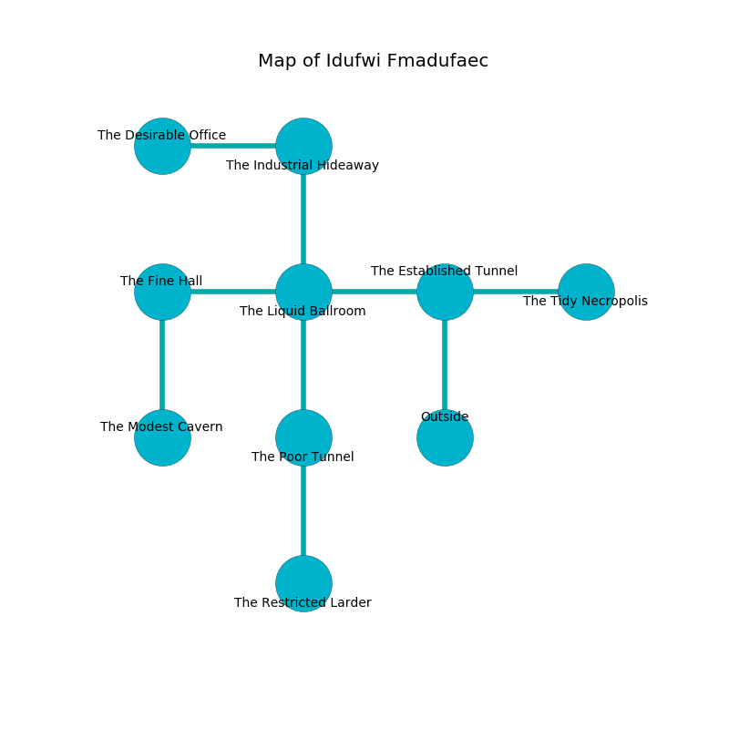

%Ruin Dogs

##Idufwi Fmadufaec
###Overview
Idufwi Fmadufaec is located under an alien rift. Parts of it are frozen. A windstorm is happening outside. It is occupied by Myconids. Emerita Bergstrom The Belligerent, a Fire Giant is here. The Myconids worship Emerita Bergstrom The Belligerent. She  is trying to find [The Illegal Record](#The-Illegal-Record). 

###Artifact
####The Illegal Record

The Illegal Record has the form of a wet crystal. Power slides towards it. When gazed upon it grants power to its owner. 

###Locations

####the established tunnel
The concrete walls are caving in. The air tastes like licorice here. The floor is flooded with one inch deep scalding water. 

* [Emerita Bergstrom The Belligerent](#Emerita-Bergstrom-The-Belligerent) is here.
* To the west a dripping cave leads to [the liquid ballroom](#the-liquid-ballroom).
* To the east a hazy gap opens to [the tidy necropolis](#the-tidy-necropolis).
* To the south is the entrance.

####the liquid ballroom
The concrete walls are ruined. The air tastes like paper here. Red razorgrass is growing in a patch on the floor. 

* To the west a flooded pathway leads to [the fine hall](#the-fine-hall).
* To the east a dripping cave leads to [the established tunnel](#the-established-tunnel).
* To the north a long cave opens to [the industrial hideaway](#the-industrial-hideaway).
* To the south a hazy gap leads to [the poor tunnel](#the-poor-tunnel).

####the tidy necropolis
Yellow mushrooms are decaying in broken urns. The air tastes like rum here. 

* To the west a hazy gap connects to [the established tunnel](#the-established-tunnel).

####the fine hall
The air smells like rhubarb here. There is a trap here. When activated, a magical proximity detector will blast flames. The floor is glossy. 

* To the east a flooded pathway opens to [the liquid ballroom](#the-liquid-ballroom).
* To the south a torchlit hallway opens to [the modest cavern](#the-modest-cavern).

####the industrial hideaway
There are four Myconid Sovereigns and five Myconid Adults here. Blue mushrooms are sprouting in cracks in the floor. One of the Myconids is on watch, the rest are drunk. 

* To the west a windy pathway opens to [the desirable office](#the-desirable-office).
* To the south a long cave leads to [the liquid ballroom](#the-liquid-ballroom).

####the modest cavern
There are an Otyugh, a Poltergeist, a Giant Owl, a Steam Mephit, a Brass Dragon Wyrmling, and an Orc here. The floor is flooded with three inch deep hot water. 

* There is a bowl here.
* There is a box here.
* To the north a torchlit hallway leads to [the fine hall](#the-fine-hall).

####the desirable office
The concrete walls are scratched. There are a Lion, an Unicorn, a Barbed Devil, and a Reef Shark here. The floor is bloodstained. The air smells like starfruit here. 

* To the east a windy pathway connects to [the industrial hideaway](#the-industrial-hideaway).

####the poor tunnel
The floor is flooded with six inch deep cold water. Blue mushrooms are growing in cracks in the floor. 

* [The Illegal Record](#The-Illegal-Record) is here.
* To the north a hazy gap leads to [the liquid ballroom](#the-liquid-ballroom).
* To the south a flooded gap leads to [the restricted larder](#the-restricted-larder).

####the restricted larder
The air tastes like grease here. Green ferns are sprouting in a patch on the floor. There are four Myconid Sovereigns and three Myconid Adults here. The Myconids are willing to fight to the death. 

* To the north a flooded gap leads to [the poor tunnel](#the-poor-tunnel).

