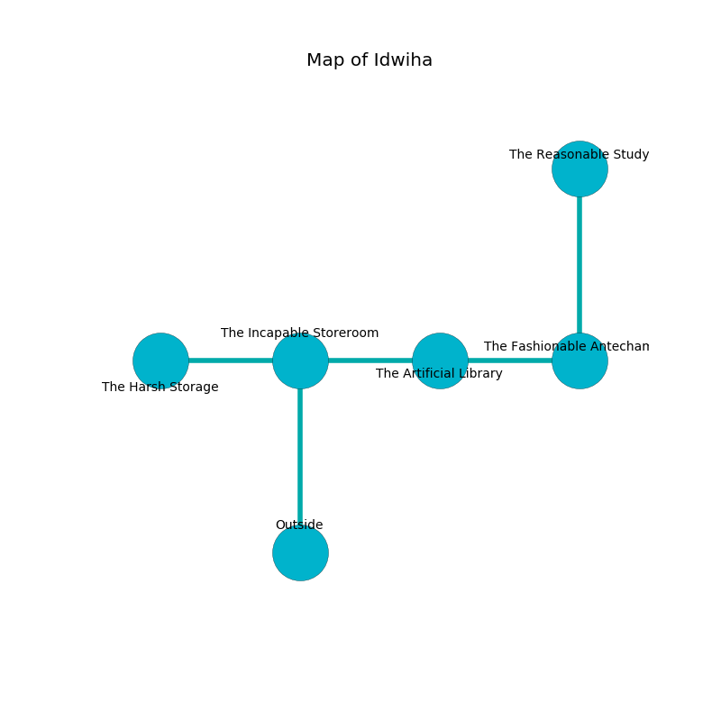

%Ruin Dogs

##Idwiha
###Overview
Idwiha is located in a crystal tree. Regions of Idwiha are unbearably hot. The ruin is larger on the inside than the outside. It is occupied by Yuan-Ti. Elmer Quinlan The Vulgar, a Vampire Spawn is here. The Yuan-Ti have been charmed by Elmer Quinlan The Vulgar. He  is trying to understand [Iwibbadfwi](#Iwibbadfwi). 

###Artifact
####Iwibbadfwi

Iwibbadfwi is a powerful artifact in the shape of an opaque blade. Cacophony slips towards it. It is a pale black color. It smells like leek. When touched it illuminates its surroundings. 

###Locations

####the incapable storeroom
Yellow moss is growing from the ceiling. The floor is cluttered with ashes. 

* [Iwibbadfwi](#Iwibbadfwi) is here.
* [Elmer Quinlan The Vulgar](#Elmer-Quinlan-The-Vulgar) is here.
* To the west a windy pathway opens to [the harsh storage](#the-harsh-storage).
* To the east a dark path leads to [the artificial library](#the-artificial-library).
* To the south is the entrance.

####the artificial library
There are a Yuan-Ti Pureblood and a Yuan-Ti Malison here. Yellow ferns are sprouting in a patch on the floor. The air smells like burnt sugar here. The floor is glossy. The Yuan-Ti are defending this room from intruders. 

* To the west a dark path opens to [the incapable storeroom](#the-incapable-storeroom).
* To the east a torchlit corridor opens to [the fashionable antechamber](#the-fashionable-antechamber).

####the fashionable antechamber
The stone walls are covered in mold. The floor is flooded with four inch deep hot water. 

* To the west a torchlit corridor connects to [the artificial library](#the-artificial-library).
* To the north a dark hall connects to [the reasonable study](#the-reasonable-study).

####the reasonable study
There are two Yuan-Ti Malisons here. The obsidion walls are unsettled. The floor is sticky. The Yuan-Ti are fighting amongst themselves. 

* To the south a dark hall connects to [the fashionable antechamber](#the-fashionable-antechamber).

####the harsh storage
White ferns are swaying from the ceiling. The wooden walls are unsettled. The air tastes like frankincense here. 

There is an engraving on the ceiling written in Yuan-Ti Script. 

> Do not try giving up.
>

* To the east a windy pathway leads to [the incapable storeroom](#the-incapable-storeroom).

