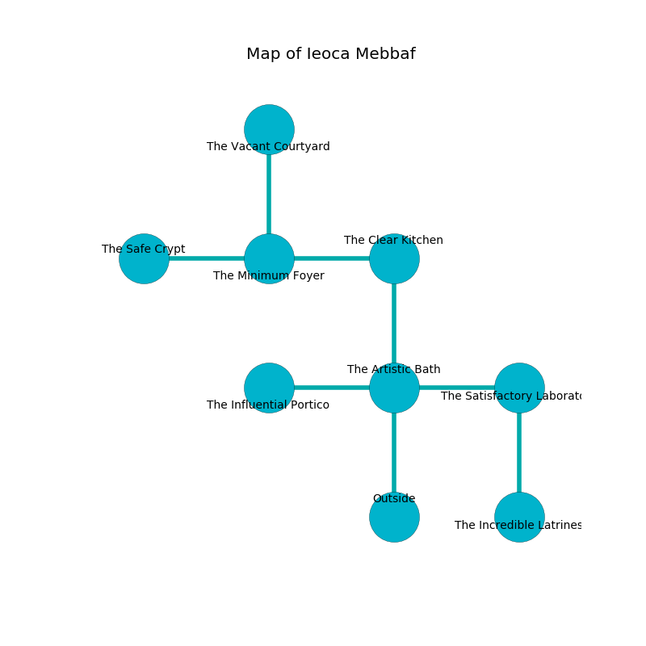

%Ruin Dogs

##Ieoca Mebbaf
###Overview
Ieoca Mebbaf is located in a broken city. Regions of it are flooded. A solar eclipse is happening outside. It is occupied by Orcs. Darius Washburn The Foolhardy, a Fire Giant is here. The Orcs are battling Darius Washburn The Foolhardy. He  is founding a new religion. 

###Artifact
####Ascoia Daedha

Ascoia Daedha has the form of a wet doll. It smells like milk. When touched it turns surrounding objects to ashes. 

###Locations

####the artistic bath
The floor is smooth. There is a trap here. When activated, a magical proximity detector will ring a bell. 

There is an engraving on a tablet written in Orcs Script. 

> Oh cruel we
>
> competent and free
>
> yet never toxic
>
> nothing is free
>

* There is a stocking here.
* [Ascoia Daedha](#Ascoia-Daedha) is here.
* To the west a flooded pathway opens to [the influential portico](#the-influential-portico).
* To the east a hazy opening opens to [the satisfactory laboratory](#the-satisfactory-laboratory).
* To the north a long path opens to [the clear kitchen](#the-clear-kitchen).
* To the south is the entrance.

####the clear kitchen
The floor is glossy. There is a trap here. When activated, a magical rune will close a portcullis. 

There is an engraving on a tablet written in common. 

> I thought about cowering.
>

* There is a key here.
* To the west a dripping passageway leads to [the minimum foyer](#the-minimum-foyer).
* To the south a long path connects to [the artistic bath](#the-artistic-bath).

####the satisfactory laboratory
The floor is sticky. The air tastes like sap here. 

* To the west a hazy opening leads to [the artistic bath](#the-artistic-bath).
* To the south a dark hallway connects to [the incredible latrines](#the-incredible-latrines).

####the minimum foyer
Red ferns are growing in cracks in the floor. 

* There is a knot here.
* There is a lock here.
* [Darius Washburn The Foolhardy](#Darius-Washburn-The-Foolhardy) is here.
* To the west a small threshold leads to [the safe crypt](#the-safe-crypt).
* To the east a dripping passageway leads to [the clear kitchen](#the-clear-kitchen).
* To the north a dark cave opens to [the vacant courtyard](#the-vacant-courtyard).

####the vacant courtyard
The stone walls are scratched. The floor is flooded with eight inch deep lukewarm water. 

* To the south a dark cave opens to [the minimum foyer](#the-minimum-foyer).

####the safe crypt
The wooden walls are unsettled. Yellow ferns are swaying in cracks in the floor. The air smells like rose tea here. There are two Orc War Chiefs and two Orc Eyes of Gruumsh here. The Orcs are performing a ritual. If not interrupted, [Darius Washburn](#Darius-Washburn) will be magically alarmed. 

* To the east a small threshold connects to [the minimum foyer](#the-minimum-foyer).

####the incredible latrines
The floor is cluttered with bones. The air tastes like storax here. There are two Orc War Chiefs and an Orc Eye of Gruumsh here. The Orcs are performing a ritual. If not interrupted, the Orcs will become more powerful. 

* There is a frame here.
* To the north a dark hallway connects to [the satisfactory laboratory](#the-satisfactory-laboratory).

####the influential portico
The air smells like laundered cloth here. Blue ferns are sprouting from the walls. The floor is glossy. 

* There is a drawer here.
* To the east a flooded pathway connects to [the artistic bath](#the-artistic-bath).

