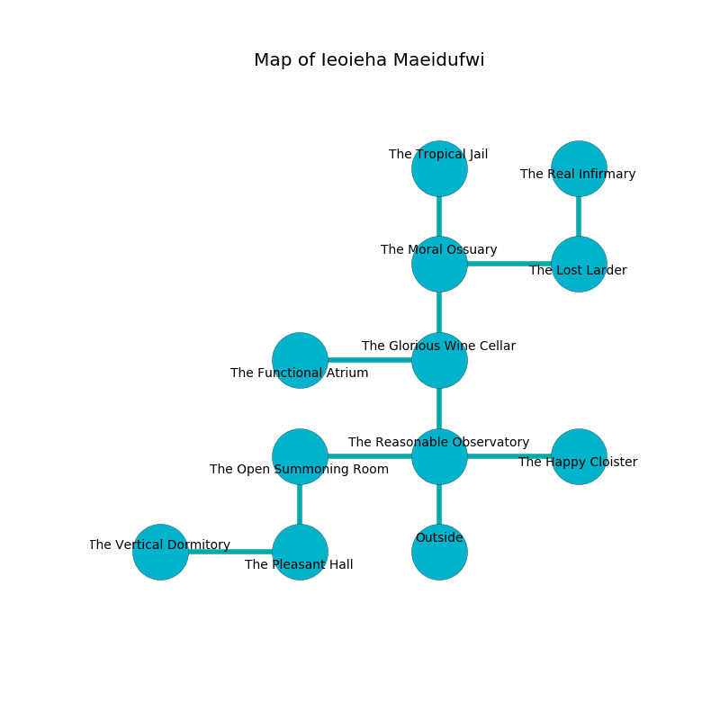

%Ruin Dogs

##Ieoieha Maeidufwi
###Overview
Ieoieha Maeidufwi is located under a ruined plain. Regions of Ieoieha Maeidufwi are inaccessible. A solar eclipse is happening outside. It is occupied by Goblins. Blake Walker The Interfering, a Fire Giant is here. The Goblins are ruled by Blake Walker The Interfering. He  is trying to steal [The Automatic Conversation](#The-Automatic-Conversation). 

###Artifact
####The Automatic Conversation

The Automatic Conversation looks like a hard crystal. Cacophony pours away from it. When gazed upon it floats in the air. 

###Locations

####the reasonable observatory
The air tastes like ginger here. The wooden walls are covered in mold. There are a Hobgoblin Warlord and two Hobgoblin Captains here. The floor is smooth. The Goblins are defending this room from intruders. 

* To the west a hazy walkway opens to [the open summoning room](#the-open-summoning-room).
* To the east a hazy hall leads to [the happy cloister](#the-happy-cloister).
* To the north a dark path opens to [the glorious wine cellar](#the-glorious-wine-cellar).
* To the south is the entrance.

####the open summoning room
Yellow mushrooms are sprouting in broken urns. The floor is glossy. 

There is an engraving on the floor written in common. 

> O! life is inhumane
>
> useless and thick
>
> equal and main
>
> sadness is sick
>

* To the east a hazy walkway opens to [the reasonable observatory](#the-reasonable-observatory).
* To the south a small threshold connects to [the pleasant hall](#the-pleasant-hall).

####the pleasant hall
Red razorgrass is decaying in a patch on the floor. 

There is an engraving on a stone written in Goblins Script. 

> O weak we
>
> it is never free
>
> colourful and seasonal
>
> sadness is free
>

* [The Automatic Conversation](#The-Automatic-Conversation) is here.
* To the west a narrow threshold leads to [the vertical dormitory](#the-vertical-dormitory).
* To the north a small threshold connects to [the open summoning room](#the-open-summoning-room).

####the glorious wine cellar
There is a trap here. When activated, a magical sound detector will make the ceiling slowly lower. Red razorgrass is decaying in cracks in the floor. There are two Goblins, a Hobgoblin Warlord, a Hobgoblin Captain, a Hobgoblin, and  here. If the Goblins notice the Ruin Dogs, one of them will retreat and alert the others. 

* There is an egg here.
* To the west a dripping artery connects to [the functional atrium](#the-functional-atrium).
* To the north a flooded path connects to [the moral ossuary](#the-moral-ossuary).
* To the south a dark path connects to [the reasonable observatory](#the-reasonable-observatory).

####the moral ossuary
There is a trap here. When activated, a tripwire will cast a curse. There are a Quaggoth Thonot, a Red Slaad, a Bugbear Chief, and a Draft Horse here. Gray razorgrass is swaying in broken urns. The mirrored walls are ruined. The air tastes like candy here. The floor is flooded with six inch deep cold water. 

There is an engraving on a monolith written in common. 

> Do not try fighting.
>

* There is an eye here.
* To the east a torchlit gap opens to [the lost larder](#the-lost-larder).
* To the north a torchlit opening connects to [the tropical jail](#the-tropical-jail).
* To the south a flooded path leads to [the glorious wine cellar](#the-glorious-wine-cellar).

####the functional atrium
The air smells like quince here. 

There is an engraving on a tablet written in Goblins Script. 

> A wire is a sphere
>
> infinite and bare
>
> you are consumed
>

* There is a box here.
* To the east a dripping artery leads to [the glorious wine cellar](#the-glorious-wine-cellar).

####the happy cloister
Yellow moss is decaying in a patch on the floor. There is a trap here. When activated, a magical sound detector will fire a scything blade. The floor is bloodstained. 

There is an engraving on the ceiling written in Goblins Script. 

> Dear me! cruel we
>
> ever last
>
> unfair, dull, free
>
> hope is fast
>

* To the west a hazy hall leads to [the reasonable observatory](#the-reasonable-observatory).

####the lost larder
There is a trap here. When activated, a magical proximity detector will launch an arrow. The metallic walls are covered in mold. The air smells like jasmin here. The floor is cluttered with debris. 

There is an engraving on a tablet written in common. 

> O! sad fate
>
> but never late
>
> valid and typical
>
> all is late
>

* To the west a torchlit gap opens to [the moral ossuary](#the-moral-ossuary).
* To the north a hazy passageway leads to [the real infirmary](#the-real-infirmary).

####the tropical jail
Gray mushrooms are growing in broken urns. The concrete walls are ruined. 

* There is a stocking here.
* To the south a torchlit opening connects to [the moral ossuary](#the-moral-ossuary).

####the real infirmary
The floor is flooded with two inch deep cold water. The glass walls are bloodstained. 

* To the south a hazy passageway connects to [the lost larder](#the-lost-larder).

####the vertical dormitory
There are a Rhinoceros, a Tribal Warrior, a Spirit Naga, and an Acolyte here. The floor is sticky. Green lichens are decaying from the walls. 

There is an engraving on a stone written in Goblins Script. 

> Dig here.
>

* [Blake Walker The Interfering](#Blake-Walker-The-Interfering) is here.
* To the east a narrow threshold opens to [the pleasant hall](#the-pleasant-hall).

