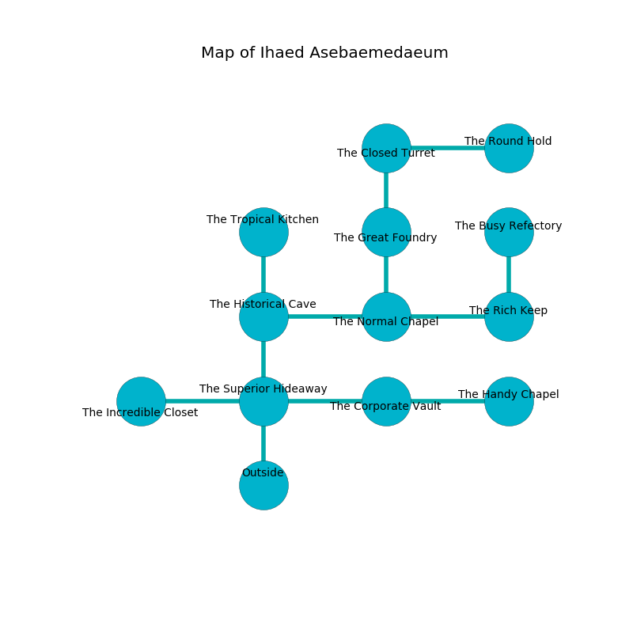

%Ruin Dogs

##Ihaed Asebaemedaeum
###Overview
Ihaed Asebaemedaeum is located on a poisoned rift. Parts of Ihaed Asebaemedaeum are flooded. A lunar eclipse is happening outside. It is occupied by Deep Gnomes. Muoi Shinn The Timid, a Drow Mage is here. The Deep Gnomes are the soldiers of Muoi Shinn The Timid. She  is founding a new religion. 

###Artifact
####The Military Trial

The Military Trial has the form of a broken monument. It is a bright pink color. Air slides away from it. It smells like jasmin. When cradled it makes its owner invisible. 

###Locations

####the superior hideaway
The air tastes like cucumber skin here. There are sixteen Deep Gnomes here. The stone walls are covered in mold. One of the Deep Gnomes is on watch, the rest are meditating. 

* There is a screw here.
* To the west a dark gap leads to [the incredible closet](#the-incredible-closet).
* To the east a torchlit cavern connects to [the corporate vault](#the-corporate-vault).
* To the north a hazy corridor connects to [the historical cave](#the-historical-cave).
* To the south is the entrance.

####the corporate vault
The air tastes like petroleum here. There are a Cult Fanatic, a Will-O’-Wisp, a Mastiff, a Fire Elemental, and a Giant Centipede here. Gray moss is sprouting in broken urns. 

* To the west a torchlit cavern leads to [the superior hideaway](#the-superior-hideaway).
* To the east a torchlit walkway leads to [the handy chapel](#the-handy-chapel).

####the historical cave
Blue lichens are growing in a patch on the floor. There are sixteen Deep Gnomes here. If the Deep Gnomes notice the Ruin Dogs, one of them will retreat and alert the others. 

* To the east a torchlit hall connects to [the normal chapel](#the-normal-chapel).
* To the north a dripping pathway connects to [the tropical kitchen](#the-tropical-kitchen).
* To the south a hazy corridor opens to [the superior hideaway](#the-superior-hideaway).

####the normal chapel
There are sixteen Deep Gnomes here. The floor is smooth. The concrete walls are scratched. One of the Deep Gnomes is pointing a ballista at the entrance. 

* To the west a torchlit hall connects to [the historical cave](#the-historical-cave).
* To the east a twisted cave leads to [the rich keep](#the-rich-keep).
* To the north a flooded cavern opens to [the great foundry](#the-great-foundry).

####the great foundry
There are a Grick Alpha and a Revenant here. 

There is an engraving on the ceiling written in common. 

> I am hiding in Ihaed Asebaemedaeum.
>

* To the north a small hallway leads to [the closed turret](#the-closed-turret).
* To the south a flooded cavern opens to [the normal chapel](#the-normal-chapel).

####the rich keep
The air smells like cereal here. There are a Giant Toad, a Gnoll, a Drow Mage, and a Gladiator here. 

There is an engraving on the wall written in common. 

> I am looting this place.
>
> Do not try cowering.
>

* To the west a twisted cave leads to [the normal chapel](#the-normal-chapel).
* To the north a dark cavern leads to [the busy refectory](#the-busy-refectory).

####the incredible closet
The stone walls are unsettled. The air smells like starch here. 

* There is a shoe here.
* There is a sceptre here.
* To the east a dark gap connects to [the superior hideaway](#the-superior-hideaway).

####the closed turret
Gray razorgrass is decaying in broken urns. The floor is bloodstained. 

* [The Military Trial](#The-Military-Trial) is here.
* To the east a windy gap opens to [the round hold](#the-round-hold).
* To the south a small hallway connects to [the great foundry](#the-great-foundry).

####the handy chapel
The mirrored walls are pristine. There are a Sprite, a Salamander, a Giant Eagle, a Mezzoloth, a Giant Frog, and a Flying Sword here. 

* To the west a torchlit walkway opens to [the corporate vault](#the-corporate-vault).

####the busy refectory
The metallic walls are covered in mold. There are a Pentadrone, a Succubus, a Sea Horse, an Ogre Zombie, and a Panther here. Gray mushrooms are sprouting in cracks in the floor. 

* There is a root here.
* [Muoi Shinn The Timid](#Muoi-Shinn-The-Timid) is here.
* To the south a dark cavern leads to [the rich keep](#the-rich-keep).

####the tropical kitchen
White ferns are decaying from the walls. The mirrored walls are bloodstained. The floor is smooth. The air smells like spearmint here. 

* There is a rowboat here.
* To the south a dripping pathway connects to [the historical cave](#the-historical-cave).

####the round hold
The air tastes like lychee here. 

* There is a sponge here.
* To the west a windy gap opens to [the closed turret](#the-closed-turret).

