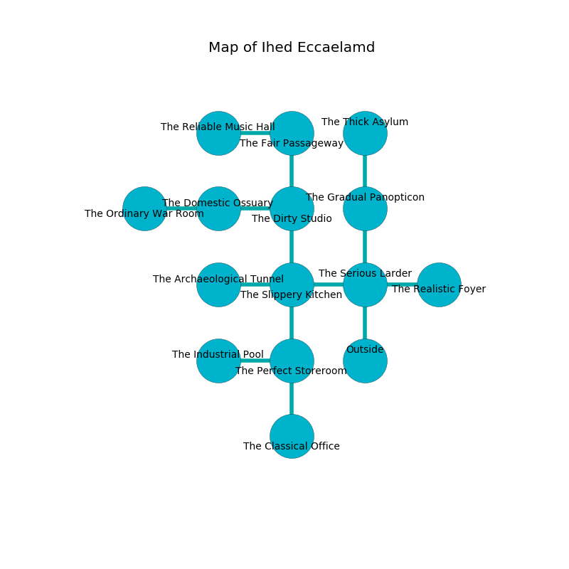

%Ruin Dogs

##Ihed Eccaelamd
###Overview
Ihed Eccaelamd is located in an obsidion city. Some rooms of it are cursed. A solar eclipse is happening outside. It is occupied by Myconids. Racquel Amador The Impolite, an Assassin is here. The Myconids worship Racquel Amador The Impolite. She  is founding a new religion. 

###Artifact
####Cumdaemoedaeum Dfaemca

Cumdaemoedaeum Dfaemca has the form of a broken doll. It smells like honeysuckle. Light flows near it. When picked up it becomes lost. 

###Locations

####the serious larder
The floor is bloodstained. The air tastes like salmon here. 

* To the west a small threshold opens to [the slippery kitchen](#the-slippery-kitchen).
* To the east a twisted cave connects to [the realistic foyer](#the-realistic-foyer).
* To the north a dripping path leads to [the gradual panopticon](#the-gradual-panopticon).
* To the south is the entrance.

####the slippery kitchen

* To the west a small artery leads to [the archaeological tunnel](#the-archaeological-tunnel).
* To the east a small threshold connects to [the serious larder](#the-serious-larder).
* To the north a small corridor opens to [the dirty studio](#the-dirty-studio).
* To the south a twisted cavern opens to [the perfect storeroom](#the-perfect-storeroom).

####the perfect storeroom
Blue moss is sprouting in broken urns. The floor is bloodstained. The glass walls are caving in. There are three Myconid Sovereigns and four Myconid Adults here. If the Myconids notice the Ruin Dogs, one of them will retreat and alert [Racquel Amador](#Racquel-Amador). 

There is an engraving on a tablet written in Myconids Script. 

> I am seeking [Cumdaemoedaeum Dfaemca](#Cumdaemoedaeum-Dfaemca).
>

* To the west a windy pathway leads to [the industrial pool](#the-industrial-pool).
* To the north a twisted cavern connects to [the slippery kitchen](#the-slippery-kitchen).
* To the south a dark passageway leads to [the classical office](#the-classical-office).

####the realistic foyer
The air smells like cucumber skin here. 

There is an engraving on the floor written in Myconids Script. 

> I tried digging.
>

* To the west a twisted cave opens to [the serious larder](#the-serious-larder).

####the gradual panopticon
The air tastes like almond here. The wooden walls are unsettled. There are three Myconid Sovereigns and three Myconid Adults here. One of the Myconids is pointing a ballista at the entrance. 

* [Cumdaemoedaeum Dfaemca](#Cumdaemoedaeum-Dfaemca) is here.
* To the north a windy cavern leads to [the thick asylum](#the-thick-asylum).
* To the south a dripping path connects to [the serious larder](#the-serious-larder).

####the dirty studio
The stone walls are bloodstained. The floor is glossy. The air smells like bread baked here. 

There is an engraving on the floor written in common. 

> Oh life is sadistic
>
> similar and characteristic
>
> but never particular
>
> fate is artistic
>

* To the west a twisted path opens to [the domestic ossuary](#the-domestic-ossuary).
* To the north a torchlit corridor leads to [the fair passageway](#the-fair-passageway).
* To the south a small corridor leads to [the slippery kitchen](#the-slippery-kitchen).

####the domestic ossuary
The floor is flooded with three inch deep hot water. White mushrooms are swaying in cracks in the floor. 

There is an engraving on the ceiling written in Myconids Script. 

> Dear me! life is inhumane
>
> arrogant, terminal, closed
>
> it is never plain
>
> sadness is opposed
>

* To the west a twisted artery connects to [the ordinary war Room](#the-ordinary-war-Room).
* To the east a twisted path opens to [the dirty studio](#the-dirty-studio).

####the industrial pool
The stone walls are covered in mold. There is a trap here. When activated, a magical sound detector will make the ceiling slowly lower. The air tastes like onion here. 

There is an engraving on a monolith written in common. 

> I am afraid.
>
> Run away.
>

* There is a gold coin here.
* There is a bone here.
* To the east a windy pathway connects to [the perfect storeroom](#the-perfect-storeroom).

####the archaeological tunnel
The air tastes like turmeric here. 

* To the east a small artery opens to [the slippery kitchen](#the-slippery-kitchen).

####the classical office
Blue mushrooms are decaying from the walls. The air smells like ginger here. The mirrored walls are scratched. There are a Kuo-Toa Monitor, a Swarm of Ravens, a Sahuagin Priestess, a Thug, a Hawk, a Piercer, a Bandit, and a Flying Snake here. The floor is smooth. 

* To the north a dark passageway opens to [the perfect storeroom](#the-perfect-storeroom).

####the fair passageway
The floor is sticky. The metallic walls are scratched. There are three Myconid Sovereigns and two Myconid Adults here. The Myconids are willing to negotiate. 

* To the west a small threshold opens to [the reliable music hall](#the-reliable-music-hall).
* To the south a torchlit corridor connects to [the dirty studio](#the-dirty-studio).

####the reliable music hall
The metallic walls are covered in mold. There is a trap here. When activated, a tripwire will collapse a column. The air smells like rhubarb here. The floor is cluttered with broken glass. 

* To the east a small threshold connects to [the fair passageway](#the-fair-passageway).

####the ordinary war Room
The floor is flooded with four inch deep hot water. 

* To the east a twisted artery leads to [the domestic ossuary](#the-domestic-ossuary).

####the thick asylum
The glass walls are unsettled. The floor is flooded with three inch deep lukewarm water. White moss is sprouting from the walls. 

* There is an icon here.
* There is a drake here.
* [Racquel Amador The Impolite](#Racquel-Amador-The-Impolite) is here.
* To the south a windy cavern connects to [the gradual panopticon](#the-gradual-panopticon).

