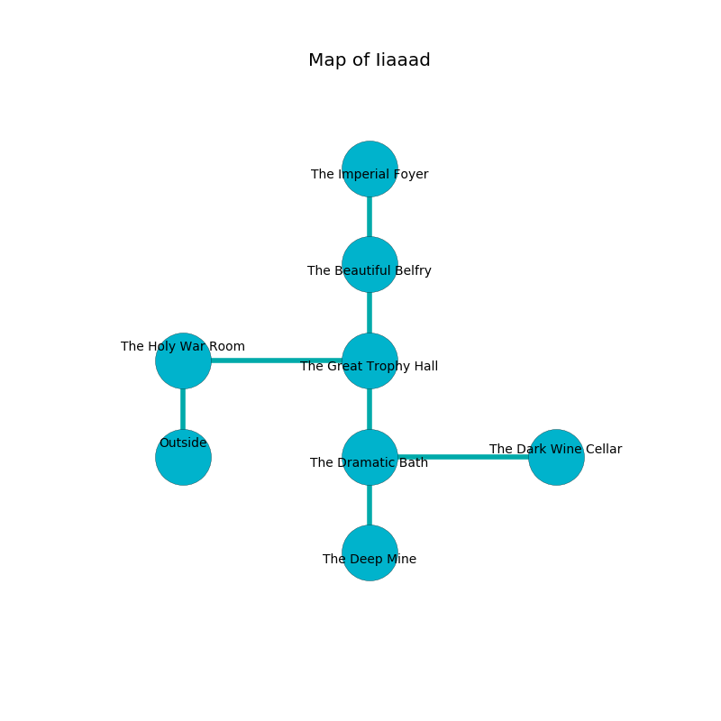

%Ruin Dogs

##Iiaaad
###Overview
Iiaaad is located on a broken city. Parts of it are corrupted. The ruin is sinking into the earth. It is occupied by Satyrs. Enrique Macklin The Callous, a Sahuagin Baron is here. The Satyrs have been charmed by Enrique Macklin The Callous. He  is trying to recover [The Occupational Excitement](#The-Occupational-Excitement). 

###Artifact
####The Occupational Excitement

The Occupational Excitement looks like a wet doll. Water incinerates around it. It is a medium blue color. It smells like dates. When rubbed it projects energy. 

###Locations

####the holy war Room
The air smells like watermelon here. The metallic walls are unsettled. 

* [Enrique Macklin The Callous](#Enrique-Macklin-The-Callous) is here.
* To the east a small path leads to [the great trophy hall](#the-great-trophy-hall).
* To the south is the entrance.

####the great trophy hall
The floor is smooth. There are a Giant Constrictor Snake and an Orog here. The crystal walls are scratched. White razorgrass is swaying from the ceiling. 

* To the west a small path leads to [the holy war Room](#the-holy-war-Room).
* To the north a long corridor connects to [the beautiful belfry](#the-beautiful-belfry).
* To the south a long hallway opens to [the dramatic bath](#the-dramatic-bath).

####the dramatic bath
Blue ferns are swaying in broken urns. The brick walls are pristine. The air tastes like nut flesh here. 

* To the east a hazy walkway opens to [the dark wine cellar](#the-dark-wine-cellar).
* To the north a long hallway connects to [the great trophy hall](#the-great-trophy-hall).
* To the south a hazy opening leads to [the deep mine](#the-deep-mine).

####the dark wine cellar
The floor is bloodstained. There are a Myconid Sovereign and a Minotaur Skeleton here. The air tastes like chemicals here. The glass walls are ruined. 

* To the west a hazy walkway opens to [the dramatic bath](#the-dramatic-bath).

####the deep mine
There is a trap here. When activated, a magical rune will extend a spring loaded spear. The air tastes like fudge here. The stone walls are unsettled. There is a Wereboar here. 

* To the north a hazy opening connects to [the dramatic bath](#the-dramatic-bath).

####the beautiful belfry
Blue ferns are growing in cracks in the floor. The air tastes like cedarwood here. There are eight Satyrs here. The stone walls are unsettled. The Satyrs are willing to fight to the death. 

* [The Occupational Excitement](#The-Occupational-Excitement) is here.
* To the north a narrow gap connects to [the imperial foyer](#the-imperial-foyer).
* To the south a long corridor connects to [the great trophy hall](#the-great-trophy-hall).

####the imperial foyer
There are eight Satyrs here. The glass walls are pristine. The floor is flooded with one inch deep lukewarm water. Blue lichens are decaying from the ceiling. The Satyrs are willing to negotiate. 

* To the south a narrow gap leads to [the beautiful belfry](#the-beautiful-belfry).

