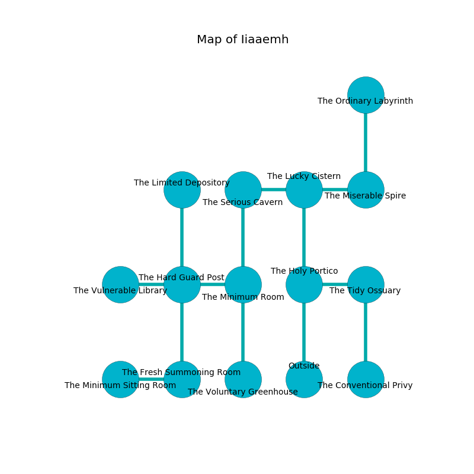

%Ruin Dogs

##Iiaaemh
###Overview
Iiaaemh is located under a giant rift. Some rooms of Iiaaemh are flooded. The ruin is larger on the inside than the outside. It is occupied by Sprites. Roy Harwell The Bossy, a Drow Priestess of Lolth is here. The Sprites are the soldiers of Roy Harwell The Bossy. He  is trying to destroy [The Loose Light](#The-Loose-Light). 

###Artifact
####The Loose Light

The Loose Light looks like a broken figurine. It is a bright green color. It smells like freesia. When eaten it becomes a shielding force. 

###Locations

####the holy portico
The air tastes like freshly cut hay here. The concrete walls are caving in. 

* To the east a dripping opening connects to [the tidy ossuary](#the-tidy-ossuary).
* To the north a narrow passageway leads to [the lucky cistern](#the-lucky-cistern).
* To the south is the entrance.

####the lucky cistern
White lichens are growing in broken urns. The floor is bloodstained. The concrete walls are caving in. There are twenty eight Sprites here. The Sprites are performing a ritual. If not interrupted, the Sprites will become more powerful. 

* There is a brick here.
* To the west a windy opening opens to [the serious cavern](#the-serious-cavern).
* To the east a narrow pathway leads to [the miserable spire](#the-miserable-spire).
* To the south a narrow passageway leads to [the holy portico](#the-holy-portico).

####the serious cavern
The air tastes like apple skin here. The obsidion walls are unsettled. The floor is cluttered with debris. 

* There is a skirt here.
* To the east a windy opening connects to [the lucky cistern](#the-lucky-cistern).
* To the south a dripping opening connects to [the minimum room](#the-minimum-room).

####the minimum room
White lichens are growing from the ceiling. There are twenty eight Sprites here. The floor is cluttered with rocks. The obsidion walls are caving in. The Sprites are willing to negotiate. 

* To the west a small gap opens to [the hard guard post](#the-hard-guard-post).
* To the north a dripping opening connects to [the serious cavern](#the-serious-cavern).
* To the south a flooded walkway connects to [the voluntary greenhouse](#the-voluntary-greenhouse).

####the voluntary greenhouse
Red mushrooms are sprouting in broken urns. The air smells like salmon here. 

* To the north a flooded walkway connects to [the minimum room](#the-minimum-room).

####the tidy ossuary
The floor is smooth. There are twenty eight Sprites here. Red mushrooms are swaying from the ceiling. One of the Sprites is working a mechanism that can launch acid at the Ruin Dogs. 

* [Roy Harwell The Bossy](#Roy-Harwell-The-Bossy) is here.
* To the west a dripping opening opens to [the holy portico](#the-holy-portico).
* To the south a torchlit path leads to [the conventional privy](#the-conventional-privy).

####the miserable spire
Blue mushrooms are sprouting from the ceiling. 

* To the west a narrow pathway connects to [the lucky cistern](#the-lucky-cistern).
* To the north a small cave connects to [the ordinary labyrinth](#the-ordinary-labyrinth).

####the hard guard post
Yellow lichens are swaying in cracks in the floor. The air smells like almond here. 

* There is a diamond here.
* There is a finger here.
* To the west a dripping hallway leads to [the vulnerable library](#the-vulnerable-library).
* To the east a small gap opens to [the minimum room](#the-minimum-room).
* To the north a dark corridor connects to [the limited depository](#the-limited-depository).
* To the south a small opening leads to [the fresh summoning room](#the-fresh-summoning-room).

####the vulnerable library

There is an engraving on the wall written in Sprites Script. 

> [The Loose Light](#The-Loose-Light)
>
> cultural, discreet, shallow
>
> but rotten
>
> enthusiastic, secure, neutral
>
> intellectual and new
>
> always equal
>
> due and harsh
>
> [The Loose Light](#The-Loose-Light)
>
> but never particular
>
> yet military
>
> shallow, offensive, able
>
> new, hot, positive
>

* There is a femur here.
* There is a potato here.
* There is a coat here.
* To the east a dripping hallway leads to [the hard guard post](#the-hard-guard-post).

####the ordinary labyrinth
The air smells like wax here. There are twenty eight Sprites here. The floor is bloodstained. The Sprites are willing to negotiate. 

There is an engraving on a stone written in Sprites Script. 

> Dear me! my fate is sadistic
>
> it is never artistic
>
> inner and continental
>
> nothing is experimental
>

* To the south a small cave leads to [the miserable spire](#the-miserable-spire).

####the conventional privy
The air tastes like rose tea here. The glass walls are scratched. 

There is an engraving on the floor written in Sprites Script. 

> A trap ahead.
>

* There is a specter here.
* To the north a torchlit path leads to [the tidy ossuary](#the-tidy-ossuary).

####the fresh summoning room
The crystal walls are pristine. There are twenty eight Sprites here. The air smells like strawberry here. The Sprites are defending this room from intruders. 

* There is a collar here.
* [The Loose Light](#The-Loose-Light) is here.
* To the west a flooded path leads to [the minimum sitting Room](#the-minimum-sitting-Room).
* To the north a small opening opens to [the hard guard post](#the-hard-guard-post).

####the limited depository
The air smells like magnolia here. There are twenty eight Sprites here. The floor is flooded with nine inch deep scalding water. The obsidion walls are caving in. The Sprites are sleeping. 

* To the south a dark corridor opens to [the hard guard post](#the-hard-guard-post).

####the minimum sitting Room
Red mushrooms are growing in cracks in the floor. The crystal walls are unsettled. 

* To the east a flooded path opens to [the fresh summoning room](#the-fresh-summoning-room).

