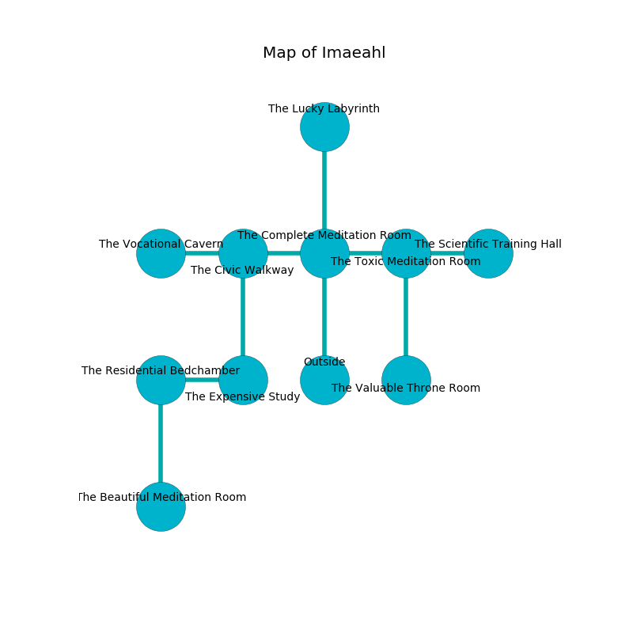

%Ruin Dogs

##Imaeahl
###Overview
Imaeahl is located on a crystal tree. Regions of Imaeahl are flooded. The ruin is sinking into the earth. It is occupied by Humans. Emmanuel Shifflett The Indiscreet, an Orc Eye of Gruumsh is here. The Humans are ruled by Emmanuel Shifflett The Indiscreet. He  is founding a new religion. 

###Artifact
####Cemcaf Dmaufaeid

Cemcaf Dmaufaeid is a powerful artifact in the shape of a soft prism. It smells like labdanum. When worn it frightens children. 

###Locations

####the complete meditation room
The concrete walls are bloodstained. White mushrooms are sprouting in broken urns. The floor is cluttered with bones. 

* There is a casket here.
* To the west a flooded hallway connects to [the civic walkway](#the-civic-walkway).
* To the east a dripping threshold opens to [the toxic meditation room](#the-toxic-meditation-room).
* To the north a dark cavern connects to [the lucky labyrinth](#the-lucky-labyrinth).
* To the south is the entrance.

####the toxic meditation room
The air tastes like sesame here. 

There is an engraving on the ceiling written in common. 

> O meak fate
>
> ever explicit
>
> valid and great
>
> cruelty is implicit
>

* To the west a dripping threshold opens to [the complete meditation room](#the-complete-meditation-room).
* To the east a flooded hall connects to [the scientific training hall](#the-scientific-training-hall).
* To the south a hazy gap opens to [the valuable throne room](#the-valuable-throne-room).

####the valuable throne room
Blue mushrooms are decaying in a patch on the floor. 

* To the north a hazy gap connects to [the toxic meditation room](#the-toxic-meditation-room).

####the lucky labyrinth
There are a Hobgoblin Captain and a Hyena here. The floor is bloodstained. 

There is an engraving on the ceiling written in Humans Script. 

> [Cemcaf Dmaufaeid](#Cemcaf-Dmaufaeid)
>
> secondary, pure, systematic
>

* To the south a dark cavern leads to [the complete meditation room](#the-complete-meditation-room).

####the civic walkway
There are a Kenku and a Basilisk here. The wooden walls are unsettled. There is a trap here. When activated, a magical sound detector will launch a ceiling pendulum. 

There is an engraving on a tablet written in Humans Script. 

> O! my fate is woe
>
> cautious, popular, low
>
> it is always mild
>
> everything is slow
>

* [Cemcaf Dmaufaeid](#Cemcaf-Dmaufaeid) is here.
* [Emmanuel Shifflett The Indiscreet](#Emmanuel-Shifflett-The-Indiscreet) is here.
* To the west a small threshold opens to [the vocational cavern](#the-vocational-cavern).
* To the east a flooded hallway connects to [the complete meditation room](#the-complete-meditation-room).
* To the south a flooded hallway opens to [the expensive study](#the-expensive-study).

####the expensive study
There are a Gray Ooze and a Gold Dragon Wyrmling here. Green lichens are swaying from the walls. The floor is sticky. 

* To the west a narrow path connects to [the residential bedchamber](#the-residential-bedchamber).
* To the north a flooded hallway connects to [the civic walkway](#the-civic-walkway).

####the residential bedchamber
Yellow ferns are sprouting in a patch on the floor. The floor is sticky. The air tastes like acerola here. 

* To the east a narrow path opens to [the expensive study](#the-expensive-study).
* To the south a narrow path leads to [the beautiful meditation room](#the-beautiful-meditation-room).

####the scientific training hall
The wooden walls are pristine. The air smells like chamomile here. Blue moss is sprouting in broken urns. 

* To the west a flooded hall opens to [the toxic meditation room](#the-toxic-meditation-room).

####the beautiful meditation room
The obsidion walls are bloodstained. The floor is flooded with six inch deep scalding water. 

* To the north a narrow path connects to [the residential bedchamber](#the-residential-bedchamber).

####the vocational cavern
White mushrooms are growing in cracks in the floor. The metallic walls are bloodstained. The floor is flooded with six inch deep hot water. 

* To the east a small threshold connects to [the civic walkway](#the-civic-walkway).

