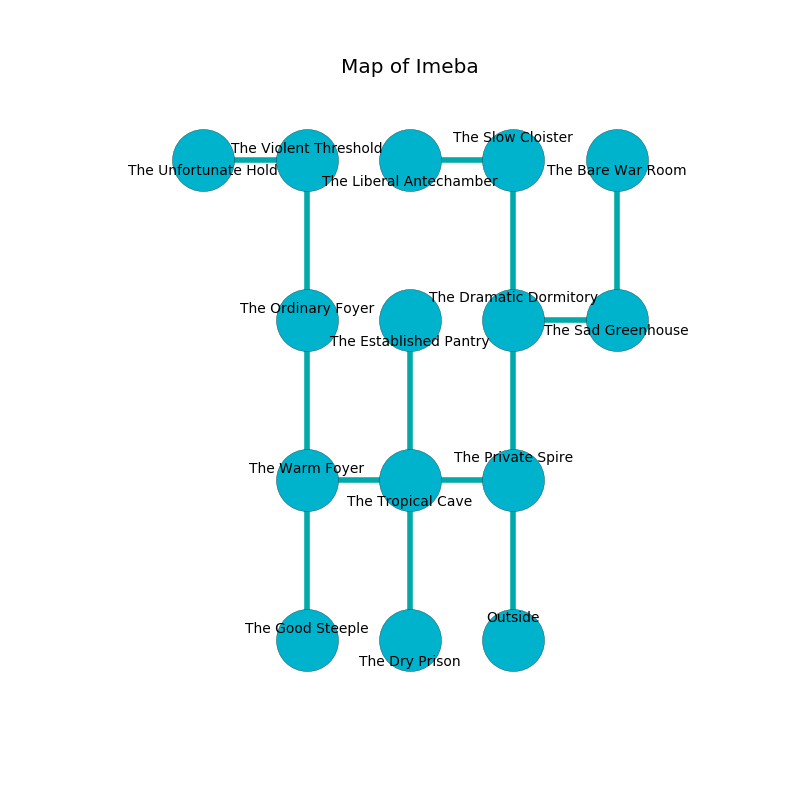

%Ruin Dogs

##Imeba
###Overview
Imeba is located under a broken tree. Some rooms of it are inaccessible. A solar eclipse is happening outside. It is occupied by Drows. Kristian Smallwood The Sarcastic, a Gladiator is here. The Drows are the soldiers of Kristian Smallwood The Sarcastic. She  is trying to hide [Caehefadda](#Caehefadda). 

###Artifact
####Caehefadda

Caehefadda has the form of an opaque doll. Light pours around it. When rubbed it become energized with a powerful vibration. 

###Locations

####the private spire
The floor is flooded with eight inch deep lukewarm water. The air tastes like melon rind here. The mirrored walls are unsettled. 

* To the west a flooded hallway connects to [the tropical cave](#the-tropical-cave).
* To the north a dripping artery connects to [the dramatic dormitory](#the-dramatic-dormitory).
* To the south is the entrance.

####the dramatic dormitory
The floor is flooded with seven inch deep lukewarm water. The air tastes like black currant here. 

There is an engraving on a monolith written in common. 

> I can not find [Caehefadda](#Caehefadda).
>
> Run away.
>

* To the east a twisted cave connects to [the sad greenhouse](#the-sad-greenhouse).
* To the north a flooded cave connects to [the slow cloister](#the-slow-cloister).
* To the south a dripping artery connects to [the private spire](#the-private-spire).

####the tropical cave
The air smells like mint here. The floor is bloodstained. 

* [Caehefadda](#Caehefadda) is here.
* To the west a long path leads to [the warm foyer](#the-warm-foyer).
* To the east a flooded hallway leads to [the private spire](#the-private-spire).
* To the north a flooded walkway leads to [the established pantry](#the-established-pantry).
* To the south a dripping gap leads to [the dry prison](#the-dry-prison).

####the warm foyer
There are a Salamander, an Otyugh, a Dust Mephit, a Shrieker, an Elk, and a Scorpion here. The floor is glossy. The glass walls are unsettled. There is a trap here. When activated, a magical proximity detector will launch a fireball. Red mushrooms are sprouting from the walls. 

* [Kristian Smallwood The Sarcastic](#Kristian-Smallwood-The-Sarcastic) is here.
* To the east a long path opens to [the tropical cave](#the-tropical-cave).
* To the north a narrow hallway opens to [the ordinary foyer](#the-ordinary-foyer).
* To the south a torchlit walkway connects to [the good steeple](#the-good-steeple).

####the slow cloister
There are a Sprite, a Young Brass Dragon, and a Gibbering Mouther here. The obsidion walls are caving in. The floor is smooth. 

There is an engraving on the floor written in common. 

> I thought about dying.
>

* To the west a twisted path opens to [the liberal antechamber](#the-liberal-antechamber).
* To the south a flooded cave connects to [the dramatic dormitory](#the-dramatic-dormitory).

####the sad greenhouse
There are an Unicorn and a Giant Crocodile here. Gray razorgrass is sprouting in broken urns. The stone walls are caving in. 

* There is a shield here.
* To the west a twisted cave opens to [the dramatic dormitory](#the-dramatic-dormitory).
* To the north a narrow hall connects to [the bare war Room](#the-bare-war-Room).

####the ordinary foyer
The air smells like chive here. The floor is bloodstained. The mirrored walls are covered in mold. There are twenty four Drows here. The Drows are willing to negotiate. 

* To the north a twisted cavern leads to [the violent threshold](#the-violent-threshold).
* To the south a narrow hallway connects to [the warm foyer](#the-warm-foyer).

####the established pantry
There are a Kuo-Toa Whip, an Awakened Shrub, a Druid, a Gibbering Mouther, and a Pegasus here. Yellow mushrooms are swaying in broken urns. 

* To the south a flooded walkway leads to [the tropical cave](#the-tropical-cave).

####the violent threshold
The air smells like rye bread here. The mirrored walls are bloodstained. The floor is glossy. Blue mushrooms are sprouting in cracks in the floor. There are a Giant Constrictor Snake, a Dust Mephit, a Dire Wolf, a Rust Monster, a Guard, a Bugbear, a Piercer, a Baboon, and a Goblin Boss here. 

* To the west a torchlit walkway connects to [the unfortunate hold](#the-unfortunate-hold).
* To the south a twisted cavern connects to [the ordinary foyer](#the-ordinary-foyer).

####the liberal antechamber
The mirrored walls are bloodstained. The floor is sticky. 

* To the east a twisted path opens to [the slow cloister](#the-slow-cloister).

####the good steeple
The air tastes like praline here. There are twenty four Drows here. The concrete walls are pristine. Green lichens are decaying in cracks in the floor. One of the Drows is working a mechanism that can launch acid at the Ruin Dogs. 

There is an engraving on a stone written in common. 

> A floor is a basketball
>
> proportional, extraordinary, legislative
>
> hostile and geological
>
> verbal, tight, desirable
>
> [Caehefadda](#Caehefadda)
>
> last and conventional
>
> continental and sexual
>
> appropriate, unlawful, vigorous
>
> crude and incongruous
>
> experienced and aloof
>
> [Caehefadda](#Caehefadda)
>
> but never eligible
>

* To the north a torchlit walkway connects to [the warm foyer](#the-warm-foyer).

####the bare war Room
The wooden walls are bloodstained. 

* To the south a narrow hall connects to [the sad greenhouse](#the-sad-greenhouse).

####the unfortunate hold
Blue razorgrass is growing in broken urns. The wooden walls are unsettled. The air smells like sweat here. The floor is sticky. 

* There is a basket here.
* To the east a torchlit walkway connects to [the violent threshold](#the-violent-threshold).

####the dry prison
The floor is sticky. The brick walls are unsettled. The air smells like sharp here. 

* To the north a dripping gap leads to [the tropical cave](#the-tropical-cave).

