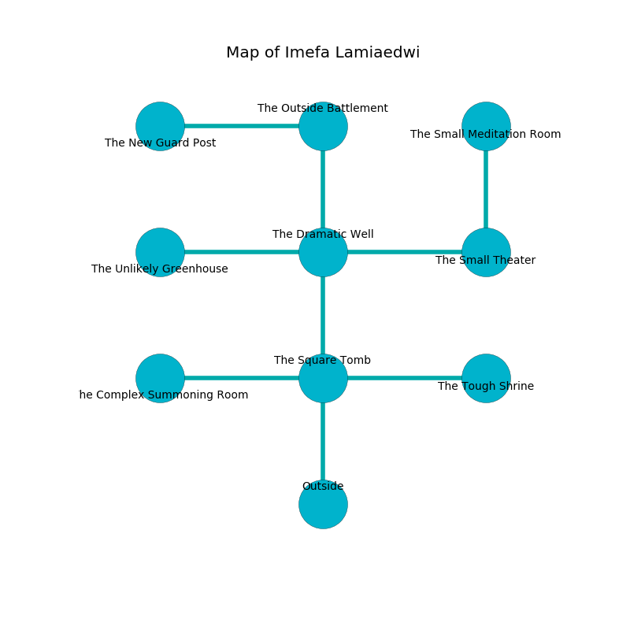

%Ruin Dogs

##Imefa Lamiaedwi
###Overview
Imefa Lamiaedwi is located in a volcanic rift. Regions of Imefa Lamiaedwi are cursed. The ruin is coming to life. It is occupied by Pixies. Makeda Zuniga The Unkind, a Mind Flayer Arcanist is here. The Pixies are battling Makeda Zuniga The Unkind. She  is trying to research [The Unaware Clearance](#The-Unaware-Clearance). 

###Artifact
####The Unaware Clearance

The Unaware Clearance is a powerful artifact in the shape of a soft spear. It smells like powder. When gazed upon it becomes a deadly projectile. 

###Locations

####the square tomb
The metallic walls are caving in. The air smells like ozone here. Red ferns are sprouting in a patch on the floor. The floor is smooth. There are two Chimeras and a Worg here. 

There is an engraving on the wall written in Pixies Script. 

> I am lost in Imefa Lamiaedwi.
>
> Go away.
>

* There is a scissors here.
* There is a coat here.
* To the west a windy opening leads to [the complex summoning room](#the-complex-summoning-room).
* To the east a hazy artery connects to [the tough shrine](#the-tough-shrine).
* To the north a windy corridor opens to [the dramatic well](#the-dramatic-well).
* To the south is the entrance.

####the tough shrine
There is a trap here. When activated, a tripwire will launch a javelin. The air smells like acai here. There are a Gray Slaad and an Old Faerie Dragon here. The floor is cluttered with rocks. Gray lichens are swaying from the walls. 

* There is a cart here.
* To the west a hazy artery connects to [the square tomb](#the-square-tomb).

####the dramatic well
The obsidion walls are scratched. The floor is sticky. The air smells like grape here. 

There is an engraving on the floor written in common. 

> I thought about running.
>

* To the west a long cavern opens to [the unlikely greenhouse](#the-unlikely-greenhouse).
* To the east a hazy pathway connects to [the small theater](#the-small-theater).
* To the north a small opening connects to [the outside battlement](#the-outside-battlement).
* To the south a windy corridor connects to [the square tomb](#the-square-tomb).

####the outside battlement
The mirrored walls are bloodstained. The floor is smooth. There are a Cult Fanatic, a Death Dog, and a Drider here. There is a trap here. When activated, a magical rune will shoot a lightning bolt. 

* [The Unaware Clearance](#The-Unaware-Clearance) is here.
* To the west a small cave connects to [the new guard post](#the-new-guard-post).
* To the south a small opening connects to [the dramatic well](#the-dramatic-well).

####the small theater
The air tastes like naphthyl here. There are thirty six Pixies here. One of the Pixies is on watch, the rest are drunk. 

* To the west a hazy pathway connects to [the dramatic well](#the-dramatic-well).
* To the north a flooded path leads to [the small meditation room](#the-small-meditation-room).

####the complex summoning room
There are thirty six Pixies here. One of the Pixies is pointing a ballista at the entrance. 

* There is a stamp here.
* [Makeda Zuniga The Unkind](#Makeda-Zuniga-The-Unkind) is here.
* To the east a windy opening leads to [the square tomb](#the-square-tomb).

####the unlikely greenhouse
The air smells like clove here. White lichens are growing in broken urns. There are a Peryton, a Duodrone, a Cloaker, a Bandit, a Giant Lizard, a Rug of Smothering, and a Green Dragon Wyrmling here. 

* There is a sceptre here.
* There is a cord here.
* There is a bird here.
* To the east a long cavern opens to [the dramatic well](#the-dramatic-well).

####the small meditation room
The glass walls are pristine. There are a Wolf, a Giant Octopus, a Young Brass Dragon, a Green Hag, and a Piercer here. The air smells like raw	reseda here. 

There is an engraving on the wall written in common. 

> O life is inhumane
>
> yet never main
>
> characteristic and expensive
>
> cruelty is comprehensive
>

* To the south a flooded path leads to [the small theater](#the-small-theater).

####the new guard post
The air tastes like mimosa here. There are thirty six Pixies here. The wooden walls are unsettled. The floor is smooth. One of the Pixies is on watch, the rest are sleeping. 

* There is an apple here.
* To the east a small cave opens to [the outside battlement](#the-outside-battlement).

