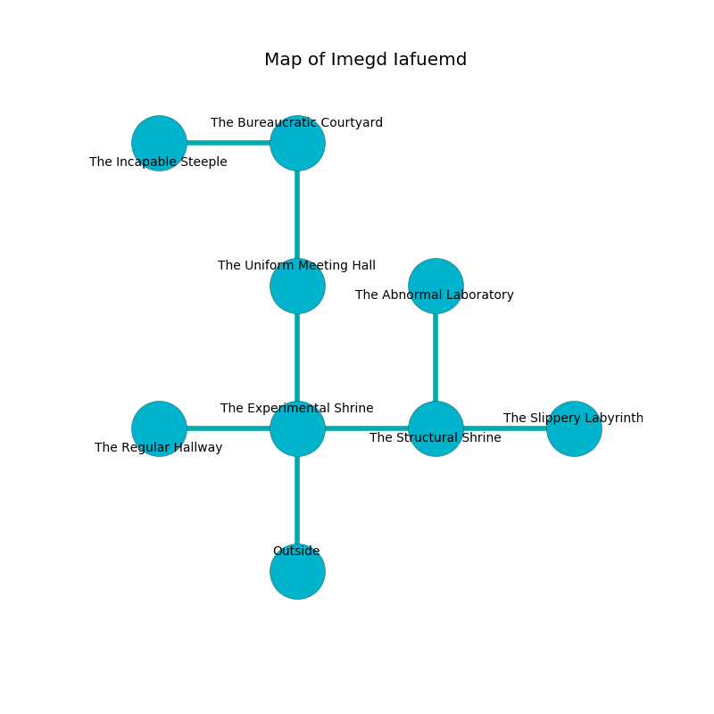

%Ruin Dogs

##Imegd Iafuemd
###Overview
Imegd Iafuemd is located under a ruined city. Regions of Imegd Iafuemd are corrupted. A massive flood is happening outside. It is occupied by Sahuagins. Matthew Schultz The Cruel, a Kuo-Toa Archpriest is here. The Sahuagins are the minions of Matthew Schultz The Cruel. He  is trying to steal [Lageohd](#Lageohd). 

###Artifact
####Lageohd

Lageohd has the form of a mushy monument. It is a shifting gray color. When rubbed it emits dust. 

###Locations

####the experimental shrine
Gray mushrooms are sprouting in broken urns. The floor is glossy. The crystal walls are scratched. The air tastes like baked potato here. 

* To the west a narrow hall opens to [the regular hallway](#the-regular-hallway).
* To the east a windy passageway leads to [the structural shrine](#the-structural-shrine).
* To the north a twisted hallway connects to [the uniform meeting hall](#the-uniform-meeting-hall).
* To the south is the entrance.

####the structural shrine
The air tastes like lobster here. The stone walls are pristine. Blue ferns are decaying from the ceiling. 

* To the west a windy passageway leads to [the experimental shrine](#the-experimental-shrine).
* To the east a narrow walkway opens to [the slippery labyrinth](#the-slippery-labyrinth).
* To the north a small pathway connects to [the abnormal laboratory](#the-abnormal-laboratory).

####the abnormal laboratory
The floor is bloodstained. The concrete walls are ruined. 

* To the south a small pathway connects to [the structural shrine](#the-structural-shrine).

####the uniform meeting hall
Green ferns are growing in cracks in the floor. There are a Flumph, a Bronze Dragon Wyrmling, a Green Dragon Wyrmling, and a Grick here. 

* There is a pot here.
* There is a casket here.
* To the north a long threshold connects to [the bureaucratic courtyard](#the-bureaucratic-courtyard).
* To the south a twisted hallway leads to [the experimental shrine](#the-experimental-shrine).

####the regular hallway
The concrete walls are unsettled. 

* There is a baby here.
* To the east a narrow hall leads to [the experimental shrine](#the-experimental-shrine).

####the bureaucratic courtyard
There are three Sahuagin Priestesses here. Blue moss is decaying in cracks in the floor. The floor is cluttered with debris. The Sahuagins are willing to negotiate. 

* There is a belt here.
* [Lageohd](#Lageohd) is here.
* To the west a dark artery opens to [the incapable steeple](#the-incapable-steeple).
* To the south a long threshold opens to [the uniform meeting hall](#the-uniform-meeting-hall).

####the slippery labyrinth
The air smells like labdanum here. The floor is flooded with eight inch deep hot water. There are three Sahuagin Priestesses here. The Sahuagins are defending this room from intruders. 

* [Matthew Schultz The Cruel](#Matthew-Schultz-The-Cruel) is here.
* To the west a narrow walkway connects to [the structural shrine](#the-structural-shrine).

####the incapable steeple
There is a trap here. When activated, a magical proximity detector will launch a rolling boulder. The glass walls are unsettled. The floor is smooth. 

* To the east a dark artery connects to [the bureaucratic courtyard](#the-bureaucratic-courtyard).

