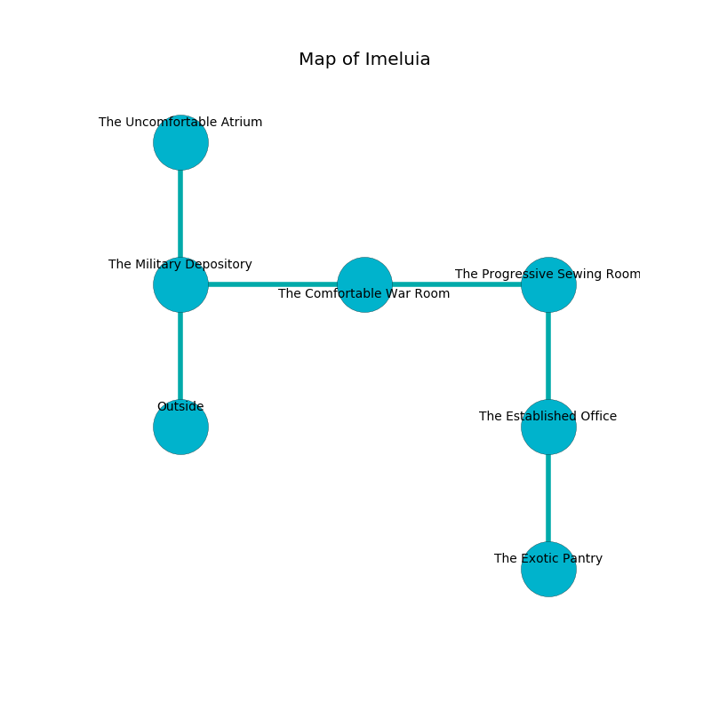

%Ruin Dogs

##Imeluia
###Overview
Imeluia is located on a spikey city. Parts of it are frozen. A battle between raiders is happening outside. It is occupied by Centaurs. Meagan Pritchard The Impatient, a Mind Flayer is here. The Centaurs have been charmed by Meagan Pritchard The Impatient. She  is trying to hide [Desdewiaf Becaod](#Desdewiaf-Becaod). 

###Artifact
####Desdewiaf Becaod

Desdewiaf Becaod is a powerful artifact in the shape of a sharp meteorite. When picked up it floats above the ground. 

###Locations

####the military depository
Yellow lichens are growing in a patch on the floor. The crystal walls are covered in mold. The floor is cluttered with rocks. 

* There is a hook here.
* To the east a windy gap connects to [the comfortable war Room](#the-comfortable-war-Room).
* To the north a torchlit walkway connects to [the uncomfortable atrium](#the-uncomfortable-atrium).
* To the south is the entrance.

####the uncomfortable atrium
Red moss is swaying from the walls. The floor is flooded with one inch deep scalding water. The mirrored walls are unsettled. 

* [Meagan Pritchard The Impatient](#Meagan-Pritchard-The-Impatient) is here.
* To the south a torchlit walkway leads to [the military depository](#the-military-depository).

####the comfortable war Room
Gray mushrooms are growing from the ceiling. There are three Centaurs here. The glass walls are unsettled. The Centaurs are performing a ritual. If not interrupted, the Centaurs will become more powerful. 

* To the west a windy gap opens to [the military depository](#the-military-depository).
* To the east a small passageway opens to [the progressive sewing room](#the-progressive-sewing-room).

####the progressive sewing room
The air tastes like tequila here. 

There is an engraving on a monolith written in Centaurs Script. 

> You are lost
>
> yet never aware
>
> ever soft
>
> You are sorrowful
>
> helpful, rare, delicate
>
> but medieval
>
> yet urban
>
> useful, poor, commercial
>
> You are lost
>

* To the west a small passageway opens to [the comfortable war Room](#the-comfortable-war-Room).
* To the south a hazy hall connects to [the established office](#the-established-office).

####the established office
There are three Centaurs here. The brick walls are covered in mold. The floor is cluttered with debris. The air smells like liver here. If the Centaurs notice the Ruin Dogs, one of them will retreat and alert the others. 

* [Desdewiaf Becaod](#Desdewiaf-Becaod) is here.
* To the north a hazy hall leads to [the progressive sewing room](#the-progressive-sewing-room).
* To the south a twisted corridor leads to [the exotic pantry](#the-exotic-pantry).

####the exotic pantry
The floor is sticky. Yellow razorgrass is sprouting in broken urns. 

* To the north a twisted corridor leads to [the established office](#the-established-office).

