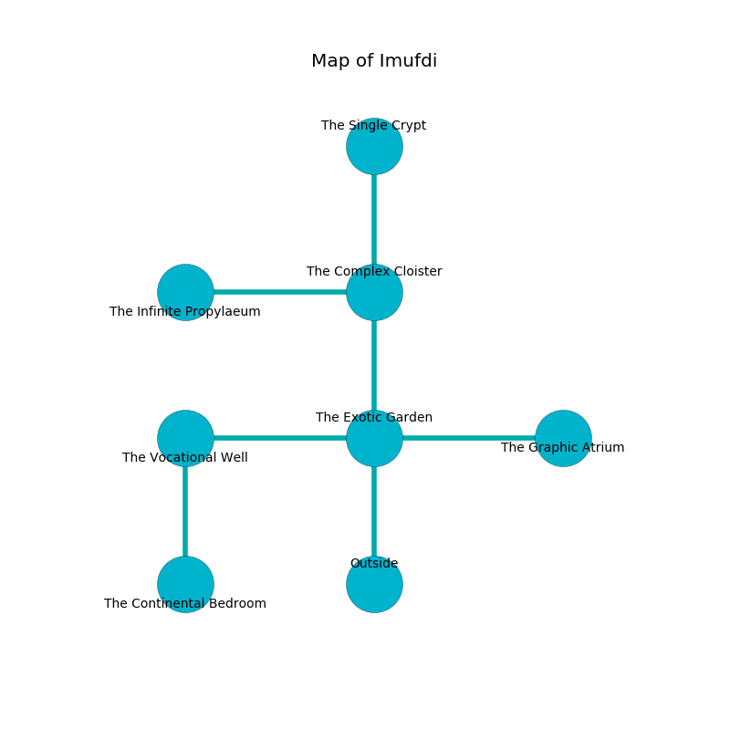

%Ruin Dogs

##Imufdi
###Overview
Imufdi is located on a volcanic city. Some rooms of it are inaccessible. The ruin is collapsing slowly. It is occupied by Githzerai. Carroll Lemaster The Changeable, a Drow Elite Warrior is here. The Githzerai are ruled by Carroll Lemaster The Changeable. He  is founding a new religion. 

###Artifact
####Amhehabamd Iaefmaemh

Amhehabamd Iaefmaemh is a powerful artifact in the shape of a glassy gem. Air incinerates towards it. When gazed upon it destroys itself. 

###Locations

####the exotic garden
The air tastes like mutton here. There are three Githzerai Monks here. If the Githzerai notice the Ruin Dogs, one of them will retreat and alert the others. 

* To the west a small path opens to [the vocational well](#the-vocational-well).
* To the east a torchlit cavern opens to [the graphic atrium](#the-graphic-atrium).
* To the north a long passageway connects to [the complex cloister](#the-complex-cloister).
* To the south is the entrance.

####the vocational well
The air tastes like laundered cloth here. The floor is flooded with six inch deep scalding water. 

* There is a bee here.
* [Amhehabamd Iaefmaemh](#Amhehabamd-Iaefmaemh) is here.
* To the east a small path opens to [the exotic garden](#the-exotic-garden).
* To the south a hazy hallway leads to [the continental bedroom](#the-continental-bedroom).

####the complex cloister
There are a Giant Constrictor Snake, a Jackal, a Dire Wolf, an Axe Beak, a Sahuagin Priestess, a Needle Blight, and a Crocodile here. The air tastes like green onion here. The mirrored walls are scratched. The floor is flooded with three inch deep hot water. Blue lichens are sprouting in broken urns. 

* To the west a dark cave leads to [the infinite propylaeum](#the-infinite-propylaeum).
* To the north a dark hallway connects to [the single crypt](#the-single-crypt).
* To the south a long passageway leads to [the exotic garden](#the-exotic-garden).

####the infinite propylaeum
The air smells like apple here. The floor is cluttered with shells. 

* To the east a dark cave opens to [the complex cloister](#the-complex-cloister).

####the graphic atrium
The concrete walls are unsettled. The air tastes like cauliflower here. 

* There is a worm here.
* To the west a torchlit cavern leads to [the exotic garden](#the-exotic-garden).

####the single crypt
There are three Githzerai Monks here. The Githzerai are willing to fight to the death. 

There is an engraving on a stone written in common. 

> I am lost in Imufdi.
>
> Try cowering.
>

* There is a cart here.
* There is a pendant here.
* To the south a dark hallway leads to [the complex cloister](#the-complex-cloister).

####the continental bedroom
The metallic walls are covered in mold. Yellow moss is growing from the walls. 

* [Carroll Lemaster The Changeable](#Carroll-Lemaster-The-Changeable) is here.
* To the north a hazy hallway opens to [the vocational well](#the-vocational-well).

