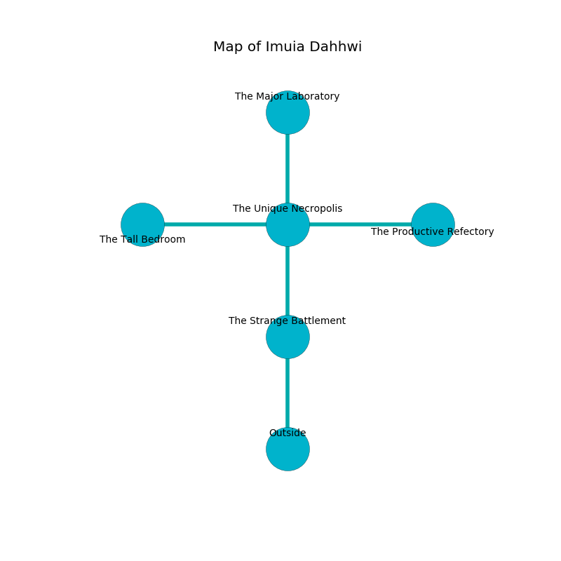

%Ruin Dogs

##Imuia Dahhwi
###Overview
Imuia Dahhwi is located on a ruined city. Some rooms of Imuia Dahhwi are cursed. A lunar eclipse is happening outside. It is occupied by Duergars. Eddie Luong The Intolerant, a Drow Priestess of Lolth is here. The Duergars worship Eddie Luong The Intolerant. He  is founding a new religion. 

###Artifact
####The Universal Pumpkin

The Universal Pumpkin looks like a warm amulet. It smells like guava. Air pours towards it. When worn it destroys others. 

###Locations

####the strange battlement
The crystal walls are unsettled. There are seven Duergars here. White moss is growing in cracks in the floor. If the Duergars notice the Ruin Dogs, one of them will retreat and alert [Eddie Luong](#Eddie-Luong). 

* To the north a dark threshold connects to [the unique necropolis](#the-unique-necropolis).
* To the south is the entrance.

####the unique necropolis
The floor is glossy. There are a Blink Dog, a Quaggoth, a Barbed Devil, and a Swarm of Ravens here. 

* There is a button here.
* [The Universal Pumpkin](#The-Universal-Pumpkin) is here.
* To the west a torchlit walkway connects to [the tall bedroom](#the-tall-bedroom).
* To the east a twisted artery leads to [the productive refectory](#the-productive-refectory).
* To the north a narrow gap leads to [the major laboratory](#the-major-laboratory).
* To the south a dark threshold leads to [the strange battlement](#the-strange-battlement).

####the productive refectory
The air smells like graham cracker here. The floor is glossy. There are seven Duergars here. One of the Duergars is working a mechanism that can pour rats from the ceiling. 

There is an engraving on the wall written in Duergars Script. 

> Oh dire you
>
> constant and new
>
> written, just, frank
>
> sadness is blank
>

* There is a wand here.
* There is a bee here.
* To the west a twisted artery opens to [the unique necropolis](#the-unique-necropolis).

####the major laboratory
The mirrored walls are caving in. The floor is sticky. There are seven Duergars here. The air tastes like spinach here. The Duergars are meditating. 

* [Eddie Luong The Intolerant](#Eddie-Luong-The-Intolerant) is here.
* To the south a narrow gap connects to [the unique necropolis](#the-unique-necropolis).

####the tall bedroom
Blue ferns are growing from the walls. 

* To the east a torchlit walkway opens to [the unique necropolis](#the-unique-necropolis).

