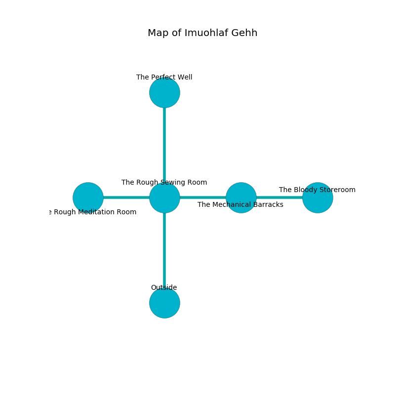

%Ruin Dogs

##Imuohlaf Gehh
###Overview
Imuohlaf Gehh is constructed on an obsidion rift. Some rooms of Imuohlaf Gehh are flooded. A windstorm is happening outside. It is occupied by Sprites. Agustin Durbin The Quarrelsome, a Cult Fanatic is here. The Sprites have been charmed by Agustin Durbin The Quarrelsome. He  is trying to find [The Short Exemption](#The-Short-Exemption). 

###Artifact
####The Short Exemption

The Short Exemption has the form of a smooth meteorite. It smells like grapefruit. Air incinerates towards it. When held it makes its owner invisible. 

###Locations

####the rough sewing room
White ferns are sprouting from the walls. 

There is an engraving on the floor written in common. 

> Leave at once.
>

* To the west a dark cave leads to [the rough meditation room](#the-rough-meditation-room).
* To the east a flooded cave leads to [the mechanical barracks](#the-mechanical-barracks).
* To the north a dark pathway connects to [the perfect well](#the-perfect-well).
* To the south is the entrance.

####the mechanical barracks
There are eight Sprites here. The floor is glossy. The brick walls are covered in mold. The air smells like jonquil here. Blue mushrooms are sprouting from the walls. The Sprites are performing a ritual. If not interrupted, the Sprites will become more powerful. 

There is an engraving on the floor written in Sprites Script. 

> A church is a cup
>
> steady, dependent, hilarious
>
> sad and last
>

* [The Short Exemption](#The-Short-Exemption) is here.
* To the west a flooded cave opens to [the rough sewing room](#the-rough-sewing-room).
* To the east a narrow artery connects to [the bloody storeroom](#the-bloody-storeroom).

####the rough meditation room
The wooden walls are covered in mold. Red mushrooms are swaying in broken urns. The floor is sticky. There are eight Sprites here. If the Sprites notice the Ruin Dogs, one of them will retreat and alert [Agustin Durbin](#Agustin-Durbin). 

There is an engraving on a tablet written in Sprites Script. 

> O! my life is inhumane
>
> obvious, finished, vain
>
> flawed and peaceful
>
> death is plain
>

* There is a finger here.
* There is a map here.
* To the east a dark cave leads to [the rough sewing room](#the-rough-sewing-room).

####the perfect well
There are a Rhinoceros, a Commoner, and a Flying Snake here. The metallic walls are unsettled. 

* [Agustin Durbin The Quarrelsome](#Agustin-Durbin-The-Quarrelsome) is here.
* To the south a dark pathway leads to [the rough sewing room](#the-rough-sewing-room).

####the bloody storeroom
There is an Allosaurus here. The floor is sticky. The crystal walls are bloodstained. 

There is an engraving on the floor written in common. 

> Poor me! cruel soul
>
> satisfactory and cultural
>
> it is never whole
>
> death is agricultural
>

* To the west a narrow artery leads to [the mechanical barracks](#the-mechanical-barracks).

