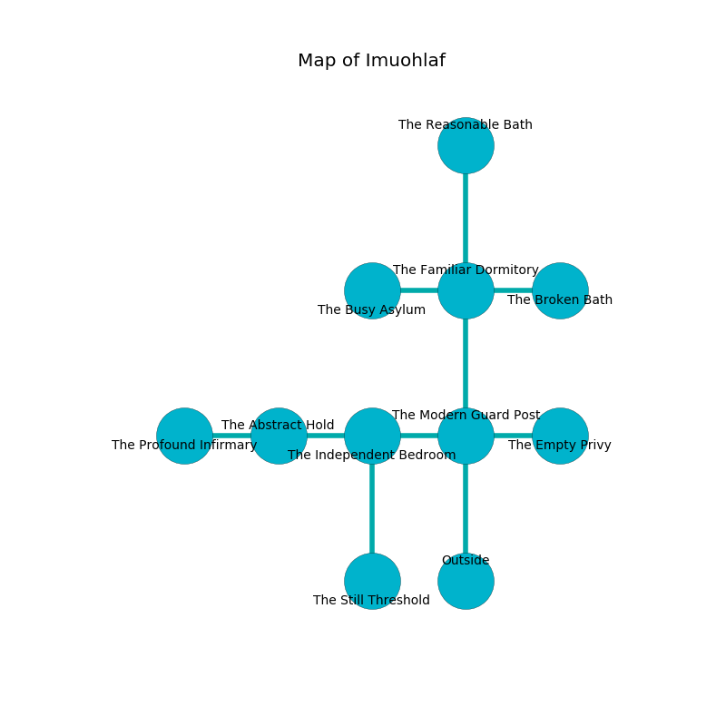

%Ruin Dogs

##Imuohlaf
###Overview
Imuohlaf is located under a volcanic rift. Regions of Imuohlaf are flooded. A lunar eclipse is happening outside. It is occupied by Deep Gnomes. Rebeca Valenti The Cynical, a Mage is here. The Deep Gnomes are the minions of Rebeca Valenti The Cynical. She  is trying to exploit [The Incongruous Exploration](#The-Incongruous-Exploration). 

###Artifact
####The Incongruous Exploration

The Incongruous Exploration is a powerful artifact in the shape of an opaque prism. Power slides towards it. When smelled it grants power to its owner. 

###Locations

####the modern guard post
There are ten Deep Gnomes here. Red mushrooms are swaying in cracks in the floor. The floor is smooth. The stone walls are scratched. One of the Deep Gnomes is working a mechanism that can lock the exits. 

* To the west a twisted hallway leads to [the independent bedroom](#the-independent-bedroom).
* To the east a dark hall leads to [the empty privy](#the-empty-privy).
* To the north a narrow path leads to [the familiar dormitory](#the-familiar-dormitory).
* To the south is the entrance.

####the independent bedroom
The air smells like magnolia here. Gray lichens are growing in a patch on the floor. 

There is an engraving on the floor written in Deep Gnomes Script. 

> I could not try cowering.
>

* To the west a hazy passageway opens to [the abstract hold](#the-abstract-hold).
* To the east a twisted hallway leads to [the modern guard post](#the-modern-guard-post).
* To the south a torchlit opening opens to [the still threshold](#the-still-threshold).

####the still threshold
The crystal walls are covered in mold. The floor is cluttered with debris. Yellow razorgrass is decaying from the ceiling. 

* There is a snake here.
* To the north a torchlit opening leads to [the independent bedroom](#the-independent-bedroom).

####the familiar dormitory
There are ten Deep Gnomes here. White moss is swaying in a patch on the floor. The floor is bloodstained. The stone walls are ruined. The Deep Gnomes are willing to negotiate. 

* To the west a hazy artery connects to [the busy asylum](#the-busy-asylum).
* To the east a dripping cavern connects to [the broken bath](#the-broken-bath).
* To the north a long artery connects to [the reasonable bath](#the-reasonable-bath).
* To the south a narrow path opens to [the modern guard post](#the-modern-guard-post).

####the abstract hold
The floor is cluttered with rocks. 

* [The Incongruous Exploration](#The-Incongruous-Exploration) is here.
* To the west a dark artery connects to [the profound infirmary](#the-profound-infirmary).
* To the east a hazy passageway opens to [the independent bedroom](#the-independent-bedroom).

####the busy asylum
There is a trap here. When activated, a magical proximity detector will fire a scything blade. There are a Lamia, a Myconid Sovereign, a Boar, and a Dretch here. The air smells like apricot here. 

* To the east a hazy artery opens to [the familiar dormitory](#the-familiar-dormitory).

####the broken bath
The air smells like mold here. White razorgrass is decaying in cracks in the floor. The floor is sticky. There are ten Deep Gnomes here. One of the Deep Gnomes is pointing a ballista at the entrance. 

* There is a treasure here.
* There is a parcel here.
* There is a basin here.
* To the west a dripping cavern leads to [the familiar dormitory](#the-familiar-dormitory).

####the empty privy
The stone walls are caving in. There is a trap here. When activated, a pressure plate will launch a blade. The floor is sticky. There are a Red Slaad and a Giant Boar here. Green lichens are swaying from the walls. 

* [Rebeca Valenti The Cynical](#Rebeca-Valenti-The-Cynical) is here.
* To the west a dark hall leads to [the modern guard post](#the-modern-guard-post).

####the reasonable bath
The concrete walls are caving in. The air smells like apple skin here. 

There is an engraving on the ceiling written in Deep Gnomes Script. 

> O cruel soul
>
> free and illegal
>
> genetic and whole
>
> fate is legal
>

* To the south a long artery opens to [the familiar dormitory](#the-familiar-dormitory).

####the profound infirmary
Red moss is sprouting in a patch on the floor. The floor is bloodstained. The concrete walls are pristine. The air smells like coffee here. There are a Chuul, a Thri-Kreen, and a Flying Snake here. 

* To the east a dark artery connects to [the abstract hold](#the-abstract-hold).

