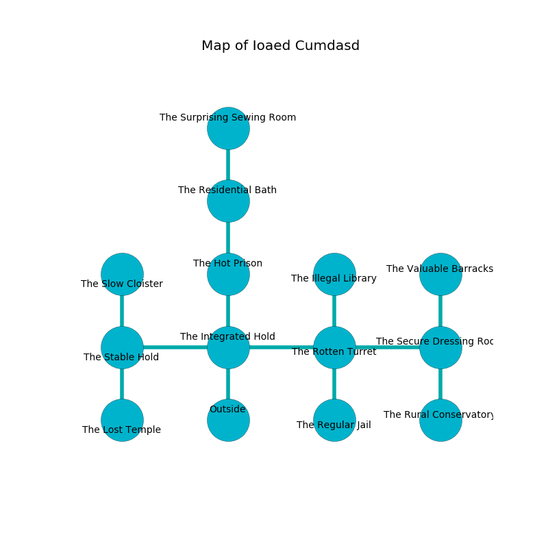

%Ruin Dogs

##Ioaed Cumdasd
###Overview
Ioaed Cumdasd is located under an alien rift. Regions of it are cursed. A windstorm is happening outside. It is occupied by Deep Gnomes. Beth Ridley The Mean, a Mind Flayer is here. The Deep Gnomes worship Beth Ridley The Mean. She  is trying to steal [Eiiofemca](#Eiiofemca). 

###Artifact
####Eiiofemca

Eiiofemca has the form of a warm cube. It is a medium orange color. When worn it illuminates its surroundings. 

###Locations

####the integrated hold
Blue razorgrass is decaying in broken urns. There are sixteen Deep Gnomes here. If the Deep Gnomes notice the Ruin Dogs, one of them will retreat and alert [Beth Ridley](#Beth-Ridley). 

There is an engraving on a monolith written in common. 

> Oh terrible fate
>
> limited and automatic
>
> but straight
>
> fate is democratic
>

* To the west a twisted gap connects to [the stable hold](#the-stable-hold).
* To the east a hazy passageway connects to [the rotten turret](#the-rotten-turret).
* To the north a windy pathway opens to [the hot prison](#the-hot-prison).
* To the south is the entrance.

####the hot prison
The stone walls are caving in. 

* There is a whip here.
* To the north a long passageway leads to [the residential bath](#the-residential-bath).
* To the south a windy pathway leads to [the integrated hold](#the-integrated-hold).

####the rotten turret

* To the west a hazy passageway leads to [the integrated hold](#the-integrated-hold).
* To the east a narrow path leads to [the secure dressing room](#the-secure-dressing-room).
* To the north a narrow cave opens to [the illegal library](#the-illegal-library).
* To the south a dark artery opens to [the regular jail](#the-regular-jail).

####the illegal library
There are sixteen Deep Gnomes here. There is a trap here. When activated, a tripwire will launch a poison needle. The Deep Gnomes are fighting amongst themselves. 

* To the south a narrow cave opens to [the rotten turret](#the-rotten-turret).

####the stable hold
The crystal walls are scratched. 

There is an engraving on the ceiling written in Deep Gnomes Script. 

> I am lost in Ioaed Cumdasd.
>
> Hide here.
>

* To the east a twisted gap connects to [the integrated hold](#the-integrated-hold).
* To the north a dripping pathway opens to [the slow cloister](#the-slow-cloister).
* To the south a twisted path connects to [the lost temple](#the-lost-temple).

####the regular jail
The brick walls are bloodstained. The floor is glossy. 

* There is a ring here.
* There is a rail here.
* To the north a dark artery connects to [the rotten turret](#the-rotten-turret).

####the lost temple

There is an engraving on the ceiling written in common. 

> I am sneaky.
>
> Dig here.
>

* There is a coat here.
* There is a basin here.
* There is a brake here.
* To the north a twisted path leads to [the stable hold](#the-stable-hold).

####the secure dressing room
The air smells like fish here. The stone walls are bloodstained. The floor is flooded with six inch deep scalding water. 

* [Eiiofemca](#Eiiofemca) is here.
* [Beth Ridley The Mean](#Beth-Ridley-The-Mean) is here.
* To the west a narrow path opens to [the rotten turret](#the-rotten-turret).
* To the north a small threshold opens to [the valuable barracks](#the-valuable-barracks).
* To the south a hazy gap connects to [the rural conservatory](#the-rural-conservatory).

####the valuable barracks
The floor is flooded with two inch deep scalding water. Blue razorgrass is decaying from the ceiling. The air tastes like labdanum here. There are sixteen Deep Gnomes here. The concrete walls are unsettled. One of the Deep Gnomes is working a mechanism that can open a trapodoor in the floor. 

* To the south a small threshold connects to [the secure dressing room](#the-secure-dressing-room).

####the residential bath
The air smells like strawberry here. There are sixteen Deep Gnomes here. The brick walls are scratched. White mushrooms are sprouting from the ceiling. The Deep Gnomes are meditating. 

* To the north a long gap connects to [the surprising sewing room](#the-surprising-sewing-room).
* To the south a long passageway leads to [the hot prison](#the-hot-prison).

####the surprising sewing room
The crystal walls are pristine. 

There is an engraving on the floor written in common. 

> Do not try fighting.
>

* To the south a long gap connects to [the residential bath](#the-residential-bath).

####the slow cloister
The brick walls are bloodstained. 

* To the south a dripping pathway leads to [the stable hold](#the-stable-hold).

####the rural conservatory
The floor is bloodstained. There are sixteen Deep Gnomes here. The Deep Gnomes are willing to negotiate. 

There is an engraving on a stone written in common. 

> I am lost in Ioaed Cumdasd.
>
> Try digging.
>

* To the north a hazy gap connects to [the secure dressing room](#the-secure-dressing-room).

