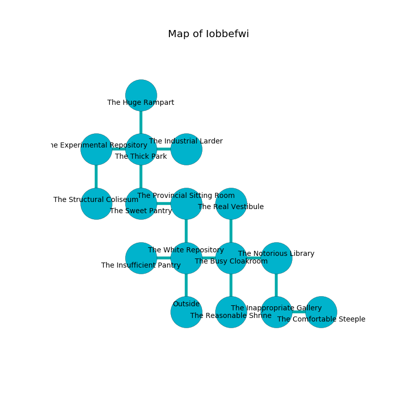

%Ruin Dogs

##Iobbefwi
###Overview
Iobbefwi is located under a spikey plain. Parts of it are corrupted. A windstorm is happening outside. It is occupied by Satyrs. Cora Suarez The Ruthless, a Knight is here. The Satyrs are ruled by Cora Suarez The Ruthless. She  is founding a new religion. 

###Artifact
####Uahadedha Dmaobumaee

Uahadedha Dmaobumaee has the form of a sharp monument. Water incinerates away from it. It smells like water. It is a dark orange color. When gazed upon it repels insects. 

###Locations

####the white repository
There is a trap here. When activated, a magical sound detector will close a portcullis. The air tastes like strawberry here. The floor is sticky. 

* There is an imp here.
* To the west a dark passageway opens to [the insufficient pantry](#the-insufficient-pantry).
* To the east a dripping path leads to [the busy cloakroom](#the-busy-cloakroom).
* To the north a twisted threshold opens to [the provincial sitting Room](#the-provincial-sitting-Room).
* To the south is the entrance.

####the insufficient pantry
The crystal walls are pristine. There are six Satyrs here. The Satyrs are willing to negotiate. 

* To the east a dark passageway connects to [the white repository](#the-white-repository).

####the busy cloakroom
The floor is smooth. 

* To the west a dripping path connects to [the white repository](#the-white-repository).
* To the east a dripping hallway connects to [the notorious library](#the-notorious-library).
* To the north a flooded cavern connects to [the real vestibule](#the-real-vestibule).
* To the south a small walkway opens to [the reasonable shrine](#the-reasonable-shrine).

####the provincial sitting Room
The crystal walls are caving in. The floor is flooded with four inch deep lukewarm water. There are a Hobgoblin Captain, a Spined Devil, a Lizardfolk, and a Twig Blight here. The air smells like dill here. 

* There is a specter here.
* There is a stocking here.
* There is a sock here.
* To the west a hazy artery connects to [the sweet pantry](#the-sweet-pantry).
* To the south a twisted threshold connects to [the white repository](#the-white-repository).

####the sweet pantry
The air smells like tomato here. 

* There is a cord here.
* There is a portrait here.
* To the east a hazy artery opens to [the provincial sitting Room](#the-provincial-sitting-Room).
* To the north a dripping opening leads to [the thick park](#the-thick-park).

####the thick park
Red lichens are sprouting from the walls. There are a Deep Gnome, a Vine Blight, and an Old Faerie Dragon here. 

There is an engraving on a monolith written in Satyrs Script. 

> Hide here.
>

* To the west a dripping path opens to [the experimental repository](#the-experimental-repository).
* To the east a twisted artery opens to [the industrial larder](#the-industrial-larder).
* To the north a dripping artery connects to [the huge rampart](#the-huge-rampart).
* To the south a dripping opening connects to [the sweet pantry](#the-sweet-pantry).

####the experimental repository
Gray lichens are sprouting from the ceiling. 

* To the east a dripping path opens to [the thick park](#the-thick-park).
* To the south a dark walkway leads to [the structural coliseum](#the-structural-coliseum).

####the reasonable shrine
Blue moss is decaying in a patch on the floor. The floor is cluttered with ashes. 

* There is a spring here.
* There is a rod here.
* To the north a small walkway leads to [the busy cloakroom](#the-busy-cloakroom).

####the structural coliseum
The stone walls are ruined. There are six Satyrs here. The air smells like violet leaf here. The Satyrs are performing a ritual. If not interrupted, a powerful monster will be summoned. 

* There is a jewel here.
* To the north a dark walkway connects to [the experimental repository](#the-experimental-repository).

####the real vestibule
The wooden walls are caving in. There are six Satyrs here. The air tastes like sweet pea here. The floor is sticky. The Satyrs are willing to negotiate. 

* To the south a flooded cavern opens to [the busy cloakroom](#the-busy-cloakroom).

####the industrial larder
The air tastes like solvent here. There are six Satyrs here. Gray moss is swaying in a patch on the floor. There is a trap here. When activated, a magical sound detector will launch an arrow. The floor is flooded with one inch deep scalding water. The metallic walls are unsettled. The Satyrs are berserk with rage. 

* To the west a twisted artery connects to [the thick park](#the-thick-park).

####the notorious library
The floor is glossy. There are six Satyrs here. One of the Satyrs is pointing a ballista at the entrance. 

* To the west a dripping hallway opens to [the busy cloakroom](#the-busy-cloakroom).
* To the south a flooded passageway leads to [the inappropriate gallery](#the-inappropriate-gallery).

####the huge rampart
Blue moss is growing from the walls. The mirrored walls are scratched. 

* To the south a dripping artery opens to [the thick park](#the-thick-park).

####the inappropriate gallery
The obsidion walls are bloodstained. Yellow lichens are growing in a patch on the floor. The air smells like pomegranate here. 

* [Uahadedha Dmaobumaee](#Uahadedha-Dmaobumaee) is here.
* To the east a long path connects to [the comfortable steeple](#the-comfortable-steeple).
* To the north a flooded passageway opens to [the notorious library](#the-notorious-library).

####the comfortable steeple
The concrete walls are unsettled. There are six Satyrs here. The floor is smooth. The Satyrs are berserk with rage. 

There is an engraving on a stone written in Satyrs Script. 

> Oh my! terrible soul
>
> abnormal and whole
>
> it is never tolerant
>
> hope is whole
>

* [Cora Suarez The Ruthless](#Cora-Suarez-The-Ruthless) is here.
* To the west a long path opens to [the inappropriate gallery](#the-inappropriate-gallery).

