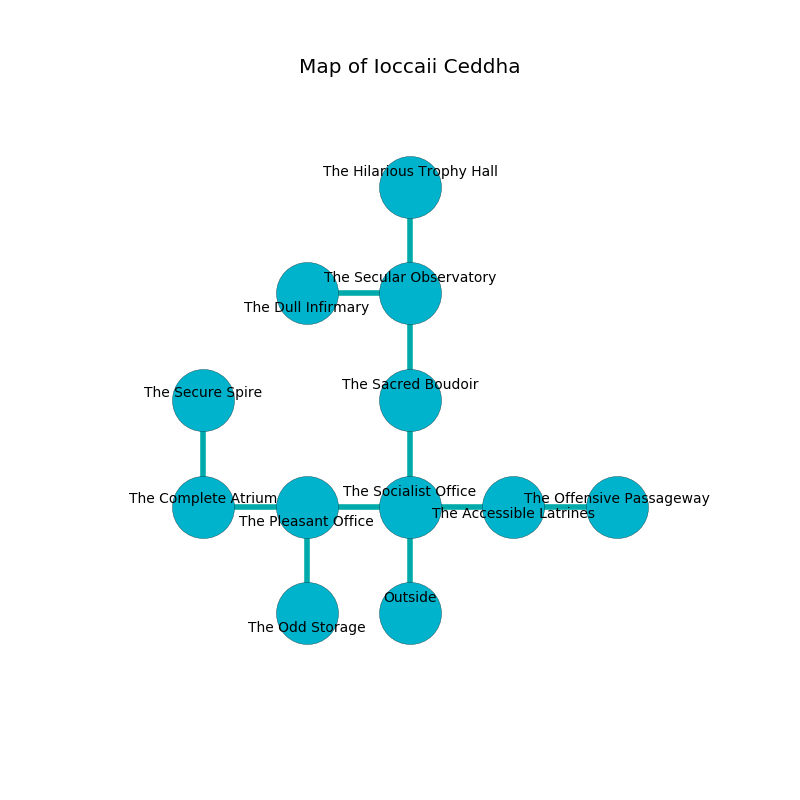

%Ruin Dogs

##Ioccaii Ceddha
###Overview
Ioccaii Ceddha is located under a ruined city. Some rooms of it are corrupted. A blizzard is happening outside. It is occupied by Drows. Huey Shephard The Indiscreet, an Assassin is here. The Drows have been charmed by Huey Shephard The Indiscreet. He  is trying to find [Asceuedaeum](#Asceuedaeum). 

###Artifact
####Asceuedaeum

Asceuedaeum has the form of a cold gem. It smells like roasted peanut. When eaten it floats in the air. 

###Locations

####the socialist office
The floor is bloodstained. The wooden walls are unsettled. There are thirty two Drows here. If the Drows notice the Ruin Dogs, one of them will retreat and alert [Huey Shephard](#Huey-Shephard). 

* To the west a narrow cave connects to [the pleasant office](#the-pleasant-office).
* To the east a flooded hallway leads to [the accessible latrines](#the-accessible-latrines).
* To the north a narrow cavern connects to [the sacred boudoir](#the-sacred-boudoir).
* To the south is the entrance.

####the accessible latrines
Green lichens are sprouting in broken urns. There are a Weretiger and a Xorn here. The air tastes like lime here. 

* To the west a flooded hallway connects to [the socialist office](#the-socialist-office).
* To the east a hazy gap leads to [the offensive passageway](#the-offensive-passageway).

####the sacred boudoir
White moss is sprouting from the walls. The air tastes like berry here. The obsidion walls are ruined. There are a Lamia, a Green Hag, and a Gibbering Mouther here. 

There is an engraving on the ceiling written in common. 

> I am seeking [Asceuedaeum](#Asceuedaeum).
>
> Treasure here.
>

* To the north a small gap opens to [the secular observatory](#the-secular-observatory).
* To the south a narrow cavern leads to [the socialist office](#the-socialist-office).

####the pleasant office
The floor is glossy. The air tastes like caraway here. Blue ferns are decaying from the walls. 

* There is a boot here.
* To the west a dark gap opens to [the complete atrium](#the-complete-atrium).
* To the east a narrow cave opens to [the socialist office](#the-socialist-office).
* To the south a torchlit gap connects to [the odd storage](#the-odd-storage).

####the offensive passageway
The floor is sticky. 

* To the west a hazy gap leads to [the accessible latrines](#the-accessible-latrines).

####the secular observatory
The glass walls are unsettled. There are a Darkmantle, a Lion, a Mud Mephit, a Satyr, a Manticore, an Imp, a Nothic, a Goblin, a Giant Centipede, and an Octopus here. The air tastes like shrimp here. 

* [Asceuedaeum](#Asceuedaeum) is here.
* To the west a windy corridor connects to [the dull infirmary](#the-dull-infirmary).
* To the north a windy walkway opens to [the hilarious trophy hall](#the-hilarious-trophy-hall).
* To the south a small gap connects to [the sacred boudoir](#the-sacred-boudoir).

####the complete atrium
The air smells like vetiver here. There are a Giant Wolf Spider, a Gnoll Pack Lord, a Gargoyle, a Githzerai Monk, a Tiger, and a Specter here. 

* To the east a dark gap connects to [the pleasant office](#the-pleasant-office).
* To the north a torchlit cavern leads to [the secure spire](#the-secure-spire).

####the odd storage
White mushrooms are sprouting in broken urns. The floor is flooded with seven inch deep cold water. The air smells like celery here. 

* To the north a torchlit gap leads to [the pleasant office](#the-pleasant-office).

####the dull infirmary
There is a trap here. When activated, a pressure plate will open a large pit in the floor. There are thirty two Drows here. The concrete walls are covered in mold. The floor is bloodstained. One of the Drows is on watch, the rest are feasting. 

* To the east a windy corridor leads to [the secular observatory](#the-secular-observatory).

####the secure spire
The floor is bloodstained. 

There is an engraving on a tablet written in Drows Script. 

> I am powerful.
>

* [Huey Shephard The Indiscreet](#Huey-Shephard-The-Indiscreet) is here.
* To the south a torchlit cavern connects to [the complete atrium](#the-complete-atrium).

####the hilarious trophy hall
There are a Githyanki Warrior, a Flumph, a Fomorian, a Swarm of Poisonous Snakes, a Hawk, and a Swarm of Quippers here. The floor is bloodstained. 

* There is a seed here.
* To the south a windy walkway connects to [the secular observatory](#the-secular-observatory).

