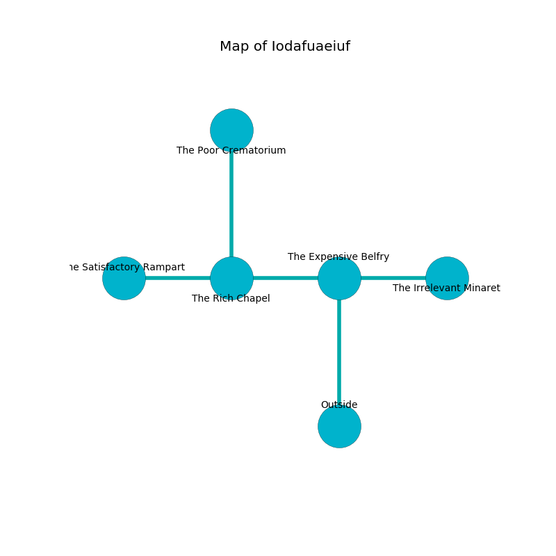

%Ruin Dogs

##Iodafuaeiuf
###Overview
Iodafuaeiuf is located on a cursed plain. Some areas of Iodafuaeiuf are somewhat hot. The ruin is larger on the inside than the outside. It is occupied by Troglodytes. Camille Davies The Resentful, a Kuo-Toa Monitor is here. The Troglodytes are battling Camille Davies The Resentful. She  is trying to destroy [Meaefcod](#Meaefcod). 

###Artifact
####Meaefcod

Meaefcod is a powerful artifact in the shape of a broken blade. Air flows near it. It smells like starfruit. When thrown it turns surrounding objects to ashes. 

###Locations

####the expensive belfry
The metallic walls are ruined. The floor is glossy. 

* To the west a small walkway connects to [the rich chapel](#the-rich-chapel).
* To the east a windy gap opens to [the irrelevant minaret](#the-irrelevant-minaret).
* To the south is the entrance.

####the rich chapel
The floor is sticky. There is a Lamia here. The stone walls are ruined. There is a trap here. When activated, a pressure plate will shoot a lightning bolt. 

* [Meaefcod](#Meaefcod) is here.
* To the west a flooded opening leads to [the satisfactory rampart](#the-satisfactory-rampart).
* To the east a small walkway connects to [the expensive belfry](#the-expensive-belfry).
* To the north a dripping opening opens to [the poor crematorium](#the-poor-crematorium).

####the satisfactory rampart
The floor is bloodstained. The stone walls are scratched. The air smells like hay here. There are sixteen Troglodytes here. The Troglodytes are defending this room from intruders. 

* There is a skirt here.
* [Camille Davies The Resentful](#Camille-Davies-The-Resentful) is here.
* To the east a flooded opening opens to [the rich chapel](#the-rich-chapel).

####the irrelevant minaret
The obsidion walls are ruined. The air smells like freshly cut hay here. The floor is cluttered with rocks. There are sixteen Troglodytes here. The Troglodytes are willing to negotiate. 

* There is a knife here.
* To the west a windy gap connects to [the expensive belfry](#the-expensive-belfry).

####the poor crematorium
The air tastes like tamarind here. There are a Githyanki Warrior, a Wolf, a Crocodile, an Acolyte, a Guard, and a Baboon here. 

* To the south a dripping opening leads to [the rich chapel](#the-rich-chapel).

